# Agent Platform — 新成员入职知识库

> **目标读者**: 新加入团队的开发工程师、架构师、DevOps
> **最后更新**: 2026-07-14
> **代码规模**: 573 个 Java 文件，7 个 Maven 模块，29 张数据库表
> **编译状态**: ✅ BUILD SUCCESS（7/7 模块）

---

## 一、项目概览与架构风格

### 1.1 项目定位

**Agent Platform** 是一个**企业级 AI Agent 平台**，解决的核心业务痛点是：

- **碎片化的 AI 工具调用**：企业内各类 AI 能力（对话、检索、工具调用）各自为政，缺乏统一入口和编排
- **安全合规盲区**：AI 对话中缺乏注入检测、敏感词过滤、越狱防护、PII 脱敏等安全围栏
- **知识管理混乱**：企业文档分散存储，缺乏统一的向量化检索和 RAG 增强生成能力
- **人机协同断裂**：高风险 AI 操作缺少审批流程，无法追溯决策链
- **可观测性缺失**：AI 调用链路不透明，无法评估效果和持续优化

平台提供**多租户 RBAC + 意图识别 + 对话管理 + RAG 知识库 + MCP 工具平台 + 安全围栏 + 人机审批 + 全链路观测 + 效果评估**的一站式解决方案。

### 1.2 架构风格：DDD 四层架构

本项目采用**领域驱动设计（Domain-Driven Design）**，严格遵循依赖倒置原则：

```
┌──────────────────────────────────────────────────┐
│                  interfaces                       │  ← Controller + Request DTO + ExceptionHandler
│        (接口层 — 只依赖 application)               │
├──────────────────────────────────────────────────┤
│                 application                       │  ← AppService + Response DTO + Event
│     (应用层 — 编排业务流程，不依赖 interfaces)       │
├──────────────────────────────────────────────────┤
│                   domain                          │  ← Entity/Aggregate + Repository接口 + DomainService
│       (领域层 — 核心业务规则，不依赖任何层)          │
├──────────────────────────────────────────────────┤
│               infrastructure                      │  ← RepositoryImpl + PO + Mapper + Config
│   (基础设施层 — 实现 domain 定义的接口)             │
├──────────────────────────────────────────────────┤
│          common (共享内核)                         │  ← Result + Exception + BizAssert + 常量
└──────────────────────────────────────────────────┘
```

**核心约束（强制）**：

| 规则 | 说明 |
|------|------|
| **依赖方向** | interfaces → application → domain ← infrastructure |
| **禁止越层** | Controller 绝不能直接注入 Repository |
| **DTO 分离** | Request DTO 在 interfaces 层，Response DTO 在 application 层 |
| **Application 层不 import interfaces 层** | 防止循环依赖 |
| **Domain 层零框架依赖** | 只依赖 common 共享内核，不依赖 Spring/MyBatis |

### 1.3 模块依赖图

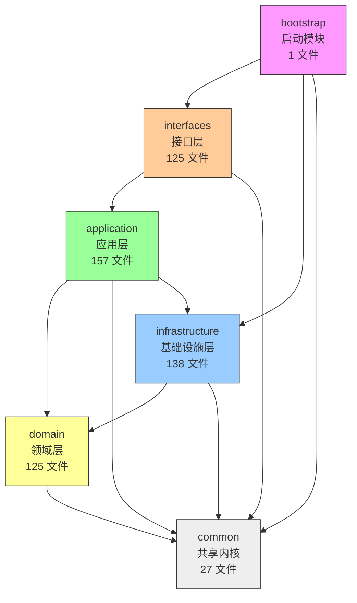

| 模块 | 文件数 | 职责 |
|------|:--:|------|
| **bootstrap** | 1 | `@SpringBootApplication` 启动类 + `@EnableAsync` |
| **common** | 27 | `Result` 响应体、6 种异常、`BizAssert`、`PageResponse`、`IdGenerator`、`ProjectConstants`（7 内部类 25 常量） |
| **domain** | 125 | 23 聚合根/实体 + 23 仓储接口 + 32 值对象 + 19 DomainService/端口 + 3 交互策略 |
| **application** | 157 | 19 AppService + 识别器/提取器/Resolver/Handler/切片策略 + Security DTO + Event + 4 交互策略 |
| **infrastructure** | 138 | 23 PO + 23 Mapper + 23 RepositoryImpl + Config + RAG + 可观测性 + Sentinel Nacos 持久化 |
| **interfaces** | 125 | 21 Controller + ~102 Request/Response DTO + ExceptionHandler + SwaggerConfig |

### 1.4 开发优先级全景

```
P0(✅) → P1(✅) → P2(✅) → P3(✅) → P4(✅核心) → P6(🟡配置治理✅) → P7(✅) → P5(⬜前端)
基础底座    核心能力    增强能力    安全治理    观测优化     迭代增强          多模式     前端
```

---

## 二、技术栈与版本明细

### 2.1 核心框架

| 框架 | 版本 | 核心用途 |
|------|------|----------|
| **JDK** | 17.0.18 | 运行环境 |
| **Spring Boot** | 3.3.7 | 应用框架（⚠️ 不要升级到 3.5.x） |
| **Spring Cloud Alibaba** | 2023.0.3.2 | 微服务治理（Nacos 配置中心 + 服务发现） |
| **Spring AI** | 1.1.7 | AI 模型统一抽象（ChatModel、Embedding） |
| **Spring AI Alibaba** | 1.1.2.0 | Alibaba DashScope 集成（groupId=`com.alibaba.cloud.ai`） |

### 2.2 持久化与缓存

| 框架 | 版本 | 核心用途 |
|------|------|----------|
| **MySQL Connector** | 8.0.33 | 关系数据库驱动（⚠️ 不要用 3.0.33 或 9.x） |
| **MyBatis Plus** | 3.5.9 | ORM 框架（逻辑删除、分页插件） |
| **MyBatis Spring Boot** | 3.0.4 | Spring Boot 自动配置整合 |
| **HikariCP** | (Spring Boot 内置) | 数据库连接池（min=5, max=20） |
| **Redisson** | 3.37.0 | 分布式锁 + Redis 高级数据结构 |
| **Spring Cache** | (Spring Boot 内置) | 声明式缓存抽象（Redis 后端） |
| **Milvus SDK** | 2.6.9 | 向量数据库（RAG 语义检索） |

### 2.3 安全与认证

| 框架 | 版本 | 核心用途 |
|------|------|----------|
| **Sa-Token** | 1.39.0 | 轻量级认证授权（Bearer Token + RBAC + 租户隔离） |
| **BCrypt** | (Spring Security 内置) | 密码哈希 |
| **Sentinel** | (Alibaba Cloud 内置) | 流量控制 + 熔断降级（Nacos 持久化） |

### 2.4 工具与辅助

| 框架 | 版本 | 核心用途 |
|------|------|----------|
| **Hutool** | 5.8.32 | 通用工具集（Aho-Corasick 敏感词匹配等） |
| **MapStruct** | 1.6.3 | 对象映射（PO ↔ Domain ↔ DTO） |
| **Guava** | 33.3.1-jre | Google 核心库 |
| **Jackson** | (Spring Boot 内置) | JSON 序列化 |
| **Apache Tika** | 2.9.2 | 文档解析（PDF/DOCX/MD/TXT 等） |
| **MinIO Client** | 8.5.10 | 对象存储客户端（文档上传） |
| **SpringDoc OpenAPI** | (Spring Boot 内置) | Swagger/OpenAPI 3 文档 |
| **Knife4j** | (Spring Boot 内置) | 增强版 Swagger UI + 离线文档导出 |

### 2.5 可观测性

| 框架/工具 | 版本 | 核心用途 |
|------|------|----------|
| **Micrometer + Prometheus** | (Spring Boot Actuator) | 指标暴露 (`/actuator/prometheus`) |
| **Langfuse** | HTTP API 直连 | LLM 调用追踪（⚠️ 不依赖 SDK） |
| **SLF4J + Logback** | (Spring Boot 内置) | 结构化日志 + MDC 追踪 |
| **Spring Boot Actuator** | (Spring Boot 内置) | 健康检查 + 指标 + 环境信息 |

### 2.6 外部服务依赖

| 服务 | 默认地址 | 用途 |
|------|----------|------|
| **MySQL** | `localhost:3306` | 主数据库 |
| **Redis** | `localhost:6379` | 缓存 + 分布式锁 + Session |
| **Milvus** | `localhost:19530` | 向量存储与检索 |
| **Nacos** | `localhost:8848` | 配置中心 + 服务发现 |
| **MinIO** | `101.37.252.221:9000` | 文档对象存储（可选） |
| **Langfuse** | `localhost:3000` | LLM 可观测性（可选） |
| **DeepSeek API** | 云端 | 大语言模型 |
| **Embedding API** | 阿里云 MaaS/DashScope | 文本向量化 |

---

## 三、核心业务领域模型

### 3.1 领域全景图

```mermaid
graph TB
    subgraph "多租户与权限"
        Tenant["Tenant<br/>租户聚合根"]
        User["User<br/>用户实体"]
        Role["Role<br/>角色实体"]
        Permission["Permission<br/>权限实体"]
        Tenant --> User
        User --> Role
        Role --> Permission
    end

    subgraph "对话与记忆"
        Conversation["Conversation<br/>对话聚合根"]
        Message["Message<br/>消息实体"]
        LongTermMemory["LongTermMemory<br/>长期记忆"]
        Intent["Intent<br/>意图定义"]
        Conversation --> Message
        Conversation --> LongTermMemory
    end

    subgraph "提示词管理"
        PromptTemplate["PromptTemplate<br/>模板聚合根"]
        PromptTemplateVersion["PromptTemplateVersion<br/>版本快照"]
        PromptTemplate --> PromptTemplateVersion
    end

    subgraph "任务执行"
        TaskExecution["TaskExecution<br/>任务聚合根"]
        TaskStepExecution["TaskStepExecution<br/>步骤实体"]
        DagGraph["DagGraph<br/>DAG 值对象"]
        TaskExecution --> TaskStepExecution
        TaskExecution --> DagGraph
    end

    subgraph "RAG 知识库"
        KnowledgeBase["KnowledgeBase<br/>知识库聚合根"]
        Document["Document<br/>文档实体"]
        DocumentChunk["DocumentChunk<br/>切片实体"]
        KnowledgeHitRecord["KnowledgeHitRecord<br/>命中记录"]
        KnowledgeBase --> Document
        Document --> DocumentChunk
        KnowledgeBase --> KnowledgeHitRecord
    end

    subgraph "MCP 工具平台"
        ToolRegistry["ToolRegistry<br/>工具聚合根"]
        ToolInvocationLog["ToolInvocationLog<br/>调用日志"]
        ToolRegistry --> ToolInvocationLog
    end

    subgraph "安全围栏"
        SensitiveWord["SensitiveWord<br/>敏感词聚合根"]
        SecurityEvent["SecurityEvent<br/>安全事件"]
        ApprovalWorkflow["ApprovalWorkflow<br/>审批工单"]
    end

    subgraph "效果评估"
        EvaluationDataset["EvaluationDataset<br/>评测数据集"]
        EvaluationRun["EvaluationRun<br/>评测执行"]
        OptimizationTicket["OptimizationTicket<br/>优化工单"]
    end

    style Tenant fill:#ff9,stroke:#333
    style Conversation fill:#ff9,stroke:#333
    style PromptTemplate fill:#ff9,stroke:#333
    style TaskExecution fill:#ff9,stroke:#333
    style KnowledgeBase fill:#ff9,stroke:#333
    style ToolRegistry fill:#ff9,stroke:#333
    style SensitiveWord fill:#ff9,stroke:#333
    style EvaluationDataset fill:#ff9,stroke:#333
```

### 3.2 关键枚举与状态机

#### 3.2.1 对话生命周期

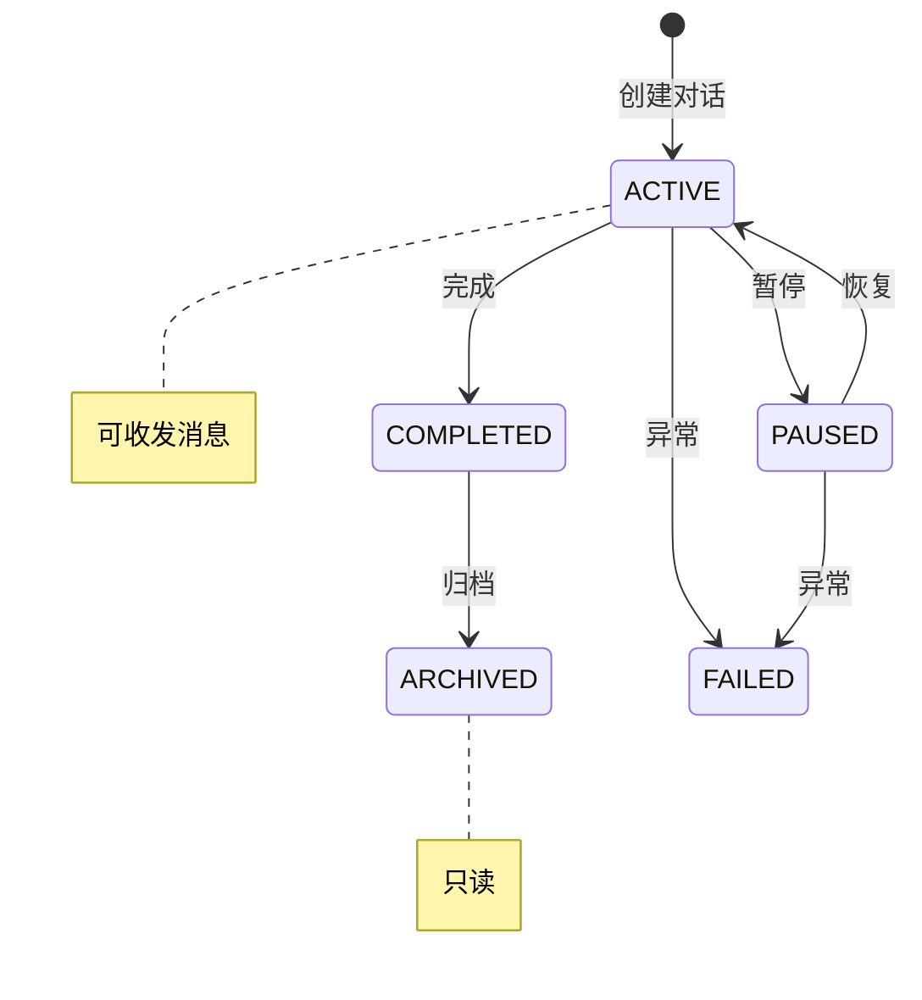

**ConversationState 枚举**: `ACTIVE` / `PAUSED` / `COMPLETED` / `ARCHIVED` / `FAILED`

#### 3.2.2 提示词模板生命周期

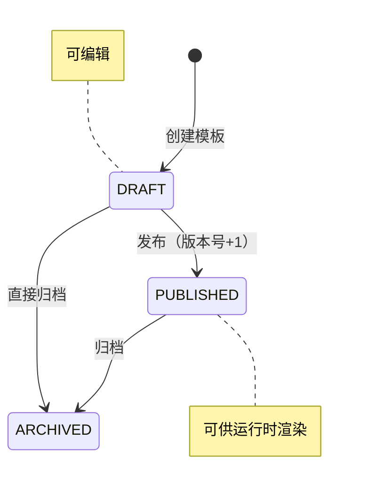

**PromptStatus 枚举**: `DRAFT` / `PUBLISHED` / `ARCHIVED`

#### 3.2.3 任务执行状态机

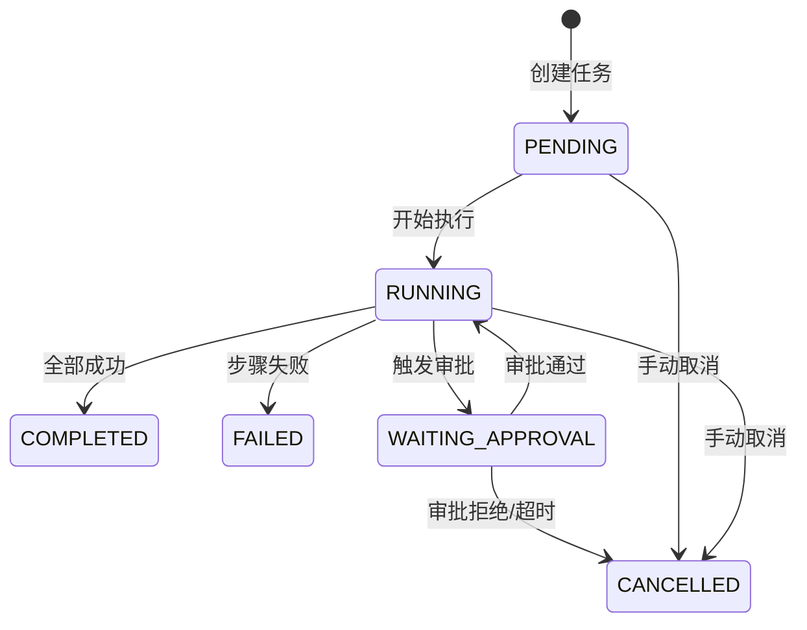

**ExecutionStatus 枚举**: `PENDING` / `RUNNING` / `COMPLETED` / `FAILED` / `CANCELLED` / `WAITING_APPROVAL`

**StepStatus 枚举**: `PENDING` / `RUNNING` / `SUCCESS` / `FAILED` / `SKIPPED`

#### 3.2.4 文档处理状态机

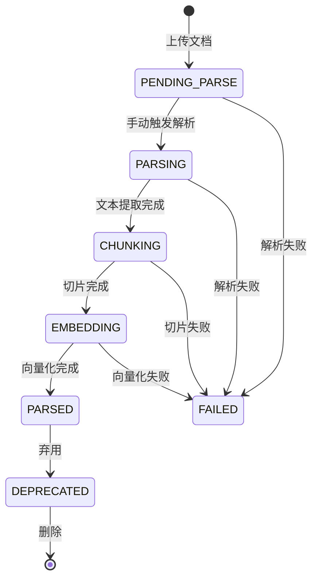

**DocumentStatus 枚举**: `PENDING_PARSE` / `PARSING` / `CHUNKING` / `EMBEDDING` / `PARSED` / `DEPRECATED` / `FAILED`

#### 3.2.5 审批工单状态机

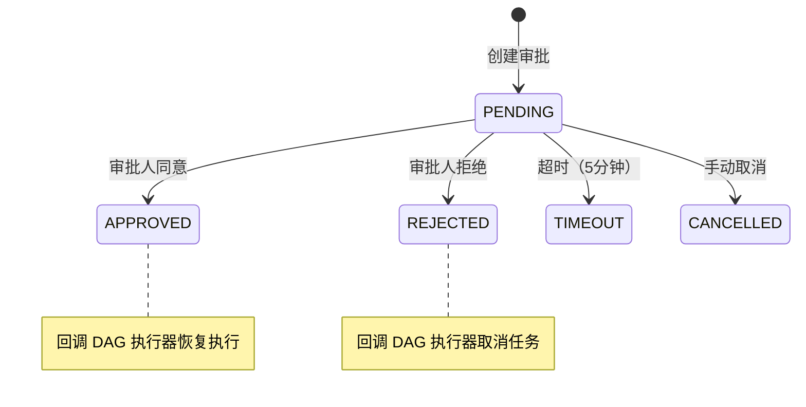

**ApprovalStatus 枚举**: `PENDING` / `APPROVED` / `REJECTED` / `TIMEOUT` / `CANCELLED`

#### 3.2.6 知识库生命周期

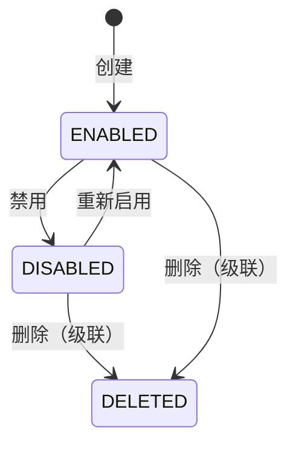

**KnowledgeBaseStatus 枚举**: `ENABLED` / `DISABLED` / `DELETED`

#### 3.2.7 其他关键枚举

| 枚举类 | 所属模块 | 可选值 | 说明 |
|------|----------|------|------|
| **ToolType** | T7-MCP | `MCP` / `HTTP` / `BUILTIN` / `CUSTOM` | 工具接入协议类型 |
| **ToolStatus** | T7-MCP | `ACTIVE` / `DISABLED` | 工具启用状态 |
| **InvocationStatus** | T7-MCP | `SUCCESS` / `FAILED` / `TIMEOUT` / `REJECTED` | 工具调用结果 |
| **ChunkStrategy** | T6-RAG | 6 种策略 | 文档切片算法（见下文） |
| **IndexType** | T6-RAG | `IVF_FLAT` / `IVF_SQ8` / `IVF_PQ` / `HNSW` / `DISKANN` / `AUTOINDEX` | Milvus 索引类型 |
| **MetricType** | T6-RAG | `COSINE` / `IP` / `L2` | 向量相似度度量 |
| **ConsistencyLevel** | T6-RAG | `STRONG` / `BOUNDED` / `EVENTUALLY` | Milvus 一致性级别 |
| **SearchStrategy** | T6-RAG | `precise` / `balanced` / `fast` / `recall` / `turbo` | 5 套检索策略预设 |
| **RerankerType** | T6-RAG | `NONE` / `CROSS_ENCODER` / `COLBERT` / `LLM` | 重排序模型 |
| **MatchType** | T10-安全 | `EXACT` / `REGEX` / `SEMANTIC` | 敏感词匹配方式 |
| **SensitiveCategory** | T10-安全 | `INJECTION` / `JAILBREAK` / `PII` / `CUSTOM` | 敏感内容分类 |
| **SeverityLevel** | T10-安全 | `LOW` / `MEDIUM` / `HIGH` / `BLOCK` | 安全事件严重程度 |
| **ActionType** | T10-安全 | `LOG` / `WARN` / `BLOCK` | 安全规则动作 |
| **InteractionMode** | P7-多模式 | `CONVERSATION` / `KNOWLEDGE_SEARCH` | 交互模式 |
| **TicketStatus** | T12-评估 | `OPEN` / `IN_PROGRESS` / `RESOLVED` / `CLOSED` | 优化工单状态（含 `canTransitionTo()` 方法） |

> ⚠️ **枚举规范（强制）**: 所有枚举必须有 `code` + `desc` 两个字段，使用 `fromCode(code)` 获取枚举，使用 `getCode()` 序列化，**禁止使用 `name()` 或 `valueOf()`** 进行转换。

### 3.3 核心 DomainService 方法签名

| DomainService | 关键方法 | 说明 |
|---------------|----------|------|
| **TenantDomainService** | `assertTenantActive(tenantId)` | 校验租户状态 |
| **UserDomainService** | `createUser(...)` / `assignRole(...)` | 用户创建 + 角色分配 |
| **PromptDomainService** | `publish(template)` / `rollback(template, version)` / `validateVariables(template)` | 发布/回滚/变量校验 |
| **DagParser** | `parse(json)` → `DagGraph` / `validate(graph)` / `topologicalSort(graph)` → `List<TaskNode>` | DAG 解析+校验+拓扑排序（DFS 三色 + BFS Khan） |
| **KnowledgeBaseDomainService** | `assertKbEnabled(kb)` / `assertCreatorAccess(kb, userId)` / `assertCanDelete(kb)` | KB 状态+权限校验 |
| **DocumentLifecycleDomainService** | `assertCanParse(doc)` / `assertCanDeprecate(doc)` / `assertCanDelete(doc)` | 文档生命周期 Guard |
| **PrecisionConfigDomainService** | `resolve(kb, doc, preset)` → `PrecisionConfig` | 四级配置合并 |
| **ToolDomainService** | `validateTool(tool)` / `assertTenantAccess(tool, tenantId)` | 工具校验 + 租户隔离 |

### 3.4 核心 ApplicationService 事务与缓存注解

| ApplicationService | 关键注解 | 说明 |
|---------------------|----------|------|
| **StreamOrchestrationService** | `@Async("streamExecutor")` + `AgentMetrics.Timer.Sample` | SSE 流式编排，专用线程池，Prometheus 计时 |
| **KnowledgeSearchStreamService** | `@Async("streamExecutor")` | RAG 流式检索增强生成 |
| **ApprovalTimeoutJob** | `@PostConstruct` 动态注册（Nacos 驱动间隔） | 30s 扫描超时工单 → 自动拒绝 |
| **TaskTimeoutScanner** | `@PostConstruct` 动态注册（2 个任务） | 超时任务 + 僵尸任务扫描 |
| **LongTermMemoryService** | `@Async` | 异步提取长期记忆（Template Method） |
| **SecurityEventRecorder** | `@Async("auditExecutor")` | 异步记录安全事件（Observer） |
| **AuditLogAspect** | `@Around("@annotation(Auditable)")` | AOP 自动采集审计日志 |

### 3.5 设计模式应用清单

项目大量应用 GoF 设计模式，总计 **20+ 种**：

| 模式 | 应用场景 | 核心类 |
|------|----------|--------|
| **Chain of Responsibility** | 意图识别 3 层链、安全围栏 4 层链 | `IntentRecognitionChain` / `InputFilter` 接口 |
| **Strategy** | 变量解析、文档切片、交互模式 | `VariableResolver` / `ChunkStrategyService` / `InteractionStrategy` |
| **Observer** | 安全事件记录、WebSocket 推送 | `SecurityEventRecorder` / `ApprovalWorkflowApplicationService` |
| **State** | 对话状态、审批状态、任务执行状态 | 各状态枚举 + 状态机 |
| **Memento** | 提示词版本快照、步骤执行 | `PromptTemplateVersion` / `TaskStepExecution` |
| **Template Method** | 长期记忆提取、指数退避重试 | `MemoryExtractor` / `RetryPolicy` |
| **Factory Method** | 识别结果、步骤结果、DAG 节点 | `IntentResult.matched()` / `TaskNode.root()` |
| **Builder** | 提示词模板、任务执行、敏感词 | `@Builder` 注解 |
| **Mediator** | DAG 执行编排、Handler 注册 | `DagExecutionService` / `ActionHandlerRegistry` |
| **Facade** | 安全围栏、DAG 执行 | `SecurityFenceApplicationService` |
| **Composite** | DAG 图节点 | `DagGraph` + `TaskNode` |
| **Command** | 超时控制、DAG 节点 | `TimeoutController` / `TaskNode` |
| **Singleton** | Nacos 配置 Bean | `@Configuration` + `@RefreshScope` |
| **Proxy** | 审计日志 AOP | `@Auditable` + `AuditLogAspect` |
| **Adapter** | HTTP 工具统一调用 | `HttpToolAdapter` |

---

## 四、API 接口契约

### 4.1 基础规范

- **Base URL**: `http://localhost:8080/api/v1`
- **认证方式**: Sa-Token Bearer Token（Header: `Authorization: Bearer <token>`）
- **响应格式**: 统一 `Result<T>` 包装 `{ "code": 200, "message": "success", "data": {...} }`
- **分页格式**: `PageResponse<T>` 包装 `{ "records": [...], "total": 100, "page": 1, "size": 20 }`
- **Swagger**: `http://localhost:8080/swagger-ui.html`
- **请求风格**: ⚠️ 项目采用 **POST-only** 风格（路径段命名操作：`/create`、`/list`、`/get`、`/update`、`/delete`），少数文件下载/预览端点使用 GET + PathVariable

### 4.2 完整 API 端点清单（按 Controller 归类，实际代码路径）

#### 4.2.1 认证 — AuthController

| Method | Path | 权限 | 业务含义 |
|------|------|:--:|------|
| POST | `/api/v1/auth/login` | 公开 | 用户登录 → `LoginResponse` (token+userInfo) |
| POST | `/api/v1/auth/refresh` | 公开 | 刷新 Token |
| POST | `/api/v1/auth/logout` | 登录 | 退出登录 |
| POST | `/api/v1/auth/me` | 登录 | 获取当前用户信息 |

#### 4.2.2 会话 — ConversationController

| Method | Path | 权限 |
|------|------|:--:|
| POST | `/api/v1/conversations/create` | `conversation:create` |
| POST | `/api/v1/conversations/list` | `conversation:read` |
| POST | `/api/v1/conversations/get` | `conversation:read` |
| POST | `/api/v1/conversations/update-title` | `conversation:update` |
| POST | `/api/v1/conversations/transition-status` | `conversation:update` |
| POST | `/api/v1/conversations/delete` | `conversation:delete` |

#### 4.2.3 消息 — MessageController

| Method | Path | 权限 | 业务含义 |
|------|------|:--:|------|
| POST | `/api/v1/conversations/messages/send` | `conversation:send` | 发送消息（同步） |
| POST | `/api/v1/conversations/messages/stream` | `conversation:send` | **SSE 流式发送**（支持双模式：CONVERSATION/KNOWLEDGE_SEARCH） |
| POST | `/api/v1/conversations/messages/list` | `conversation:read` | 消息列表 |
| POST | `/api/v1/conversations/messages/before` | `conversation:read` | 加载更早消息 |
| POST | `/api/v1/conversations/messages/feedback` | `conversation:feedback` | 消息反馈 |

#### 4.2.4 租户与用户 — TenantController / UserController

| Method | Path | 权限 |
|------|------|:--:|
| POST | `/api/v1/tenants/create` | `tenant:write` |
| POST | `/api/v1/tenants/list` | `tenant:read` |
| POST | `/api/v1/tenants/get` | `tenant:read` |
| POST | `/api/v1/tenants/update` | `tenant:write` |
| POST | `/api/v1/tenants/toggle-status` | `@SaCheckRole("TENANT_ADMIN")` |
| POST | `/api/v1/tenants/delete` | `@SaCheckRole("TENANT_ADMIN")` |
| POST | `/api/v1/users/register` | 公开 |
| POST | `/api/v1/users/list` | `user:read` |
| POST | `/api/v1/users/get` | `user:read` |
| POST | `/api/v1/users/update` | `user:write` |
| POST | `/api/v1/users/toggle-status` | `user:write` |
| POST | `/api/v1/users/change-password` | 公开 |

#### 4.2.5 角色与权限 — RoleController / PermissionController

| Method | Path | 权限 |
|------|------|:--:|
| POST | `/api/v1/roles/create` | `user:write` |
| POST | `/api/v1/roles/list` | `user:read` |
| POST | `/api/v1/roles/update` | `user:write` |
| POST | `/api/v1/roles/delete` | `user:write` |
| POST | `/api/v1/roles/assign-user` | `user:write` |
| POST | `/api/v1/roles/users` | `user:read` |
| POST | `/api/v1/roles/assign-permission` | `user:write` |
| POST | `/api/v1/permissions/list` | `user:read` |
| POST | `/api/v1/permissions/create` | `user:write` |
| POST | `/api/v1/permissions/delete` | `user:write` |
| POST | `/api/v1/permissions/import` | `user:write` |

#### 4.2.6 意图识别 — IntentController

| Method | Path | 权限 |
|------|------|:--:|
| POST | `/api/v1/intents/create` | `intent:create` |
| POST | `/api/v1/intents/list` | `intent:read` |
| POST | `/api/v1/intents/get` | `intent:read` |
| POST | `/api/v1/intents/update` | `intent:update` |
| POST | `/api/v1/intents/toggle-status` | `intent:update` |
| POST | `/api/v1/intents/test` | `intent:read` |
| POST | `/api/v1/intents/batch-test` | `intent:read` |
| POST | `/api/v1/intents/delete` | `intent:delete` |

#### 4.2.7 提示词管理 — PromptController

| Method | Path | 权限 | 业务含义 |
|------|------|:--:|------|
| POST | `/api/v1/prompts/create` | `prompt:create` | 创建模板 |
| POST | `/api/v1/prompts/list` | `prompt:read` | 模板列表 |
| POST | `/api/v1/prompts/get` | `prompt:read` | 模板详情 |
| POST | `/api/v1/prompts/update` | `prompt:update` | 更新模板 |
| POST | `/api/v1/prompts/delete` | `prompt:delete` | 删除模板 |
| POST | `/api/v1/prompts/preview` | `prompt:read` | 预览渲染 |
| POST | `/api/v1/prompts/publish` | `prompt:publish` | **发布版本** |
| POST | `/api/v1/prompts/rollback` | `prompt:publish` | **版本回滚** |
| POST | `/api/v1/prompts/archive` | `prompt:update` | 归档模板 |
| POST | `/api/v1/prompts/versions/list` | `prompt:read` | 版本历史 |
| POST | `/api/v1/prompts/versions/detail` | `prompt:read` | 版本详情 |
| POST | `/api/v1/prompts/diff` | `prompt:read` | 版本差异对比 |
| POST | `/api/v1/prompts/render` | `prompt:read` | 运行时渲染 |

#### 4.2.8 任务执行 — TaskController

| Method | Path | 权限 |
|------|------|:--:|
| POST | `/api/v1/tasks/plan` | `task:create` |
| POST | `/api/v1/tasks/execute` | `task:execute` |
| POST | `/api/v1/tasks/status` | `task:read` |
| POST | `/api/v1/tasks/plan/get` | `task:read` |
| POST | `/api/v1/tasks/cancel` | `task:execute` |
| POST | `/api/v1/tasks/handlers` | `task:read` |

#### 4.2.9 RAG 知识库 — KnowledgeBaseController

| Method | Path | 权限 |
|------|------|:--:|
| POST | `/api/v1/knowledge-bases/create` | `kb:create` |
| POST | `/api/v1/knowledge-bases/list` | `kb:read` |
| POST | `/api/v1/knowledge-bases/get` | `kb:read` |
| POST | `/api/v1/knowledge-bases/update` | `kb:update` |
| POST | `/api/v1/knowledge-bases/update-chunk-config` | `kb:update` |
| POST | `/api/v1/knowledge-bases/set-precision-config` | `kb:update` |
| POST | `/api/v1/knowledge-bases/precision-config/resolved` | `kb:read` |
| POST | `/api/v1/knowledge-bases/enable` | `kb:update` |
| POST | `/api/v1/knowledge-bases/disable` | `kb:update` |
| POST | `/api/v1/knowledge-bases/delete` | `kb:delete` |
| POST | `/api/v1/knowledge-bases/stats` | `kb:read` |

#### 4.2.10 文档管理 — DocumentController

| Method | Path | 权限 | 备注 |
|------|------|:--:|------|
| POST | `/api/v1/knowledge-bases/documents/upload` | `doc:upload` | MultipartFile 上传 |
| POST | `/api/v1/documents/list` | `doc:read` | |
| POST | `/api/v1/documents/get` | `doc:read` | |
| POST | `/api/v1/documents/status` | `doc:read` | 处理状态 |
| POST | `/api/v1/documents/download` | `doc:read` | 下载 |
| GET | `/api/v1/documents/{documentId}/download` | `doc:read` | GET 方式下载 |
| GET | `/api/v1/documents/{documentId}/preview` | `doc:read` | 预览 |
| POST | `/api/v1/documents/chunks` | `doc:read` | 切片列表 |
| POST | `/api/v1/documents/precision-override` | `doc:update` | |
| POST | `/api/v1/documents/delete` | `doc:delete` | |
| POST | `/api/v1/documents/parse` | `doc:update` | 触发解析 |
| POST | `/api/v1/documents/batch-parse` | `doc:update` | 批量解析 |
| POST | `/api/v1/documents/deprecate` | `doc:update` | 弃用文档 |

#### 4.2.11 文件管理与检索

| Method | Path | 权限 |
|------|------|:--:|
| POST | `/api/v1/knowledge-bases/files/list` | `doc:read` |
| POST | `/api/v1/knowledge-bases/files/summary` | `doc:read` |
| POST | `/api/v1/knowledge/search` | `kb:search` |
| POST | `/api/v1/knowledge/hits/list` | `kb:read` |
| POST | `/api/v1/knowledge/hits/feedback` | `kb:update` |
| POST | `/api/v1/knowledge/precision-strategies` | `kb:read` |

#### 4.2.12 MCP 工具平台 — ToolController

| Method | Path | 权限 |
|------|------|:--:|
| POST | `/api/v1/tools/create` | `tool:create` |
| POST | `/api/v1/tools/list` | `tool:read` |
| POST | `/api/v1/tools/invocations` | `tool:read` |
| POST | `/api/v1/tools/get` | `tool:read` |
| POST | `/api/v1/tools/update` | `tool:update` |
| POST | `/api/v1/tools/toggle-status` | `tool:update` |
| POST | `/api/v1/tools/test` | `tool:read` |
| POST | `/api/v1/tools/versions/list` | `tool:read` |
| POST | `/api/v1/tools/versions/detail` | `tool:read` |
| POST | `/api/v1/tools/rollback` | `tool:update` |

#### 4.2.13 安全围栏 — SecurityFenceController

| Method | Path | 权限 |
|------|------|:--:|
| POST | `/api/v1/security/sensitive-words/create` | 公开 |
| POST | `/api/v1/security/sensitive-words/update` | 公开 |
| POST | `/api/v1/security/sensitive-words/list` | 公开 |
| POST | `/api/v1/security/sensitive-words/get` | 公开 |
| POST | `/api/v1/security/sensitive-words/toggle-status` | 公开 |
| POST | `/api/v1/security/sensitive-words/delete` | 公开 |
| POST | `/api/v1/security/events/list` | 公开 |
| POST | `/api/v1/security/events/by-conversation` | 公开 |

#### 4.2.14 人机协同审批 — ApprovalController

| Method | Path | 权限 |
|------|------|:--:|
| POST | `/api/v1/approvals/list` | 公开 |
| POST | `/api/v1/approvals/get` | 公开 |
| POST | `/api/v1/approvals/approve` | 公开 |
| POST | `/api/v1/approvals/reject` | 公开 |
| POST | `/api/v1/approvals/stats` | 公开 |

#### 4.2.15 效果评估 — EvaluationDatasetController / EvaluationRunController

| Method | Path | 权限 |
|------|------|:--:|
| POST | `/api/v1/evaluation/datasets/create` | 公开 |
| POST | `/api/v1/evaluation/datasets/list` | 公开 |
| POST | `/api/v1/evaluation/datasets/get` | 公开 |
| POST | `/api/v1/evaluation/datasets/delete` | 公开 |
| POST | `/api/v1/evaluation/datasets/items/add` | 公开 |
| POST | `/api/v1/evaluation/datasets/items/list` | 公开 |
| POST | `/api/v1/evaluation/datasets/items/delete` | 公开 |
| POST | `/api/v1/evaluation/run` | 公开 |
| POST | `/api/v1/evaluation/get` | 公开 |
| POST | `/api/v1/evaluation/list` | 公开 |

#### 4.2.16 优化工单 — OptimizationTicketController

| Method | Path | 权限 |
|------|------|:--:|
| POST | `/api/v1/optimization-tickets/list` | 公开 |
| POST | `/api/v1/optimization-tickets/get` | 公开 |
| POST | `/api/v1/optimization-tickets/assign` | 公开 |
| POST | `/api/v1/optimization-tickets/update-status` | 公开 |
| POST | `/api/v1/optimization-tickets/resolve` | 公开 |
| POST | `/api/v1/optimization-tickets/feedback/stats` | 公开 |

#### 4.2.17 统一交互入口 — InteractionController (P7)

| Method | Path | 权限 | 业务含义 |
|------|------|:--:|------|
| POST | `/api/v1/interactions/execute` | `interaction:execute` | 同步交互 |
| GET | `/api/v1/interactions/modes` | `interaction:read` | 可用交互模式列表 |

#### 4.2.18 精度评估 — PrecisionController

| Method | Path | 权限 |
|------|------|:--:|
| POST | `/api/v1/knowledge-bases/precision/evaluate` | `kb:read` |
| POST | `/api/v1/knowledge-bases/precision/optimize` | `kb:read` |

### 4.3 API 统计

| 统计维度 | 数量 |
|----------|:--:|
| **Controller 类** | 22 个 |
| **REST 端点** | ~130 个（绝大多数 POST，少数 GET） |
| **权限码** | 44 条 |
| **SSE 流式端点** | 1 个（`/conversations/messages/stream`） |
| **WebSocket 端点** | 1 个（`/ws/conversation`） |

---

## 五、数据存储映射

### 5.1 数据库总览

- **数据库名**: `agent_platform_dev`（开发环境）
- **字符集**: UTF-8MB4
- **时区**: Asia/Shanghai
- **总表数**: 29 张
- **ORM**: MyBatis Plus（逻辑删除 + 驼峰自动映射）

### 5.2 ER 关系图

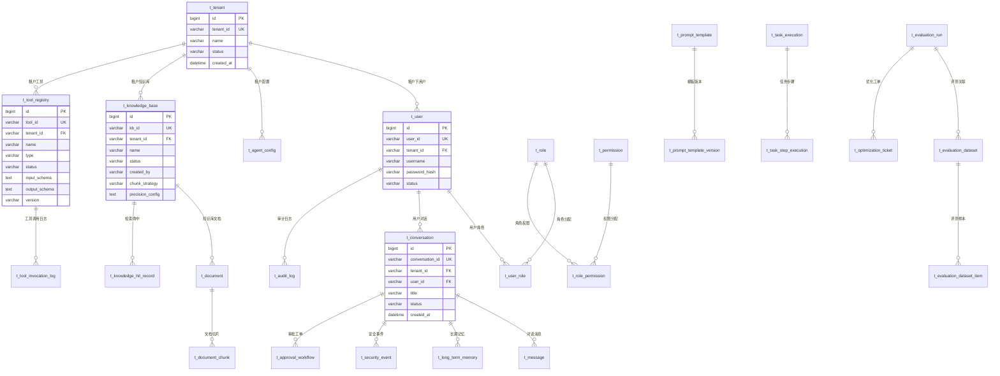

### 5.3 表结构详情

#### 5.3.1 基础表（V1.0.0 — 13 张）

| 表名 | 说明 | 关键字段 |
|------|------|----------|
| **t_tenant** | 租户信息 | tenant_id, name, status, contact_email |
| **t_user** | 用户账号 | user_id, tenant_id, username, password_hash, status, email |
| **t_role** | 角色定义 | role_id, tenant_id, role_code, role_name |
| **t_permission** | 权限码 | permission_id, permission_code, permission_name, resource_type |
| **t_user_role** | 用户-角色关联 | user_id, role_id |
| **t_role_permission** | 角色-权限关联 | role_id, permission_id |
| **t_agent_config** | Agent 配置 | tenant_id, agent_name, model_provider, system_prompt |
| **t_conversation** | 对话会话 | conversation_id, tenant_id, user_id, title, status |
| **t_message** | 对话消息 | message_id, conversation_id, role, content, metadata |
| **t_knowledge_base** | 知识库 | kb_id, tenant_id, name, description, status, chunk_strategy, precision_config |
| **t_tool_registry** | 工具注册 | tool_id, tenant_id, name, type, status, input_schema, output_schema, version |
| **t_prompt_template** | 提示词模板 | template_id, tenant_id, name, template_text, status, version |
| **t_evaluation_run** | 评测执行 | run_id, dataset_id, status, average_score |

#### 5.3.2 扩展表（V1.1.0 — 16 张）

| 表名 | 说明 | 关键字段 |
|------|------|----------|
| **t_intent** | 意图定义 | intent_id, tenant_id, name, keywords, examples, priority |
| **t_long_term_memory** | 长期记忆 | memory_id, conversation_id, user_id, memory_type, content, importance |
| **t_prompt_template_version** | 模板版本快照 | version_id, template_id, version_number, template_text, variables (JSON) |
| **t_task_execution** | 任务执行记录 | execution_id, tenant_id, dag_graph (JSON), status, result |
| **t_task_step_execution** | 步骤执行记录 | step_id, execution_id, step_name, status, output |
| **t_document** | RAG 文档 | document_id, kb_id, file_name, file_type, status, file_size |
| **t_document_chunk** | 文档切片 | chunk_id, document_id, content, vector_id, chunk_index |
| **t_knowledge_hit_record** | 检索命中记录 | hit_id, search_id, chunk_id, score, feedback |
| **t_tool_invocation_log** | 工具调用日志 | log_id, tool_id, invocation_id, params, result, duration_ms, status |
| **t_sensitive_word** | 敏感词规则 | word_id, tenant_id, word, category, match_type, action |
| **t_security_event** | 安全事件 | event_id, tenant_id, conversation_id, event_type, content, severity |
| **t_audit_log** | 审计日志 | log_id, tenant_id, user_id, action, resource_type, request, response, duration_ms |
| **t_approval_workflow** | 审批工单 | approval_id, tenant_id, execution_id, status, requester_id, approver_id, timeout_at |
| **t_evaluation_dataset** | 评测数据集 | dataset_id, tenant_id, name, description |
| **t_evaluation_dataset_item** | 评测样本 | item_id, dataset_id, question, expected_answer |
| **t_optimization_ticket** | 优化工单 | ticket_id, tenant_id, run_id, title, status, priority, assigned_to |

#### 5.3.3 逻辑删除

所有表使用 MyBatis Plus `@TableLogic` 机制：
- `deleted = 0` → 正常记录
- `deleted = 1` → 已删除（查询自动过滤）

配置在 `application.yml` 中：
```yaml
mybatis-plus:
  global-config:
    db-config:
      logic-delete-field: deleted
      logic-delete-value: 1
      logic-not-delete-value: 0
```

### 5.4 Redis Key 前缀规范

| 前缀 | 用途 | 示例 | TTL |
|------|------|------|-----|
| `auth:token:` | Sa-Token 登录态 | `auth:token:xxx` | 1h（active-timeout: 30min） |
| `auth:session:` | Sa-Token Session | `auth:session:loginId` | 跟随 Token |
| `cache:intent:` | 意图识别缓存 | `cache:intent:{tenantId}:{text}` | 30min（可配置） |
| `cache:tool:` | 工具信息缓存 | `cache:tool:{toolId}` | 可配置 |
| `cache:sensitive-word:` | 敏感词缓存 | `cache:sensitive-word:{tenantId}` | 5min 刷新 |
| `conversation:context:` | 对话上下文 | `conversation:context:{convId}` | 可配置（SessionConfig） |
| `lock:` | Redisson 分布式锁 | `lock:task:{executionId}` | 业务决定 |
| `redisson:` | Redisson 内部数据 | 自动管理 | — |

### 5.5 Milvus 向量集合

| Collection | 维度 | 索引类型 | 度量 | 说明 |
|------|:--:|------|:--:|------|
| **knowledge_chunks** | 1024 | IVF_FLAT (可配) | COSINE | 文档切片向量存储 |
| Schema 字段 | — | — | — | `id`(PK) + `vector`(1024d) + `document_id` + `knowledge_id` + `chunk_index` + `content` |

---

## 六、基础设施与外部依赖

### 6.1 配置中心架构（Nacos）

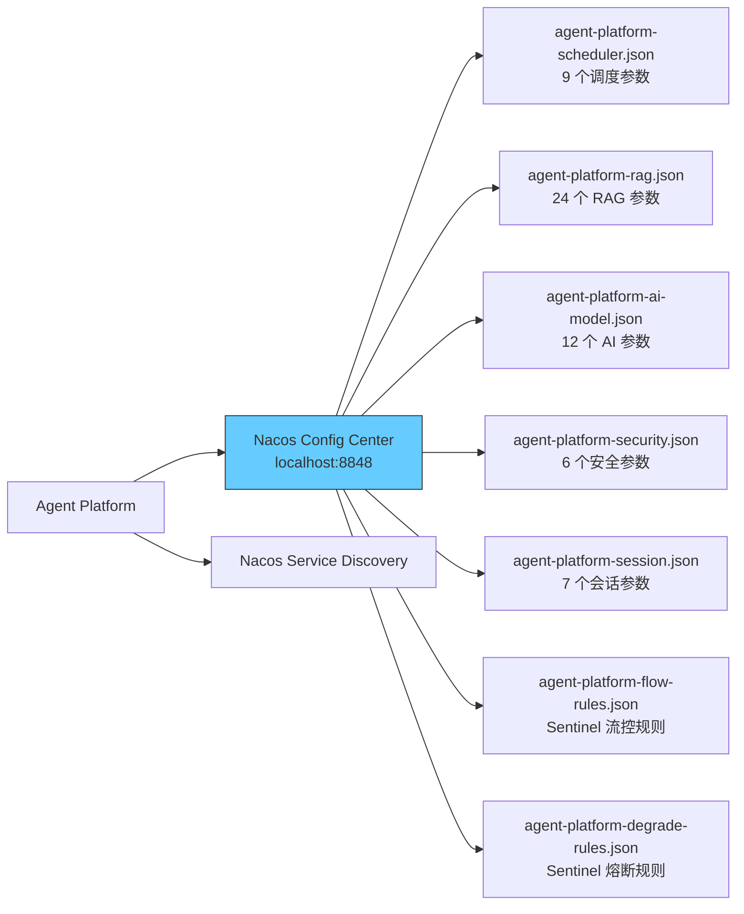

**配置治理策略**（~85 项配置，三维分类）：

| 配置类别 | 存储位置 | DataId 数量 | 变更频率 | 生效方式 |
|----------|----------|:--:|:--:|:--:|
| **动态运行时** | Nacos JSON | 5 个 DataId（62 参数） | 高 | `@RefreshScope` 实时生效 |
| **静态常量** | `ProjectConstants.java` | 1 类（25 常量） | 极低 | 重新编译 |
| **环境相关** | `application.yml` 兜底 | 1 文件 | 低 | 重启生效 |

**Nacos 配置 DataId 清单**：

| DataId | Group | 参数数 | 文件 |
|------|------|:--:|------|
| `agent-platform-scheduler.json` | AGENT-PLATFORM-CONFIG_ENTITY | 9 | SchedulerConfig.java |
| `agent-platform-rag.json` | AGENT-PLATFORM-CONFIG_ENTITY | 24 | RagConfig.java |
| `agent-platform-ai-model.json` | AGENT-PLATFORM-CONFIG_ENTITY | 12 | AiModelConfig.java |
| `agent-platform-security.json` | AGENT-PLATFORM-CONFIG_ENTITY | 6 | SecurityConfig.java |
| `agent-platform-session.json` | AGENT-PLATFORM-CONFIG_ENTITY | 7 | SessionConfig.java |
| `agent-platform-flow-rules.json` | SENTINEL_GROUP | 流控规则 | Sentinel |
| `agent-platform-degrade-rules.json` | SENTINEL_GROUP | 熔断规则 | Sentinel |

### 6.2 安全围栏架构

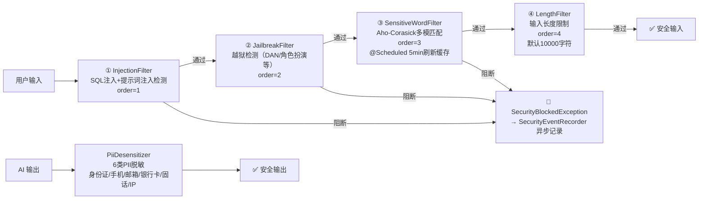

### 6.3 流式编排架构

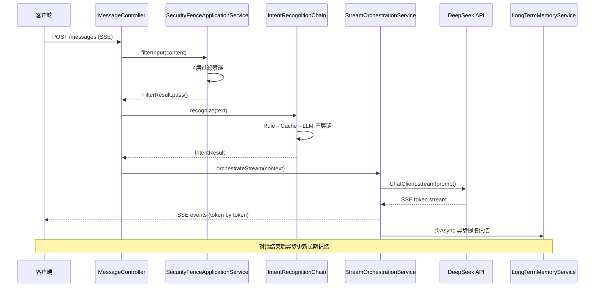

### 6.4 MCP 工具调用架构

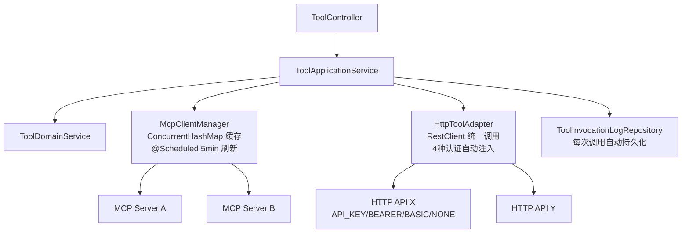

### 6.5 AOP 切面清单

| 切面类 | Pointcut | 说明 |
|------|------|------|
| **AuditLogAspect** | `@annotation(com.example.agent.infrastructure.annotation.Auditable)` | 自动采集审计日志（traceId + 耗时 + 请求/响应） |
| **RateLimitAspect** | `@annotation(com.example.agent.infrastructure.annotation.RateLimit)` | 租户维度限流（Sentinel 规则） |

### 6.6 分布式锁（Redisson）使用场景

| 场景 | Key 模式 | 说明 |
|------|----------|------|
| **DAG 任务执行** | `lock:task:{executionId}` | 防止同一任务并发执行 |
| **知识库删除** | `lock:kb:{kbId}` | 级联删除操作互斥 |
| **工具刷新** | `lock:tool:refresh` | McpClientManager 定时刷新互斥 |

### 6.7 异步线程池配置

| 线程池 Bean | 核心线程 | 最大线程 | 队列容量 | 用途 |
|------|:--:|:--:|:--:|------|
| **streamExecutor** | 4 | 8 | 100 | SSE 流式处理（`StreamOrchestrationService`） |
| **taskExecutor** | 2 | 4 | 500 | 通用异步任务 |
| **auditExecutor** | 2 | 4 | 1000 | 审计日志异步写入（`AuditLogAspect`） |

### 6.8 动态调度任务（替代 @Scheduled）

从子方案01开始，项目已将所有 `@Scheduled` 注解迁移到 Nacos 动态配置驱动：

| 注册任务 | 默认间隔 | 配置来源 | 说明 |
|------|:--:|------|------|
| **超时任务扫描** | 15s | `schedulerConfig.getTimeoutScanIntervalMs()` | 扫描超时未完成的任务 |
| **僵尸任务扫描** | 60s | `schedulerConfig.getStaleScanIntervalMs()` | 扫描长时间未更新的僵尸任务 |
| **审批超时扫描** | 30s | `schedulerConfig.getApprovalTimeoutScanMs()` | 扫描超时工单 → 自动拒绝 |
| **MCP 心跳检测** | 30s | `schedulerConfig.getMcpHeartbeatIntervalMs()` | 检测 MCP 服务连接状态 |
| **MCP Client 刷新** | 5min | `schedulerConfig.getMcpClientRefreshMs()` | 刷新 MCP Client 连接池 |
| **敏感词缓存刷新** | 5min | `schedulerConfig.getSensitiveWordRefreshMs()` | 刷新 Aho-Corasick 敏感词缓存 |

> ⚠️ **注意**: 所有任务间隔由 `DynamicScheduledTaskManager` 统一管理，运行时可通过 Nacos 控制台实时调整，无需重启。

### 6.9 下游外部服务调用

| 服务 | 调用方式 | 地址 | 用途 |
|------|----------|------|------|
| **DeepSeek API** | Spring AI `ChatClient` | 云端 | LLM 对话（ChatModel） |
| **Embedding API** | Spring AI `EmbeddingModel` | 阿里云 MaaS/DashScope | 文本向量化（text-embedding-v3） |
| **Milvus** | Milvus SDK `MilvusServiceClient` | `localhost:19530` | 向量存储与 ANN 检索 |
| **MinIO** | MinIO Client `MinioClient` | `101.37.252.221:9000` | 文档对象存储（上传/下载） |
| **Langfuse** | `RestTemplate` + HTTP Ingestion API | `localhost:3000` | LLM 调用追踪（异步发送） |
| **Nacos** | Spring Cloud Alibaba Nacos | `localhost:8848` | 配置中心 + 服务发现 |
| **Presidio** | HTTP（可选） | `localhost:3000` | PII 增强脱敏（超时 5s，fallback 正则） |
| **LDAP** | Spring LDAP（默认禁用） | 企业 LDAP 服务器 | 企业统一认证 |

### 6.10 应用启动入口

```java
// agent-platform-bootstrap/.../AgentPlatformApplication.java
@SpringBootApplication
@EnableAsync
public class AgentPlatformApplication {
    public static void main(String[] args) {
        SpringApplication.run(AgentPlatformApplication.class, args);
    }
}
```

- **端口**: `8080`（可通过 `SERVER_PORT` 环境变量覆盖）
- **关闭方式**: Graceful Shutdown（`server.shutdown: graceful`）
- **Tomcat**: 最大连接 1000，线程池 max=200 / min-spare=10

### 6.11 NacosConfig 模板方法模式

项目所有 Nacos 动态配置继承自统一模板 `NacosConfig<T>`，位于 `infrastructure/config/nacos/`：

```java
// 抽象模板 — Jackson JSON 解析 + Nacos 监听器注册
public abstract class NacosConfig<T> {
    protected abstract String getDataId();      // 如 "agent-platform-scheduler.json"
    protected abstract String getGroup();       // 如 "AGENT-PLATFORM-CONFIG_ENTITY"
    protected abstract String getConfigName();  // 如 "调度配置"
    protected abstract Class<T> getPropsClass(); // 内部静态配置类

    // 从 Nacos 获取配置，JSON → Props 对象，注册监听器实现热更新
    // getXxx() 便捷方法使用 Optional 链式判空 + 硬编码兜底
}
```

| 子类 | DataId | 参数数 | 消费方 |
|------|------|:--:|------|
| **SchedulerConfig** | `agent-platform-scheduler.json` | 9 | DynamicScheduledTaskManager, TaskTimeoutScanner, ApprovalTimeoutJob, McpHeartbeatDetector, McpClientManager, SensitiveWordFilter |
| **RagConfig** | `agent-platform-rag.json` | 24 | MilvusCollectionManager, HybridSearchApplicationService |
| **AiModelConfig** | `agent-platform-ai-model.json` | 12 | AiConfig (ChatClient 默认参数) |
| **SecurityConfig** | `agent-platform-security.json` | 6 | LengthFilter, ApprovalWorkflowApplicationService, CorsConfig |
| **SessionConfig** | `agent-platform-session.json` | 7 | SessionMemoryService, LongTermMemoryService, StreamOrchestrationService, KnowledgeSearchStreamService, CacheRecognizer, ToolCacheManager |

### 6.12 分布式锁子系统（Common 层）

项目使用 **Redisson** + **AOP 注解** 实现声明式分布式锁，位于 `common/lock/`：

```
@DistributeLock(keyPattern = LockEnum.DOCUMENT_MUTEX, keyValue = {"[0].documentId"}, waitSeconds = 3)
public void processDocument(DocumentDTO dto) { ... }
```

| 组件 | 说明 |
|------|------|
| **`@DistributeLock`** | 方法级注解，指定 `LockEnum` 键模板 + SpEL 参数提取 + 等待超时 |
| **`LockEnum`** | 预定义锁模板：`CONVERSATION_STATUS_TRANSITION("conversation", "status_transition_%s")`、`DOCUMENT_MUTEX("document", "doc_mutex_%s")` |
| **`DistributeLockAspect`** | `@Around` 切面，反射解析 `keyValue[]` 表达式（`[paramIndex].fieldPath` 语法），调用 `DistributeLockService` |
| **`DistributeLockService`** | 封装 `RedissonClient.tryLock()`：非阻塞获取 / 带超时阻塞获取 / `executeWithLock` 模板方法（safe unlock in finally） |
| **`RedissonConfig`** | 单机模式 RedissonClient Bean（地址/密码/数据库从 Redis 配置读取） |

### 6.13 多租户隔离机制

```
HTTP Request
  → TraceFilter (traceId/spanId/requestId → MDC)
  → Sa-Token Auth Interceptor (验证 Token → Session)
  → TenantInterceptor (Session → TenantContext ThreadLocal + MDC)
  → Controller
  → MyBatis TenantSqlInterceptor (自动注入 AND tenant_id = ?)
  → AfterCompletion (清理 TenantContext + MDC)
```

| 组件 | 层 | 机制 |
|------|------|------|
| **TenantContext** | Common | `ThreadLocal<String>` 持有 `CURRENT_TENANT` + `CURRENT_USER` |
| **TenantInterceptor** | Infrastructure | `HandlerInterceptor.preHandle()` 从 Sa-Token Session 提取 tenantId/userId → 设置 TenantContext + MDC |
| **TenantSqlInterceptor** | Infrastructure | MyBatis `Interceptor` (`@Intercepts`) — 自动向 SELECT/UPDATE/DELETE SQL 注入 `AND tenant_id = ?`，白名单排除 `t_tenant` 和 `t_permission` 表 |
| **TenantPermissionValidator** | Domain | 跨租户访问校验 |
| **ToolDomainService** | Domain | 工具操作的租户隔离断言 |

### 6.14 Spring Cache 区域定义

| Cache Region | TTL | 存储 | 用途 |
|------|:--:|------|------|
| `prompt:template:latest` | 30min | Redis | 最新发布版提示词模板 |
| `prompt:template:version` | 2h | Redis | 提示词模板版本快照 |
| `tool:def` | 1h (可配) | Redis (L2) + ConcurrentHashMap (L1) | 工具定义双层缓存 |

---

## 七、开发环境速查

### 7.1 编译与运行

| 操作 | 命令 |
|------|------|
| 编译全部模块 | `mvn clean compile` |
| 安装到本地仓库（跳过测试） | `mvn clean install -DskipTests` |
| 打包可执行 JAR | `mvn clean package -DskipTests -pl agent-platform-bootstrap` |
| 启动应用（dev） | `mvn spring-boot:run -pl agent-platform-bootstrap` |
| 运行单个测试 | `mvn test -pl <module> -Dtest=<TestClass>` |

### 7.2 启动前置条件

```bash
# 必须运行的服务
MySQL    → localhost:3306   (agent_platform_dev 数据库)
Redis    → localhost:6379   (缓存 + Session + 分布式锁)
Milvus   → localhost:19530  (向量数据库)

# 可选服务
Nacos    → localhost:8848   (配置中心，不可用时使用 application.yml 兜底)
MinIO    → 101.37.252.221:9000  (文档存储)
Langfuse → localhost:3000   (LLM 可观测性)
```

### 7.3 重要安全提醒

⚠️ **`application.yml` 中的 API Key 和密码仅作本地开发默认值，生产环境必须通过环境变量覆盖**：

| 环境变量 | 用途 |
|------|------|
| `DEEPSEEK_API_KEY` | DeepSeek LLM API Key |
| `EMBEDDING_API_KEY` | Embedding 模型 API Key |
| `MYSQL_PASSWORD` | MySQL 数据库密码 |
| `REDIS_PASSWORD` | Redis 密码 |
| `MINIO_ACCESS_KEY` / `MINIO_SECRET_KEY` | MinIO 对象存储凭证 |
| `LANGFUSE_PUBLIC_KEY` / `LANGFUSE_SECRET_KEY` | Langfuse 可观测性凭证 |
| `NACOS_USERNAME` / `NACOS_PASSWORD` | Nacos 认证凭证 |

### 7.4 已踩过的坑（必读）

1. **`spring-ai-alibaba-starter` 已废弃** → 用 `spring-ai-alibaba-agent-framework`
2. **`spring-ai-mcp-client-spring-boot-starter`** → 正确名称是 `spring-ai-starter-mcp-client`
3. **`spring-ai-rag-core` 不存在** → 正确名称是 `spring-ai-rag`
4. **MySQL 用 8.0.33** 不是 3.0.33（那个版本不存在）
5. **Langfuse 用 HTTP Ingestion API 直连**（不依赖 langfuse-java SDK，其 0.2.0 版本是 auto-generated OpenAPI 客户端，无高层 API）
6. **必须显式添加 `spring-ai-autoconfigure-model-deepseek` + `spring-ai-autoconfigure-model-chat-client`**，否则 ChatModel/ChatClient.Builder 均不会创建
7. **新增依赖后必须 `mvn install`**，否则 bootstrap 模块解析不到传递依赖
8. **Application 层禁止 import interfaces 层** — DTO 必须下沉到 Application 层
9. **枚举统一规范** — 所有枚举必须有 `code` + `desc`，用 `fromCode()` 获取，禁止 `name()`/`valueOf()`
10. **Controller 禁止直接返回 Map/List** — 必须封装为强类型 Response DTO
11. **Spring 6.x `Trigger.nextExecution()` 返回 `Instant` 非 `Date`** — 用 `Object` 接收兼容

---

## 八、文档索引

| 文档 | 路径 | 说明 |
|------|------|------|
| **项目现状摘要** | `docs/project-memory/00-项目现状摘要.md` | 快速了解项目全貌 |
| **开发进度** | `docs/开发进度.md` | 所有功能点清单 + 完成状态 |
| **开发规范** | `docs/开发规范.md` | 编码风格 + 强制约束 |
| **数据库设计** | `docs/数据库设计文档.md` | 完整表结构 + 字段说明 |
| **技术方案** | `docs/企业级Agent平台技术方案.md` | 架构决策 + 技术选型 |
| **技术流程图** | `docs/Agent平台技术方案流程图.md` | 11 张 Mermaid 流程图 |
| **架构设计图** | `docs/Agent平台架构设计图.md` | 10 张架构图（4+1/部署/DDD/安全/MCP） |
| **会话记忆索引** | `docs/project-memory/README.md` | 所有历史会话记录 |
| **P6 配置治理** | `docs/P6-迭代优化方案/配置信息迭代优化方案/` | 配置治理 5 个子方案 |
| **SQL 迁移参考** | `docs/database/` | V1.0.0 ~ V1.5.0 全部迁移脚本 |
| **Swagger** | `http://localhost:8080/swagger-ui.html` | 在线 API 文档 |

---

## 附录：领域层枚举全量参考

> 来自 `agent-platform-domain` 模块，10 个有界上下文，40+ 个枚举类型，150+ 个枚举常量。
> 所有枚举均遵循 `code` + `desc` 规范，使用 `fromCode()` 获取，`getCode()` 序列化。

### A.1 会话上下文 (conversation)

| 枚举 | 常量 | code | desc | 状态转移 |
|------|------|------|------|:--:|
| **ConversationStatus** | ACTIVE | ACTIVE | 活跃 | → CLOSED, ARCHIVED |
| | CLOSED | CLOSED | 已关闭 | → ACTIVE, ARCHIVED |
| | ARCHIVED | ARCHIVED | 已归档 | 终态 |
| **MessageRole** | USER / ASSISTANT / SYSTEM / TOOL | — | 消息发送者角色 | — |
| **IntentStatus** | ACTIVE / DISABLED | — | 意图启用状态 | — |
| **IntentCategory** | FAQ / TASK / CHITCHAT / MULTI_STEP | — | 意图分类 | — |
| **MemoryType** | FACT(3) / PREFERENCE(1) / CONTEXT(2) / SUMMARY(4) | — | 长期记忆类型（数字为优先级） | — |
| **FeedbackType** | LIKE / DISLIKE | — | 消息反馈 | — |

### A.2 知识库上下文 (knowledge)

| 枚举 | 常量 | code | desc |
|------|------|------|------|
| **KnowledgeBaseStatus** | ENABLED / DISABLED / DELETED | — | KB 生命周期状态 |
| **DocumentStatus** | PENDING_PARSE / PARSING / CHUNKING / EMBEDDING / PARSED / DEPRECATED / FAILED | — | 文档处理管线状态 |
| **IndexType** | IVF_FLAT / IVF_SQ8 / IVF_PQ / HNSW / DISKANN / AUTOINDEX | — | Milvus 索引类型 |
| **MetricType** | COSINE / IP / L2 | — | 向量相似度度量 |
| **ConsistencyLevel** | STRONG / BOUNDED / EVENTUALLY | — | Milvus 一致性级别 |
| **RerankerType** | NONE / CROSS_ENCODER / COLBERT / LLM | — | 重排序模型 |
| **SearchStrategy** | precise / balanced / fast / recall / turbo | — | 5 套检索策略预设 |
| **ChunkStrategy** | paragraph / fixed_size / markdown_header_aware / sentence_level / recursive_char_split / semantic | — | 6 种文档切片策略 |

### A.3 任务上下文 (task)

| 枚举 | 常量 | code | desc |
|------|------|------|------|
| **ExecutionStatus** | PENDING / RUNNING / COMPLETED / FAILED / CANCELLED / WAITING_APPROVAL | — | 任务执行生命周期 |
| **StepStatus** | PENDING / RUNNING / SUCCESS / FAILED / SKIPPED / TIMEOUT | — | 步骤执行状态 |
| **AsyncTaskStatus** | SUBMITTED / RUNNING / COMPLETED / FAILED / TIMEOUT | — | 异步任务状态（v1.6.0） |

### A.4 安全上下文 (security)

| 枚举 | 常量 | code | desc |
|------|------|------|------|
| **ApprovalStatus** | PENDING / APPROVED / REJECTED / TIMEOUT / CANCELLED | — | 审批工单状态机 |
| **MatchType** | EXACT / REGEX / SEMANTIC | — | 敏感词匹配方式 |
| **ActionType** | LOG / WARN / BLOCK | — | 命中后动作 |
| **SensitiveCategory** | INJECTION / JAILBREAK / PII / CUSTOM | — | 敏感内容分类 |
| **SeverityLevel** | LOW / MEDIUM / HIGH / BLOCK | — | 严重程度 |
| **SensitiveWordStatus** | ACTIVE / DISABLED | — | 规则启停 |
| **AuthProviderType** | LOCAL / LDAP / SSO | — | 认证提供者类型 |

### A.5 提示词与模板 (prompt)

| 枚举 | 常量 | code | desc | 状态转移 |
|------|------|------|------|:--:|
| **PromptStatus** | DRAFT / PUBLISHED / ARCHIVED | — | 模板生命周期 | DRAFT→PUBLISHED→ARCHIVED |

### A.6 工具上下文 (tool)

| 枚举 | 常量 | code | desc |
|------|------|------|------|
| **ToolType** | MCP / HTTP / BUILTIN / CUSTOM | — | 工具接入协议 |
| **ToolStatus** | ACTIVE / DISABLED | — | 工具启停 |
| **InvocationStatus** | SUCCESS / FAILED / TIMEOUT / REJECTED | — | 工具调用结果 |

### A.7 租户与用户 (tenant)

| 枚举 | 常量 | code | desc |
|------|------|------|------|
| **TenantStatusEnums** | ACTIVE / SUSPENDED / DELETED | — | 租户状态 |
| **TenantTierEnums** | STANDARD / PREMIUM / ENTERPRISE | — | 租户等级 |
| **UserStatusEnums** | ACTIVE / DISABLED | — | 用户状态 |

### A.8 评估与优化 (evaluation + optimization)

| 枚举 | 常量 | code | desc |
|------|------|------|------|
| **EvaluationRunStatusEnums** | PENDING / RUNNING / COMPLETED / FAILED | — | 评测执行状态 |
| **TicketStatus** | OPEN / ANALYZING / IN_PROGRESS / RESOLVED / CLOSED | — | 优化工单状态机 |

### A.9 审计 (audit)

| 枚举 | 常量 | code | desc |
|------|------|------|------|
| **ActorTypeEnums** | USER / SYSTEM | — | 审计操作者类型 |

---

> 📌 **本文档面向新成员入职**，覆盖项目架构、技术栈、领域模型、API 契约、数据存储和基础设施六大维度。
> 如发现文档与代码不一致，请以代码为准并更新本文档。标注 `[待补充]` 的部分欢迎提交 PR 补充。
