# Agent Platform — 技术方案与流程图

> 生成日期: 2026-06-18
> 项目: 企业级 AI Agent 平台
> 架构: DDD 六模块 (bootstrap → common → domain → application → infrastructure → interfaces)

---

## 目录

1. [系统整体架构](#1-系统整体架构)
2. [请求处理全链路](#2-请求处理全链路)
3. [DDD 分层依赖关系](#3-ddd-分层依赖关系)
4. [意图识别 3 层责任链](#4-意图识别-3-层责任链)
5. [安全围栏 4 层过滤链](#5-安全围栏-4-层过滤链)
6. [RAG 知识库引擎流程](#6-rag-知识库引擎流程)
7. [任务规划与 DAG 执行引擎](#7-任务规划与-dag-执行引擎)
8. [人机协同审批状态机](#8-人机协同审批状态机)
9. [流式对话编排 (SSE/WebSocket)](#9-流式对话编排-ssewebsocket)
10. [全链路可观测性](#10-全链路可观测性)
11. [数据库核心 ER 关系](#11-数据库核心-er-关系)

---

## 1. 系统整体架构

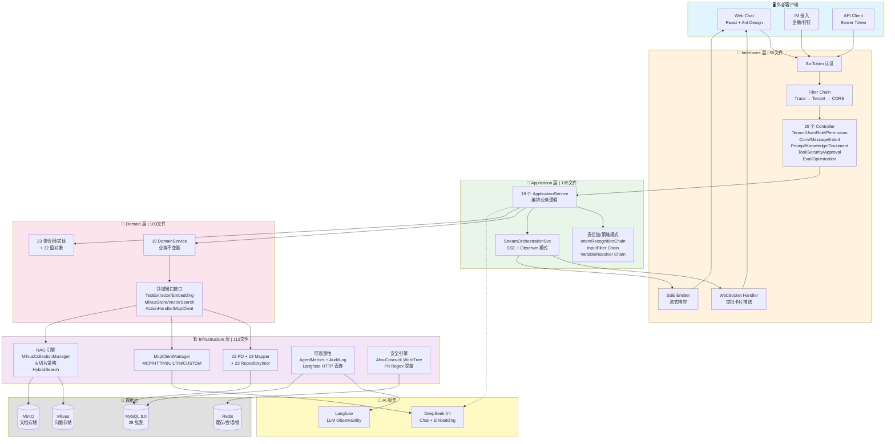

> 🔗 [在 Draw.io 中打开编辑](#)

---

## 2. 请求处理全链路

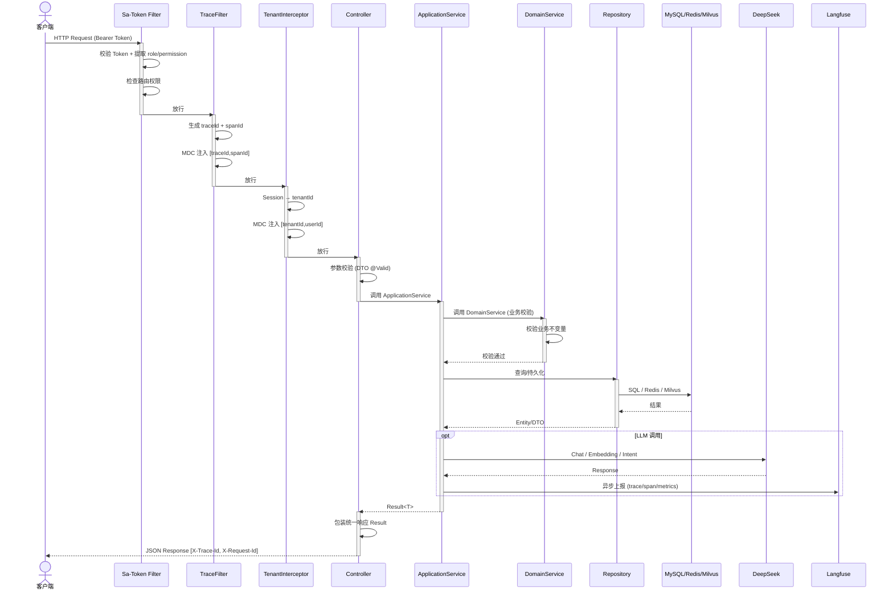

---

## 3. DDD 分层依赖关系

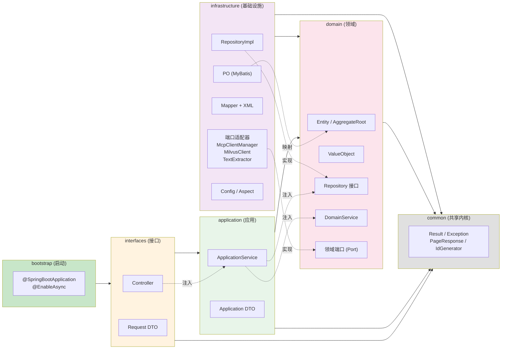

> 🔴 **强制规则**: Controller 绝不直接注入 Repository。依赖方向: interfaces → application → domain ← infrastructure

---

## 4. 意图识别 3 层责任链

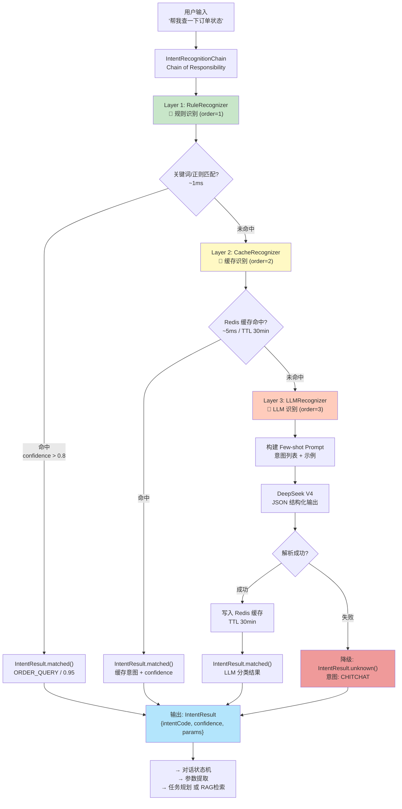

**设计模式**: Chain of Responsibility + Strategy  
**性能**: Rule ~1ms | Cache ~5ms | LLM ~500-2000ms  
**命中率**: Rule 覆盖 80% 高频意图 → Cache 15% → LLM 5% 兜底

---

## 5. 安全围栏 4 层过滤链

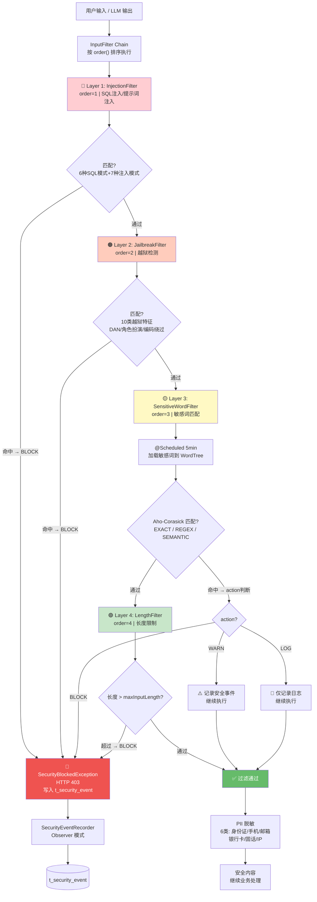

**设计模式**: Chain of Responsibility + Observer  
**敏感词匹配**: Hutool WordTree (Aho-Corasick 算法, O(n) 复杂度)  
**PII 脱敏**: 预编译正则 Pattern, 6 类 PII 自动检测

---

## 6. RAG 知识库引擎流程

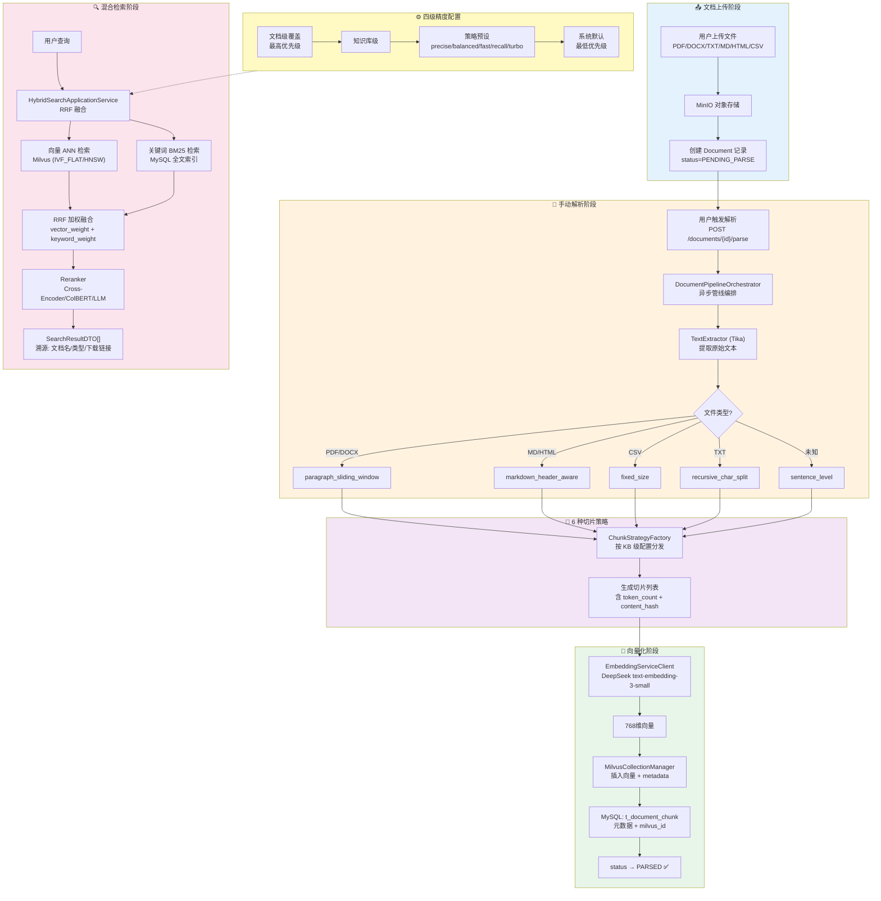

**检索公式**: `final_score = (vector_rank × vector_weight + keyword_rank × keyword_weight) / (vector_weight + keyword_weight)`  
**索引类型**: IVF_FLAT | IVF_SQ8 | IVF_PQ | HNSW | DISKANN | AUTOINDEX  
**一致性**: STRONG | BOUNDED | EVENTUALLY

---

## 7. 任务规划与 DAG 执行引擎

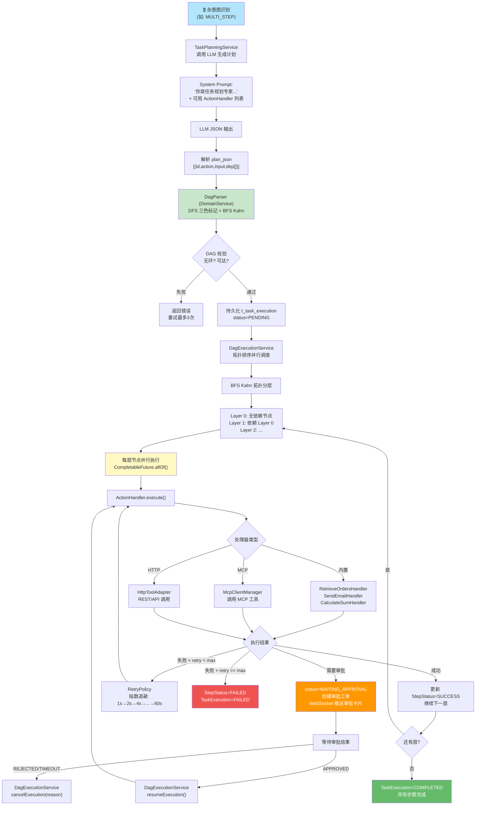

**关键设计模式**: 
- **Command**: ActionHandler 接口 (6 钩子: preValidate/execute/postProcess/onSuccess/onError/rollback)
- **Mediator**: DagExecutionService 编排所有 Handler
- **Observer**: WebSocket 实时推送步骤进度
- **Template Method**: RetryPolicy 指数退避重试
- **Factory**: ActionHandlerRegistry (InitializingBean 自动注册)

---

## 8. 人机协同审批状态机

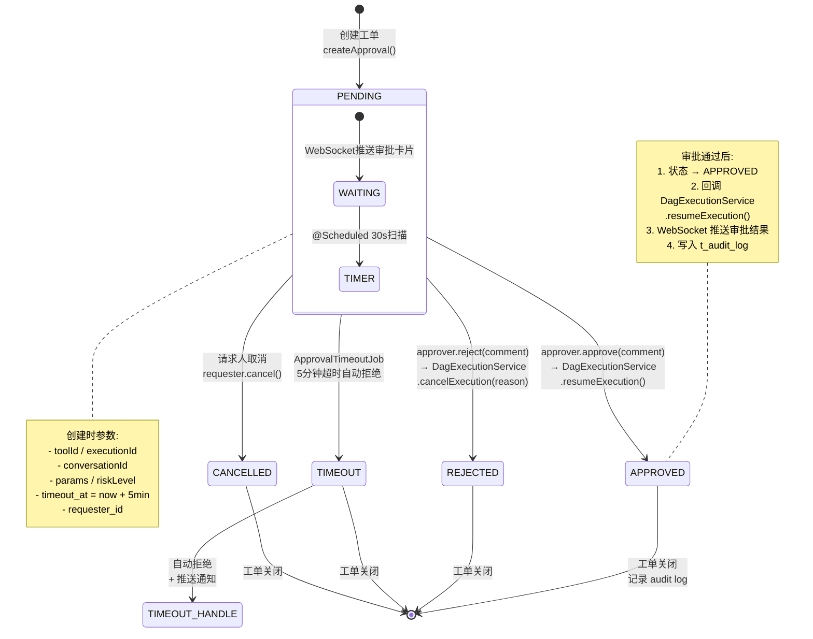

**API 端点**:
| 方法 | 路径 | 说明 |
|------|------|------|
| GET | `/api/v1/approvals?filter=my-pending` | 待审批列表 |
| GET | `/api/v1/approvals/{id}` | 审批详情(含倒计时) |
| POST | `/api/v1/approvals/{id}/approve` | 同意 |
| POST | `/api/v1/approvals/{id}/reject` | 拒绝 |
| GET | `/api/v1/approvals/stats` | 统计 |

---

## 9. 流式对话编排 (SSE/WebSocket)

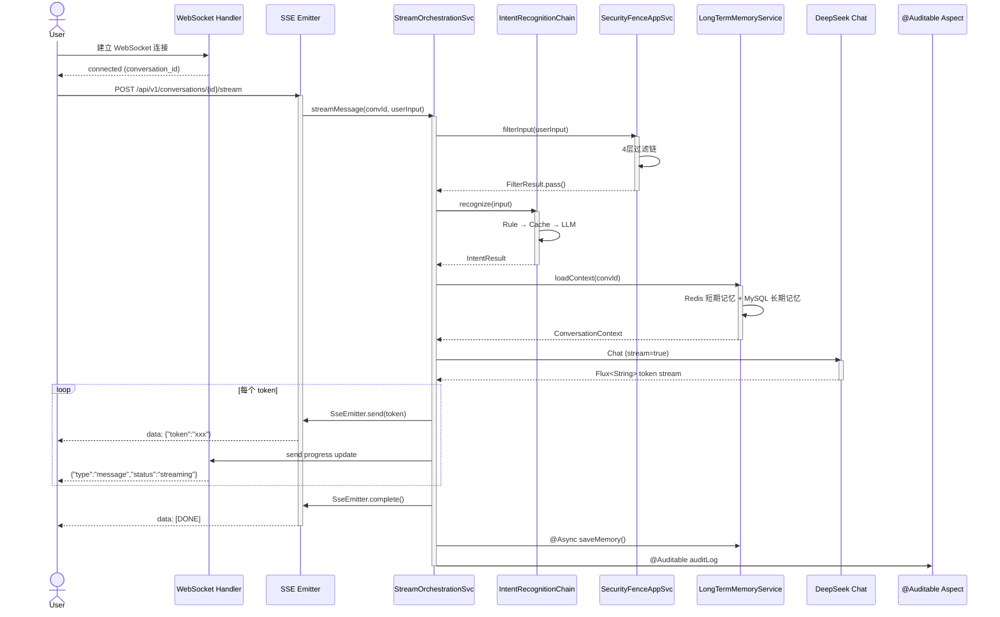

---

## 10. 全链路可观测性

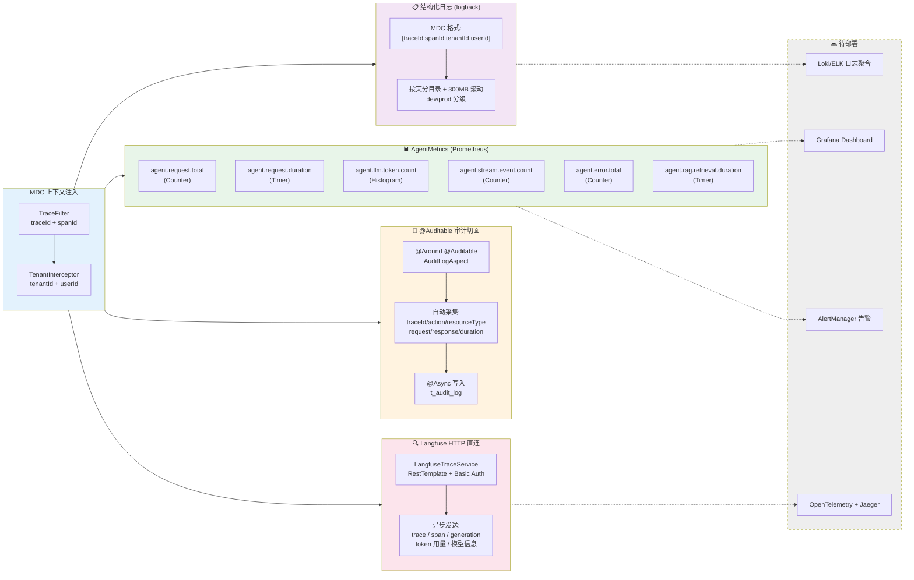

**10 个 Prometheus 指标**: `agent.request.total`, `agent.request.duration`, `agent.llm.token.total`, `agent.llm.duration`, `agent.stream.event.total`, `agent.stream.duration`, `agent.rag.retrieval.duration`, `agent.error.total`, `agent.tool.invocation.total`, `agent.tool.invocation.duration`

---

## 11. 数据库核心 ER 关系

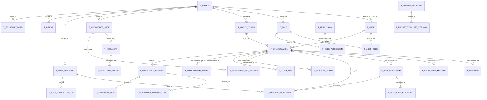

---

## 📊 技术栈速览

| 层次 | 技术 | 说明 |
|------|------|------|
| **语言** | Java 17 | LTS, 虚拟线程就绪 |
| **框架** | Spring Boot 3.3.7 | IOC/MVC/Actuator/DevTools |
| **持久化** | MyBatis 3.0.4 + MyBatis-Plus 3.5.9 | XML SQL + 自动 CRUD + 逻辑删除 |
| **数据库** | MySQL 8.0.33 | 28 张表, 手动版本管理 |
| **缓存** | Redis + Redisson 3.37.0 | 缓存/会话/分布式锁 |
| **向量库** | Milvus 2.6.9 | 6 种索引, 混合检索 |
| **鉴权** | Sa-Token 1.39.0 | RBAC, Bearer Token, 多租户 |
| **AI** | Spring AI 1.1.7 + DeepSeek V4 | Chat + Embedding |
| **文档** | SpringDoc OpenAPI + Knife4j | Swagger UI |
| **日志** | Logback + SLF4J | MDC 全链路追踪 |
| **观测** | Micrometer + Langfuse HTTP | Prometheus + LLM Trace |
| **安全** | BCrypt + Aho-Corasick + Regex | 4 层过滤 + PII 脱敏 |
| **流式** | SSE + WebSocket | 实时消息推送 |
| **构建** | Maven 多模块 | 7 模块 DDD 项目 |

---

## 🔗 模块依赖关系

```
bootstrap
  ├── interfaces ────── Controller + Request DTO + Swagger
  │   └── application ─ ApplicationService + Chain + Strategy
  │       └── domain ── Entity + Repository接口 + DomainService + Port
  │           └── common ─ Result + Exception + PageResponse + IdGenerator
  └── infrastructure ── RepositoryImpl + PO + Mapper + Adapter + Config
      └── domain
          └── common
```

> 📐 **DDD 强制约束**: `interfaces → application → domain ← infrastructure`  
> 🔴 Controller 绝不直接注入 Repository | Application 层不 import interfaces 层
