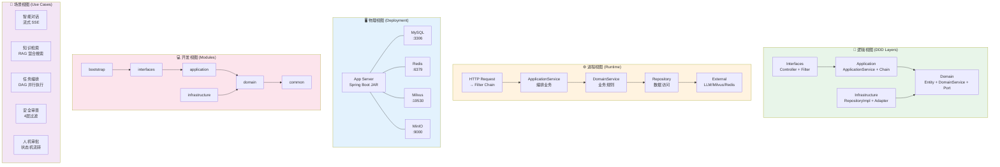
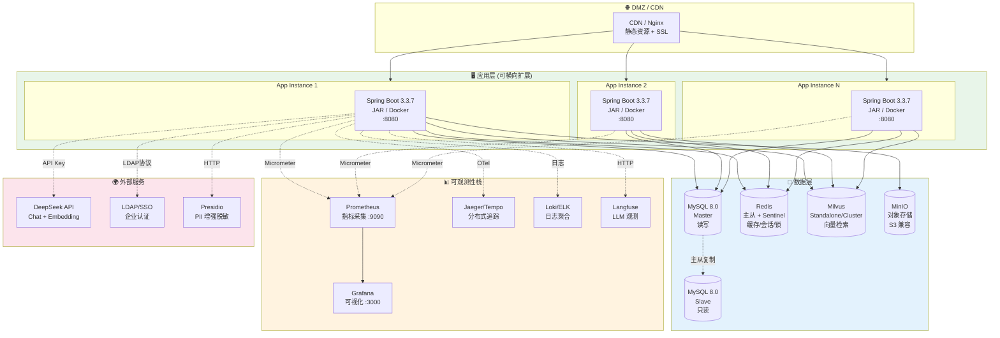
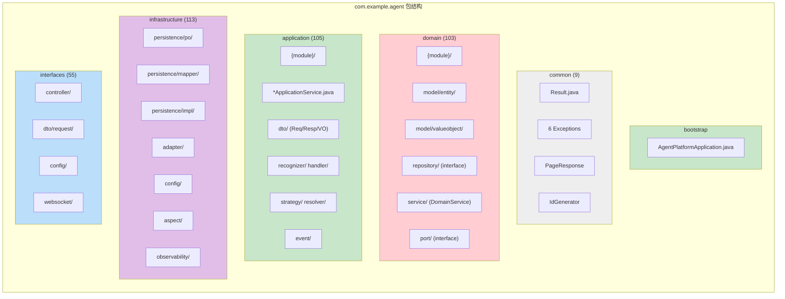
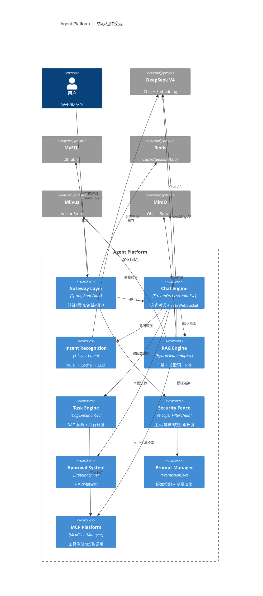
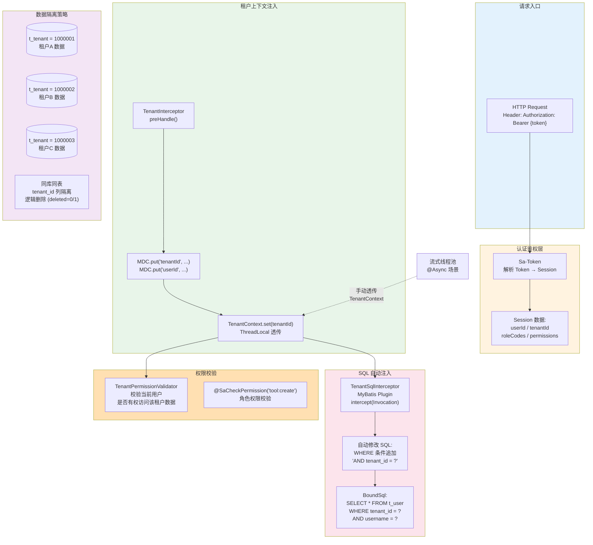
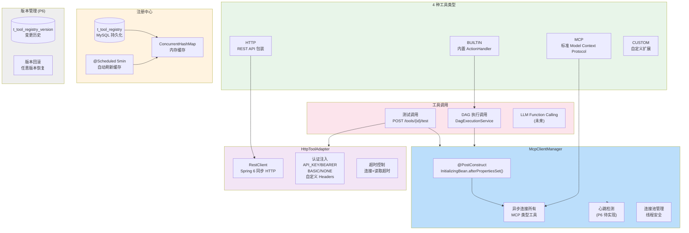
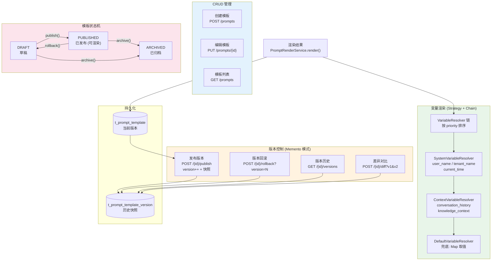
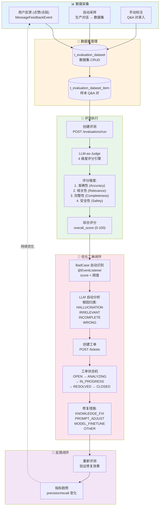

# Agent Platform — 架构设计图

> 生成日期: 2026-06-18
> 对应文档: `docs/Agent平台技术方案流程图.md`

---

## 目录

1. [4+1 架构视图](#1-41-架构视图)
2. [部署架构 (物理视图)](#2-部署架构-物理视图)
3. [DDD 分层架构 (逻辑视图)](#3-ddd-分层架构-逻辑视图)
4. [模块包结构 (开发视图)](#4-模块包结构-开发视图)
5. [核心组件交互 (进程视图)](#5-核心组件交互-进程视图)
6. [多租户数据隔离架构](#6-多租户数据隔离架构)
7. [安全架构全景](#7-安全架构全景)
8. [MCP 工具平台架构](#8-mcp-工具平台架构)
9. [提示词管理架构](#9-提示词管理架构)
10. [效果评估闭环架构](#10-效果评估闭环架构)

---

## 1. 4+1 架构视图



---

## 2. 部署架构 (物理视图)



**端口规划**:
| 服务 | 端口 | 说明 |
|------|:--:|------|
| App | 8080 | Spring Boot |
| Prometheus | 9090 | 指标采集 |
| Grafana | 3000 | 可视化 |
| MySQL | 3306 | 主库 |
| Redis | 6379 | 缓存 |
| Milvus | 19530 | 向量库 |
| MinIO | 9000/9001 | 存储/控制台 |
| Langfuse | 3000 | LLM 观测 |

---

## 3. DDD 分层架构 (逻辑视图)

```mermaid
graph TB
    subgraph Top[" "]
        BOOT["🎯 bootstrap<br/>@SpringBootApplication<br/>@EnableAsync<br/>@ComponentScan"]
    end

    subgraph Layer4["🔵 Interfaces 层 — 用户接口"]
        direction LR
        REST["REST Controllers<br/>20 个 @RestController"]
        REQ_DTO["Request DTOs<br/>28 个 @Validated"]
        FILTERS["Filters/Interceptors<br/>Sa-Token / Trace / Tenant / CORS"]
        WS_SSE["WebSocket / SSE<br/>实时消息推送"]
        SWAGGER2["Swagger / Knife4j<br/>API 文档"]
        EX_HANDLER["GlobalExceptionHandler<br/>@ControllerAdvice"]
    end

    subgraph Layer3["🟢 Application 层 — 应用编排"]
        direction LR
        APP_SVCS["ApplicationServices<br/>19 个 @Service"]
        DTO2["Application DTOs<br/>Request/Response/VO"]
        CHAINS2["责任链<br/>IntentRecognitionChain<br/>InputFilterChain"]
        STRATEGY2["策略模式<br/>ChunkStrategy x6<br/>MemoryExtractor x5<br/>VariableResolver x4"]
        EVENTS["领域事件<br/>ConversationCreatedEvent<br/>StatusChangedEvent<br/>MessageFeedbackEvent"]
        ORCH["编排器<br/>StreamOrchestrationSvc<br/>DocumentPipelineOrch<br/>DagExecutionSvc"]
    end

    subgraph Layer2["🔴 Domain 层 — 业务核心"]
        direction LR
        ENTITIES2["聚合根 + 实体<br/>23 个 @Data @Builder"]
        VALUE_OBJS["值对象<br/>32 个 Enum / Record"]
        DOMAIN_SVCS["DomainServices<br/>19 个 @Service<br/>业务不变量"]
        REPO_PORTS["仓储端口<br/>23 个 Interface<br/>DDD Port"]
        EXT_PORTS["外部端口<br/>10 个 Interface<br/>TextExtractor/Embedding<br/>MilvusStore/VectorSearch<br/>ActionHandler/McpClient"]
    end

    subgraph Layer1["🟣 Infrastructure 层 — 技术实现"]
        direction LR
        PO2["持久化对象<br/>23 个 PO<br/>@TableName + @TableLogic"]
        MAPPER2["MyBatis 映射<br/>23 Mapper + XML<br/>RepositoryImpl"]
        ADAPTERS["端口适配器<br/>McpClientManager<br/>HttpToolAdapter<br/>MilvusCollectionManager<br/>HybridSearchProviders"]
        CONFIGS["配置<br/>13 个 @Configuration<br/>线程池/安全/AI/观测"]
        ASPECTS["切面<br/>@Auditable Aspect<br/>@RateLimit Aspect"]
        METRICS2["指标<br/>AgentMetrics<br/>LangfuseTraceService"]
        CACHE2["缓存<br/>Redisson<br/>WordTree Cache"]
    end

    subgraph Foundation["⚪ Common 层 — 共享内核"]
        RESULT2["Result<T><br/>统一响应体"]
        EXCEPTIONS["6 异常类<br/>Auth/Business/Dup<br/>NotFound/Tenant/Blocked"]
        PAGE["PageResponse<br/>通用分页"]
        IDGEN["IdGenerator<br/>雪花+业务前缀"]
    end

    BOOT --> Layer4
    Layer4 -->|"调用"| Layer3
    Layer3 -->|"调用"| Layer2
    Layer1 -->|"实现"| Layer2
    Layer2 --> Foundation
    Layer3 --> Foundation
    Layer1 --> Foundation

    style Top fill:#c8e6c9
    style Layer4 fill:#bbdefb
    style Layer3 fill:#c8e6c9
    style Layer2 fill:#ffcdd2
    style Layer1 fill:#e1bee7
    style Foundation fill:#eeeeee
```



**依赖方向 (强制)**:
```
interfaces → application → domain ← infrastructure
                              ↑
                           common
```

**禁止事项**:
- ❌ Controller 直接注入 Repository
- ❌ Application 层 import interfaces 层
- ❌ DomainService 泄漏到 Application 层
- ❌ Domain 层依赖 Infrastructure 层具体实现

---

## 4. 模块包结构 (开发视图)



**包命名约定**: 每个业务模块在 domain/application/infrastructure/interfaces 中保持一致的子包名:
```
{tenant, user, role, permission, conversation, message,
 intent, prompt/knowledge, document, tool, security,
 approval, evaluation, optimization, agent}
```

---

## 5. 核心组件交互 (进程视图)



---

## 6. 多租户数据隔离架构



**多租户隔离关键点**:
1. **认证层**: Sa-Token 从 Token 解析 tenantId → Session
2. **上下文层**: TenantInterceptor → MDC + ThreadLocal 透传
3. **SQL 层**: MyBatis Plugin 自动注入 `WHERE tenant_id = ?` (防漏写)
4. **校验层**: TenantPermissionValidator 防跨租户访问
5. **异步场景**: 流式线程池需手动从父线程获取 TenantContext

---

## 7. 安全架构全景

```mermaid
flowchart TB
    subgraph Input["📥 输入安全"]
        direction LR
        I1["SQL 注入检测<br/>6 种模式"]
        I2["提示词注入检测<br/>7 种模式"]
        I3["越狱检测<br/>10 类特征"]
        I4["敏感词过滤<br/>Aho-Corasick"]
        I5["长度限制<br/>maxInputLength"]
        I6["PII 脱敏<br/>6 种正则"]
    end

    subgraph Processing["⚙️ 处理安全"]
        direction LR
        P_AUTH["身份认证<br/>Sa-Token + BCrypt"]
        P_RBAC["RBAC 鉴权<br/>角色+权限码"]
        P_TENANT2["租户隔离<br/>SQL 自动注入"]
        P_APPROVAL2["审批控制<br/>高风险操作拦截"]
    end

    subgraph Output["📤 输出安全"]
        direction LR
        O1["输出脱敏<br/>PII 遮蔽"]
        O2["内容过滤<br/>敏感信息检测"]
        O3["审计日志<br/>@Auditable 自动记录"]
    end

    subgraph Infrastructure2["🛡️ 基础设施安全"]
        direction LR
        N1["CORS 精确控制<br/>白名单域名"]
        N2["Rate Limit<br/>Sentinel 限流熔断"]
        N3["BCrypt 密码哈希<br/>不可逆加密"]
        N4["Token 过期控制<br/>1h有效期+30min续期"]
    end

    subgraph Monitor["📊 安全监控"]
        direction LR
        M_EVENT["SecurityEvent<br/>事件追溯"]
        M_AUDIT["AuditLog<br/>审计链完整"]
        M_ALERT["高危告警<br/>(待部署 AlertManager)"]
    end

    Input --> Processing --> Output
    Infrastructure2 --> Input
    Infrastructure2 --> Processing
    Output --> Monitor

    style Input fill:#ffcdd2
    style Processing fill:#fff9c4
    style Output fill:#c8e6c9
    style Infrastructure2 fill:#bbdefb
    style Monitor fill:#e1bee7
```



---

## 8. MCP 工具平台架构



---

## 9. 提示词管理架构



**13 个 API 端点**: CRUD (5) + 发布/回滚/历史/详情/差异/预览/渲染 (8)

---

## 10. 效果评估闭环架构



---

## 🎯 架构设计原则总结

| 原则 | 实现 |
|------|------|
| **分层架构** | DDD 4 层: interfaces → application → domain ← infrastructure |
| **依赖倒置** | Domain 定义端口 (Port), Infrastructure 提供实现 (Adapter) |
| **单一职责** | 每层职责明确: 接口/编排/业务/技术 |
| **开闭原则** | Strategy/Chain 模式: 新增策略不修改现有代码 |
| **多租户隔离** | Token → Session → ThreadLocal → MyBatis Plugin → SQL 注入 |
| **安全纵深防御** | 4 层过滤链 + PII 脱敏 + 审计日志 + 审批控制 |
| **可观测性** | MDC 全链路追踪 + Prometheus 指标 + Langfuse LLM 观测 |
| **配置分离** | dev/prod profile + 环境变量注入 |
