# Agent Platform 架构设计文档

> **版本**: v1.0  
> **日期**: 2026-08-26  
> **依据**: 仓库源码现状（约 573 个 Java 文件，P0–P4 / P6 / P7 已落地）  
> **定位**: 本文是「为什么这样设计 + 技术栈 + 如何实现 + 解决什么场景」的架构总览。  
> **配套图集**: `docs/Agent平台架构设计图.md`（4+1 视图）、`docs/Agent平台技术方案流程图.md`（11 张流程）  
> **诚实原则**: 设计意图与源码落地不一致处，会在对应章节明确标注，避免把「已实现」与「已预留」混为一谈。

---

## 目录

1. [文档定位](#1-文档定位)
2. [系统定位与设计原则](#2-系统定位与设计原则)
3. [技术栈全景](#3-技术栈全景)
4. [总体架构](#4-总体架构)
5. [DDD 分层与 Maven 模块](#5-ddd-分层与-maven-模块)
6. [部署与运行时架构](#6-部署与运行时架构)
7. [请求处理全链路](#7-请求处理全链路)
8. [领域限界上下文与聚合关系](#8-领域限界上下文与聚合关系)
9. [子系统详细分析](#9-子系统详细分析)
    - [9.1 多租户、认证与 RBAC](#91-多租户认证与-rbac)
    - [9.2 意图识别与对话管理](#92-意图识别与对话管理)
    - [9.3 多模式交互（P7）](#93-多模式交互p7)
    - [9.4 提示词管理与版本控制](#94-提示词管理与版本控制)
    - [9.5 任务规划与 DAG 执行](#95-任务规划与-dag-执行)
    - [9.6 RAG 知识库引擎](#96-rag-知识库引擎)
    - [9.7 MCP 工具平台](#97-mcp-工具平台)
    - [9.8 安全围栏](#98-安全围栏)
    - [9.9 人机协同审批](#99-人机协同审批)
    - [9.10 全链路可观测性](#910-全链路可观测性)
    - [9.11 效果评估与持续优化](#911-效果评估与持续优化)
    - [9.12 配置治理](#912-配置治理)
10. [数据架构](#10-数据架构)
11. [横切关注点](#11-横切关注点)
12. [设计模式地图](#12-设计模式地图)
13. [设计意图 vs 落地缺口](#13-设计意图-vs-落地缺口)
14. [演进建议](#14-演进建议)
15. [相关文档索引](#15-相关文档索引)

---

## 1. 文档定位

本平台已有多份子方案（`docs/P0`–`docs/P7`）和两套图集。它们解决的是「某一能力怎么做」，本文解决的是：

| 读者问题 | 本文回答 |
|----------|----------|
| 这是一个什么系统？ | 企业级多租户 AI Agent 后端平台 |
| 为什么拆成六模块？ | DDD 依赖方向、可测试性、演进边界 |
| 一次对话请求经过哪些层？ | Filter → Controller → 策略工厂 → 编排服务 → Domain/Infra |
| 每个子系统用了什么、为什么、怎么接？ | 第 9 章按限界上下文拆开 |
| 图里画的能力是否都接到主链路？ | 第 13 章对照源码给出诚实清单 |

**不替代**：API 文档、数据库 DDL、P0–P7 子方案细节。本文是架构入口，细节下沉到对应源码与子方案。

---

## 2. 系统定位与设计原则

### 2.1 系统定位

Agent Platform 是面向企业内部的 **AI Agent 后端平台**：同一套后端同时服务「智能对话、知识检索、任务编排、工具调用、安全审批、效果评估」。当前后端核心已落地，**P5 前端交互层尚未开始**，客户端通过 REST + SSE + WebSocket 接入。

核心价值主张：

- **多租户 SaaS**：租户隔离、RBAC、配额与审计
- **Agent 运行时**：会话记忆 + LLM 流式输出 + 可选 RAG
- **企业可控**：提示词版本、工具注册、高风险审批、安全围栏
- **可观测可优化**：Trace / Metrics / Langfuse / LLM-as-Judge / BadCase 工单

### 2.2 设计原则

| 原则 | 含义 | 落地方式 |
|------|------|----------|
| **领域为中心** | 业务规则不进 Controller | `interfaces → application → domain ← infrastructure` |
| **端口与适配器** | Domain 不依赖 Milvus/MCP/LLM SDK | Domain 端口 + Infrastructure 实现 |
| **快路径优先** | LLM 贵且慢，能短路就短路 | 意图 3 层链、Sentinel、缓存 |
| **Fail-open（可观测/审计）** | 旁路失败不得拖垮主业务 | Langfuse、审计、部分过滤器异常吞掉并记日志 |
| **Fail-close（安全/鉴权）** | 认证失败、围栏阻断必须拒绝 | Sa-Token、`SecurityBlockedException` |
| **配置三分** | 密钥 / 热更新 / 编译期常数分离 | YAML + Nacos JSON + `ProjectConstants` |
| **显式契约** | 禁止裸 `Map`/`List` 出 Controller | Application 层强类型 Response DTO |
| **演进开放** | 新交互模式、新切片策略、新工具类型可插拔 | Strategy + Factory + Registry |

### 2.3 刻意简化（方案变更）

相对早期方案，源码已做 5 项「简化设计」，这是架构决策而非遗漏：

| 原方案 | 实际选择 | 原因 |
|--------|----------|------|
| Spring Cloud Gateway | 嵌入式 Filter / Interceptor | 单体阶段减少运维面 |
| Nacos 发现 MCP Server | 数据库轮询 + `McpClientManager` | 工具数量可控，避免服务网格复杂度 |
| 输出过滤器链 | 单一 `desensitizeOutput` | 出口逻辑简单，先保证 PII 脱敏 |
| Elasticsearch 全文 | MySQL `LIKE` | 降低组件数；召回靠向量 + RRF 补偿 |
| 上传即自动解析 | 手动 `triggerParse` | 避免瞬时打满 Embedding/Milvus |

---

## 3. 技术栈全景

### 3.1 选型总表

| 层次 | 技术 | 版本 | 为什么选它 | 解决什么 |
|------|------|------|------------|----------|
| 语言 / 构建 | JDK 17 + Maven 多模块 | 17 / 3.9+ | 环境锁定 JDK 17；BOM 统一版本 | 编译一致性 |
| 应用框架 | Spring Boot | **3.3.7** | 匹配 Spring Cloud 2023.0.x；**不要升 3.5** | Web / 事务 / Actuator |
| 云原生 | Spring Cloud Alibaba | 2023.0.3.2 | Nacos 配置/发现、Sentinel 流控 | 热更新与限流 |
| LLM 编排 | Spring AI + Spring AI Alibaba | 1.1.7 / 1.1.2.0 | 统一 `ChatClient` / Embedding；Alibaba Agent Framework 不含 ChatModel，需单独引入模型 | 对话与向量化 |
| 对话模型 | DeepSeek（OpenAI 兼容） | — | 国内可用、成本可控 | Chat / Judge / 意图兜底 |
| 认证授权 | Sa-Token | 1.39.0 | 比 Spring Security 更轻，Session 可写租户 | 登录 / RBAC |
| 持久化 | MyBatis-Plus + MySQL | 3.5.9 / 8.0.33 | SQL 可控，适合复杂查询与租户条件 | 业务库 |
| 缓存 / 锁 | Redis + Redisson | 3.37.0 | 会话记忆、Token、分布式锁、意图缓存 | 低延迟状态 |
| 向量库 | Milvus SDK | 2.6.9 | 租户级 Collection、ANN（COSINE） | RAG 语义检索 |
| 对象存储 | MinIO | 8.5.10 | S3 兼容，文档原文可追溯 | 知识库文件 |
| 文档解析 | Apache Tika | 2.9.2 | 多格式抽文本 | PDF/DOCX/MD… |
| 流控熔断 | Sentinel + Nacos DataSource | SCA 配套 | 规则可持久化、可热更新 | 租户/接口限流 |
| 可观测 | Micrometer + Prometheus + Langfuse HTTP | 1.13.8 | 指标本地暴露；Langfuse 不绑过时 SDK | 大盘 + LLM Trace |
| API 文档 | SpringDoc + Knife4j | — | Bearer 鉴权、中文 UI | 联调 |
| 实时通道 | SSE + WebSocket | Spring 内置 | SSE 推 token；WS 推审批/DAG 进度 | 交互体验 |
| 工具协议 | MCP Client（SSE Transport） | Spring AI MCP | 标准化工具调用 | 外部工具生态 |
| 密码 | BCrypt（`spring-security-crypto`） | — | **不引入完整 Spring Security** | 本地认证 |

### 3.2 技术栈关系图

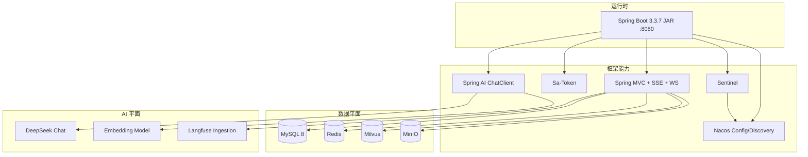

### 3.3 依赖方向（Maven）

```
bootstrap
  ├── interfaces  → application → domain → common
  └── infrastructure → domain → common
```

`interfaces` 额外依赖 `infrastructure`（安全配置、Filter 同进程装配），这是 **单体组装的务实选择**：HTTP 适配仍禁止直接调 Repository，但启动时需要把 Infra 的拦截器注册进 WebMvc。

---

## 4. 总体架构

### 4.1 逻辑全景

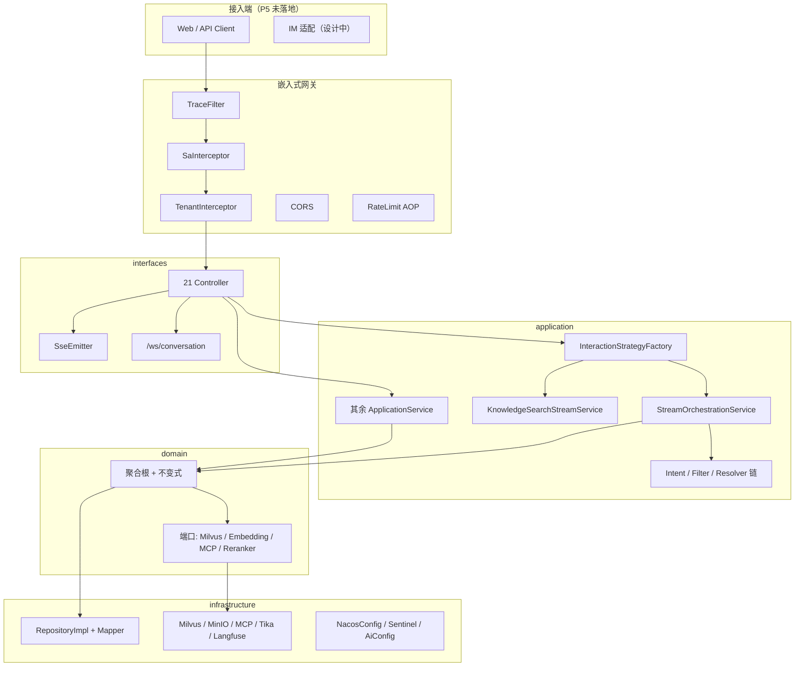

### 4.2 4+1 视图摘要

| 视图 | 关注点 | 本文位置 |
|------|--------|----------|
| 逻辑视图 | DDD 四层 + 限界上下文 | 第 5、8 章 |
| 开发视图 | Maven 六模块与包结构 | 第 5 章 |
| 进程视图 | Filter 链、线程池、异步任务 | 第 6、7 章 |
| 物理视图 | MySQL / Redis / Milvus / MinIO / Nacos | 第 6 章 |
| 场景视图 | 对话、RAG、DAG、审批、评估 | 第 9 章 |

---

## 5. DDD 分层与 Maven 模块

### 5.1 为什么采用六模块而不是单模块

企业 Agent 平台同时包含「身份、对话、知识、工具、安全、评估」多个限界上下文。若全部堆在一个 `src`：

- Controller 极易直接打到 Mapper（已在早期重构中踩过）
- 领域规则散落到 HTTP 层，无法单测
- 替换向量库或 MCP 传输会污染业务代码

因此拆成：

| 模块 | 职责 | 允许依赖 | 禁止 |
|------|------|----------|------|
| **common** | `Result`、异常、`BizAssert`、`PageResponse`、`IdGenerator`、`ProjectConstants` | 无业务 | 业务实体 |
| **domain** | 聚合根、值对象、仓储接口、DomainService、外部端口 | common | 任何上层、任何 SDK |
| **application** | 用例编排、事务、DTO、责任链/策略实现 | domain | interfaces、直接 JDBC |
| **infrastructure** | RepositoryImpl、PO/Mapper、外部适配、Filter/AOP/Config | domain | 业务不变式 |
| **interfaces** | Controller、Request DTO、OpenAPI、WS | application（+ 装配期 infra） | Repository、业务 if-else |
| **bootstrap** | 启动类、`application*.yml`、logback | interfaces + infrastructure | 业务逻辑 |

依赖方向图：

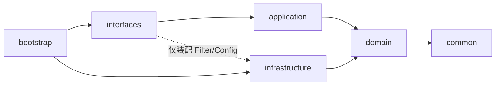

### 5.2 新功能强制开发顺序

```
Domain 建模（实体 + 不变式）
  → Repository 接口（domain）
  → DomainService
  → ApplicationService + DTO
  → Controller + Request 映射
  → Infrastructure RepositoryImpl / Adapter
```

反模式（项目强制禁止）：

- Controller 注入 `*Repository`
- Application `import com.example.agent.interfaces.*`
- 枚举用 `name()` / `valueOf()` 比较（必须 `code` + `fromCode()`）
- Controller 返回 `Result<Map<...>>` 或裸 `List`

### 5.3 各层典型职责对照

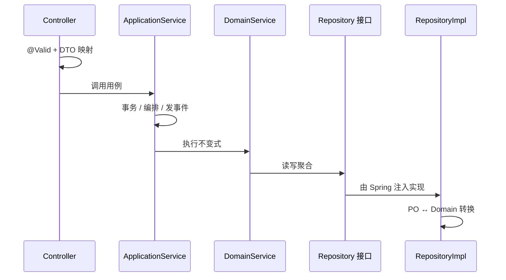

---

## 6. 部署与运行时架构

### 6.1 为什么是「可横向扩展的单体」

当前阶段业务量与团队规模不支撑微服务拆分（对话、RAG、工具各自独立部署会引入分布式事务与 Trace 复杂度）。选择：

- **一个 Spring Boot JAR** 承载全部限界上下文
- 无状态应用（会话在 Redis / Sa-Token，文件在 MinIO，向量在 Milvus）
- 需要扩容时复制 App 实例即可
- 配置与限流规则放 Nacos，避免改代码发版

### 6.2 部署关系图

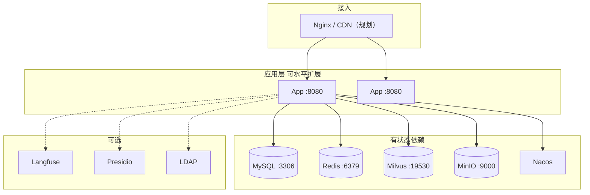

### 6.3 进程内运行时

| 组件 | 配置位置 | 作用 |
|------|----------|------|
| Tomcat | `server.tomcat.*` | HTTP；`max-connections=1000`，优雅停机 |
| `streamExecutor` | `StreamThreadPoolConfig` | SSE 管线异步，避免占用 Tomcat 线程等 LLM |
| `@EnableAsync` | 启动类 | 长期记忆抽取、Langfuse 上报 |
| `DynamicScheduledTaskManager` | 配置治理 01 | 心跳、审批超时、MCP 刷新等可热更新周期 |
| 任务中心 | `t_async_task`（V1.6.0） | 文档解析等耗时任务统一调度 |

### 6.4 启动必需 vs 可选

| 服务 | 必需性 | 不启动的影响 |
|------|--------|----------------|
| MySQL | 必需 | 无法启动业务 |
| Redis | 必需 | 登录 / 会话记忆 / 锁失败 |
| Milvus | RAG 必需 | 对话仍可用，知识检索不可用 |
| MinIO | 上传必需 | 无法落文档原文 |
| Nacos | 强烈建议 | 回落到代码内默认值 |
| Langfuse / Presidio / LDAP | 可选 | 对应能力空操作或 Stub |

---

## 7. 请求处理全链路

### 7.1 为什么 Filter 顺序如此排列

1. **Trace 最先**：无论鉴权成败都要有 `X-Trace-Id`，否则 401 无法排查  
2. **Sa-Token 其次**：未登录请求不进入业务  
3. **Tenant 再次**：登录后才能从 Session 取 `tenantId` 写入 `TenantContext` + MDC  
4. **Controller**：只做 HTTP 适配  
5. **AOP**（限流、审计、分布式锁）：切在应用服务或注解方法上，不阻塞 Filter

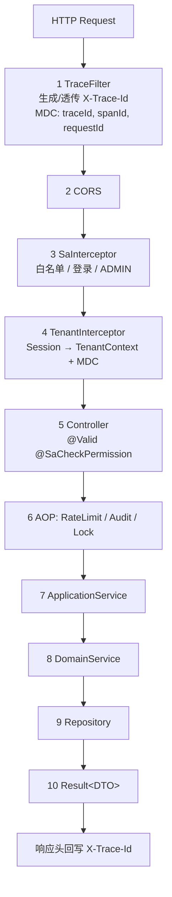

时序：

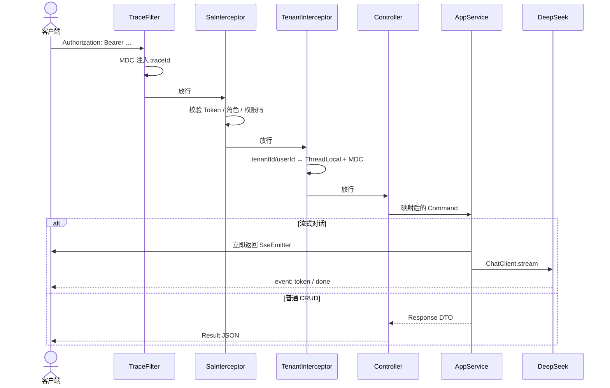

### 7.2 流式请求的线程模型

SSE 不能在 Tomcat 请求线程里阻塞等待 LLM：

```
MessageController.streamChat
  → 创建 SseEmitter（超时 300s）
  → InteractionApplicationService.executeStream
       → streamExecutor.submit(策略.executeStream)
  → 立即把 Emitter 返回给容器
```

异步线程内必须 **重新写入 `TenantContext`**，因为 ThreadLocal 不会自动跨线程。`StreamOrchestrationService` 已处理这一点。

---

## 8. 领域限界上下文与聚合关系

### 8.1 限界上下文地图

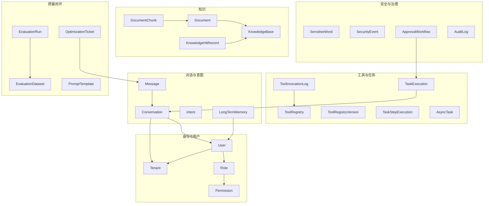

### 8.2 核心聚合职责

| 限界上下文 | 聚合根 / 实体 | 关键不变式 |
|------------|---------------|------------|
| 租户 | `Tenant` | 停用租户不可登录；`isActive()` |
| 用户 | `User` | 角色通过关联表挂载，经 DomainService 分配 |
| 对话 | `Conversation` | `ACTIVE/CLOSED/ARCHIVED` 合法迁移；`canReceiveMessage` |
| 提示词 | `PromptTemplate` | 仅 `PUBLISHED` 可运行时渲染 |
| 任务 | `TaskExecution` | 状态机：PENDING→RUNNING→终态 |
| 知识库 | `KnowledgeBase` | ENABLED 才可检索；删除级联软删 |
| 文档 | `Document` | 解析状态单向前进，FAILED 可重试 |
| 工具 | `ToolRegistry` | MCP 必须有 endpoint；版本快照后才改 |
| 审批 | `ApprovalWorkflow` | 仅 PENDING 可迁出 |
| 评估 | `EvaluationRun` | RUNNING→COMPLETED/FAILED |

---

## 9. 子系统详细分析

每一节统一结构：**解决场景 → 为什么这样设计 → 技术栈 → 如何实现 → 流程图 / 关系图 → 现状边界**。

---

### 9.1 多租户、认证与 RBAC

#### 解决什么场景

- 多个企业共用一套部署，数据不能互看
- 同一租户内管理员 / 运营 / 普通用户权限不同
- OpenAPI、SSE、WebSocket 都要带同一套身份

#### 为什么这样设计

| 决策 | 理由 |
|------|------|
| Sa-Token 而非完整 Spring Security | 权限模型简单（`resource:action`），减少 Filter 链复杂度 |
| `TenantContext` ThreadLocal | 业务代码随处可读租户，避免方法签名层层传 `tenantId` |
| Mapper 手写 `tenant_id` 条件 | SQL 可见、可审查；自动拦截器已写但未注册（见边界） |
| 权限码种子化（约 44+） | 前后端约定稳定，`@SaCheckPermission("kb:read")` 编译期可读 |

#### 技术栈

Sa-Token 1.39（Redis Jackson 会话）、BCrypt、`TenantInterceptor`、MyBatis 显式租户条件。

#### 如何实现

1. `AuthController.login`：校验用户 → `StpUtil.login(userId)` → Session 写入 `tenantId`/`username` → Redis RefreshToken  
2. `SaTokenWebMvcConfig`：`/api/v1/**` 需登录；`/api/v1/admin/**` 需 ADMIN；白名单放行登录/文档/健康检查  
3. `TenantInterceptor`：Session → `TenantContext` + MDC；`afterCompletion` 清理防线程复用泄漏  
4. `StpInterfaceImpl`：从 DB 加载角色码与权限码  
5. Controller 方法级 `@SaCheckPermission`

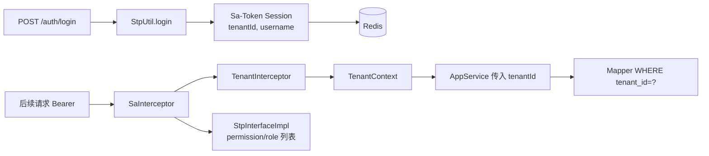

#### 现状边界

- `TenantSqlInterceptor` **已实现未注册**（无 `@Component`），隔离靠各 XML 手写  
- LDAP：`LdapAuthenticationProvider` 为 Stub，默认关闭  
- SSO：仅有 `AuthProviderType.SSO` 枚举，无 OIDC 实现  
- LOCAL 登录走 Controller → `UserService.authenticate`，未走 `AuthenticationProvider` Bean

---

### 9.2 意图识别与对话管理

#### 解决什么场景

- 用户一句话可能是闲聊、查知识、下任务；需要低成本分类  
- 多轮对话要带上下文，但不能每次把全量历史塞给 LLM  
- 需要把「说过的偏好/事实」沉淀为长期记忆  

#### 为什么这样设计

| 决策 | 理由 |
|------|------|
| Rule → Cache → LLM 责任链 | 规则 ~1ms、Redis ~5ms、LLM 百毫秒级；高置信规则直接短路 |
| 规则置信 ≥0.9 才短路 | 0.7–0.9 视为「可疑命中」，交给 LLM 避免关键词误伤 |
| Redis List 做短期记忆 | 与会话绑定、可 trim、TTL 可 Nacos 调 |
| 长期记忆异步抽取 | 不阻塞 SSE 完成事件；对话 ≥4 轮才抽，控制成本 |
| 业务状态用枚举，槽位状态机单独配置 | `ACTIVE/CLOSED` 足够支撑 CRUD；槽位补全用 Spring StateMachine **预留** |

#### 技术栈

责任链、Redis List、Spring AI `ChatClient`、SSE、`@Async`、（可选）Spring StateMachine。

#### 如何实现

**意图链** `IntentRecognitionChain.recognize(tenantId, input)`：

| 层 | 类 | 行为 |
|----|-----|------|
| L1 | `RuleRecognizer` | 租户意图：正则全匹配 confidence=1.0；关键词加权上限 0.9 |
| L2 | `CacheRecognizer` | key `intent:cache:{tenantId}:{hash}` |
| L3 | `LLMRecognizer` | `ChatClient.call()` JSON 分类，成功后回写缓存 |

异常时 `IntentResult.unknown`（fail-open，避免识别故障导致整句对话失败）。

**对话落库** `MessageApplicationService.saveMessage`：MySQL + `SessionMemoryService.appendMessage`。

**长期记忆** `LongTermMemoryService.extractAndSave`：LLM 摘要 → `MemoryExtractorRegistry`（FACT / PREFERENCE / CONTEXT / SUMMARY）→ upsert。

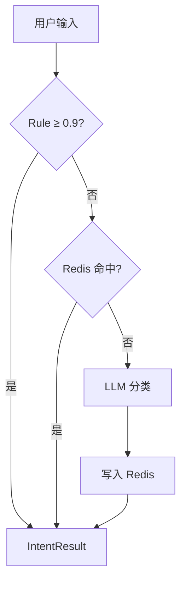

#### 现状边界

- 流式管线里意图结果 **仅打日志，不驱动路由/槽位/审批**  
- `loadUserMemories` / `injectMemoriesIntoPrompt` **存在但未接入 stream Prompt**（只写不读）  
- `ConversationStateMachineConfig` **无 `sendEvent` 业务调用**

---

### 9.3 多模式交互（P7）

#### 解决什么场景

同一条 `stream` API 既要「闲聊」，又要「带引用的知识问答」。若在 Controller 里 `if (mode)` 会迅速膨胀（后续还可能加任务模式、工具模式）。

#### 为什么这样设计

- **策略 + 工厂**：对齐项目里 `ChunkStrategyFactory` 的惯例  
- **开闭原则**：新增模式 = 新枚举 + `@Component` 实现，Controller 不动  
- **对话强制流式**：同步接口对 CONVERSATION 返回 400，避免前端误用阻塞 HTTP  

#### 技术栈

`InteractionStrategy`（Domain 接口）、`InteractionStrategyFactory`（`InitializingBean` 按 priority 注册）、`streamExecutor`。

#### 如何实现

```
POST /api/v1/conversations/messages/stream
  MessageSendRequest.mode
    → InteractionApplicationService.resolveMode   // 空/非法 → CONVERSATION
    → InteractionStrategyFactory.getStrategy
    → executeStream(InteractionContext)
```

| 模式 | 策略 | 同步 | 流式 |
|------|------|------|------|
| `CONVERSATION` | `ConversationInteractionStrategy` | 禁止 | `StreamOrchestrationService` |
| `KNOWLEDGE_SEARCH` | `KnowledgeSearchInteractionStrategy` | `HybridSearchApplicationService` | `KnowledgeSearchStreamService` |

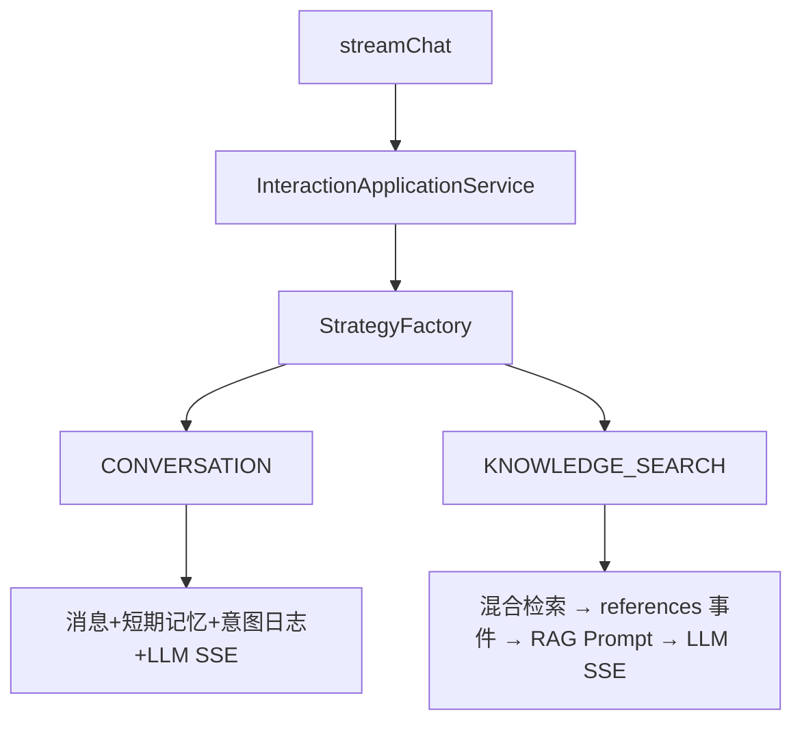

对话流式管线（源码真实步骤）：

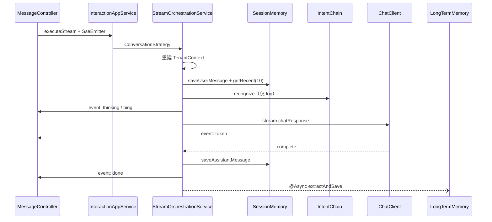

#### 现状边界

安全围栏、工具调用、审批、长期记忆读入 **均未挂到该管线**（见第 13 章）。P7 解决的是「模式可扩展」，不是「Agent 全能力编排完成」。

---

### 9.4 提示词管理与版本控制

#### 解决什么场景

运营需要改系统提示词且可回滚；运行时要把 `{{user_name}}`、会话历史等变量填进去；未发布草稿不能影响线上对话。

#### 为什么这样设计

| 模式 | 落点 | 理由 |
|------|------|------|
| State | `PromptStatus` DRAFT→PUBLISHED→ARCHIVED | 非法状态不可渲染 |
| Memento | `PromptTemplateVersion` | 回滚不丢审计链 |
| Chain of Responsibility | `VariableResolver`（System → Context → Default） | 变量来源多样，按优先级解析 |

#### 技术栈

MySQL 双表、Jackson 序列化 `List<VariableDef>`、`PromptRenderService`。

#### 如何实现

- 发布：版本号 +1，快照 templateText + variables  
- 回滚：先快照当前，再从历史版本恢复  
- 渲染：仅 PUBLISHED；Resolver 链按 priority 排序  

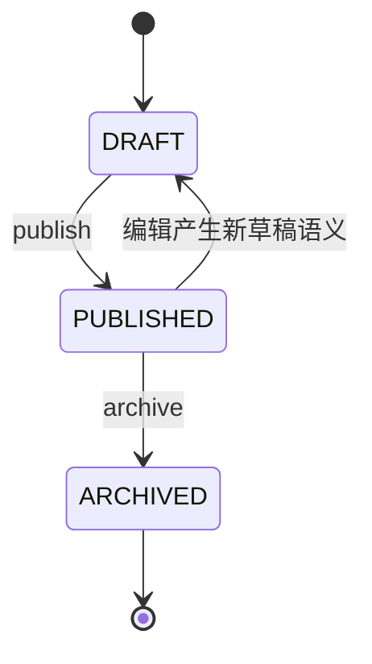

---

### 9.5 任务规划与 DAG 执行

#### 解决什么场景

用户目标不是单轮问答，而是「查订单 → 汇总 → 发邮件」等多步骤，步骤间有依赖，部分可并行，失败要重试，超时要掐断，进度要推到前端。

#### 为什么这样设计

| 决策 | 理由 |
|------|------|
| LLM 规划 + 领域 DAG 校验 | LLM 生成结构，`DagParser` 用 DFS 三色 + Kahn 拓扑保证无环 |
| `ActionHandler` 策略 | 内置动作可插拔，不把 HTTP/SQL 写进执行引擎 |
| 按拓扑层并行 | 同一层无依赖，提高吞吐 |
| 指数退避 + `TimeoutController` | 外部 API 抖动与悬挂 |
| WebSocket 推进度 | 长任务不适合轮询 |

#### 技术栈

`DagParser`、`ActionHandlerRegistry`、`RetryPolicy`、`TimeoutController`、`DagExecutionService`、WebSocket。

#### 如何实现

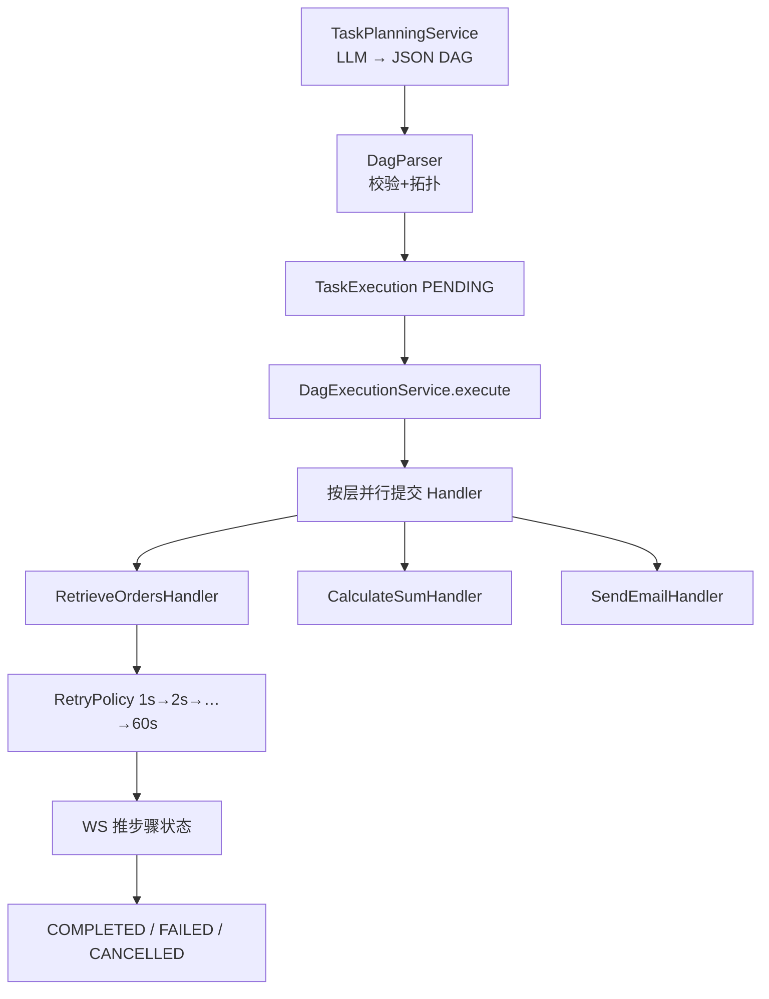

内置 Handler 是 **示例能力**（订单查询 / 求和 / 发邮件），生产动作应继续注册。审批恢复钩子 `resumeExecution` / `cancelExecution` 已存在，但工具侧 `requireApproval` **尚未自动建单**（见 9.9）。

---

### 9.6 RAG 知识库引擎

#### 解决什么场景

企业文档（制度、FAQ、合同、Markdown）要被 Agent 检索；不同文件结构不能用同一切片；专有名词靠关键词、语义靠向量；检索参数要按业务调（医疗高精度 vs 客服低延迟）。

#### 为什么这样设计

| 决策 | 理由 |
|------|------|
| 上传与解析解耦 | 批量上传后择机解析，保护 Embedding 配额 |
| Domain 端口 | 可换向量库/解析器而不改领域 |
| 6 种切片策略 | PDF 段落、MD 标题、FAQ 句子、CSV 定长、无结构递归、语义断点 |
| 向量 + MySQL LIKE + RRF | 无 ES 时仍能混合召回 |
| 四级精度（设计） | 文档 > KB > 策略预设 > Nacos 系统默认 |
| MinIO 存原文 | 弃用可留档；处理中禁止误删 |
| 租户 Collection `kb_{tenantId}` | 向量侧隔离 |

#### 技术栈

Tika、MinIO、Spring AI Embedding、Milvus（COSINE）、RRF、可选 LLM Reranker、任务中心、Redisson 文档互斥锁。

#### 文档管线

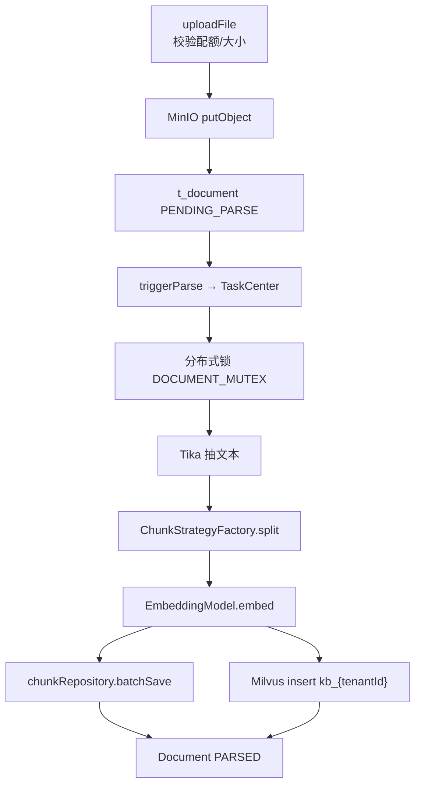

文档状态：

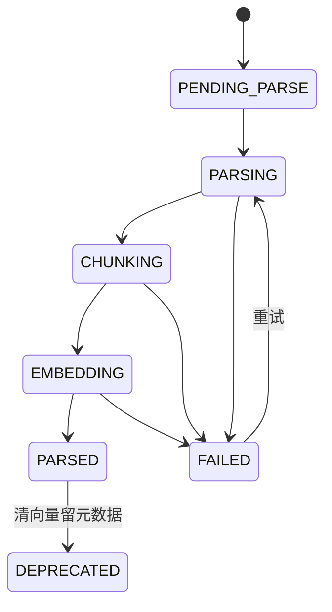

切片策略选择：文档级 → KB 默认 → 文件类型兜底（PDF→paragraph，MD→markdown，CSV→fixed_size，TXT→recursive）。`semantic` 在句数过大或 embedding 失败时降级 paragraph。

#### 检索流程

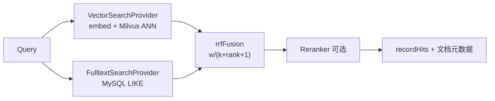

#### 现状边界

- `resolveChunkConfig()` 仍硬编码 `chunk_size=512 / overlap=50`  
- `HybridSearchApplicationService.mergeConfig(null, null, searchConfig, null)`：**未自动合并 KB/文档级 JSON**  
- KB `deleteWithCascade` **可能未清 Milvus**（注入了 Client 但级联路径未调 `deleteByKnowledgeId`）  
- CrossEncoder Reranker 当前为 STUB  

---

### 9.7 MCP 工具平台

#### 解决什么场景

Agent 要调外部系统：有的已提供 MCP Server，有的只有内部 REST。需要统一注册、鉴权头注入、测试调用、版本回滚、故障时自动摘除。

#### 为什么这样设计

| 决策 | 理由 |
|------|------|
| 四类型 MCP/HTTP/BUILTIN/CUSTOM | 覆盖新协议与遗留 HTTP |
| `McpClientManager` 进程内连接池 | 避免每次 call 建连 |
| 心跳失败达阈值 → DISABLED | 防止抖动自动恢复把故障节点拉回 |
| 版本表 Memento | 改 Schema 可回滚 |
| 调用日志 | 审计与排障 |

#### 技术栈

Spring AI MCP `McpSyncClient` + `HttpClientSseClientTransport`、`HttpToolAdapter`（RestClient）、Redis 工具定义缓存、动态定时心跳。

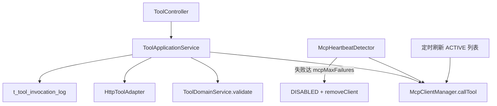

#### 现状边界

BUILTIN/CUSTOM 在线测试拒绝（走 T5 Handler）。高风险 `requireApproval` 字段在实体上，**测试/执行路径未自动进入 T11**。工具 SSE 事件名已在 `SseEventFactory` 预留，对话管线未发。

---

### 9.8 安全围栏

#### 解决什么场景

用户可能做 Prompt Injection、越狱、灌敏感词、超长刷接口；模型输出可能泄漏身份证/手机号。企业需要可运营的词库和安全事件台账。

#### 为什么这样设计

- **输入 4 层责任链**：便宜规则在前（注入/越狱/敏感词/长度）  
- **输出单一脱敏**：先保证 PII，避免过早上复杂过滤器链  
- **过滤器异常 fail-open**：围栏自身故障不应变成全站 500；阻断则 fail-close  
- **WordTree（Aho-Corasick）**：词库规模上来后仍要线性扫描  

#### 技术栈

`InputFilter` 链、Hutool WordTree、正则 PII、可选 Presidio HTTP、Nacos `SecurityConfig`。

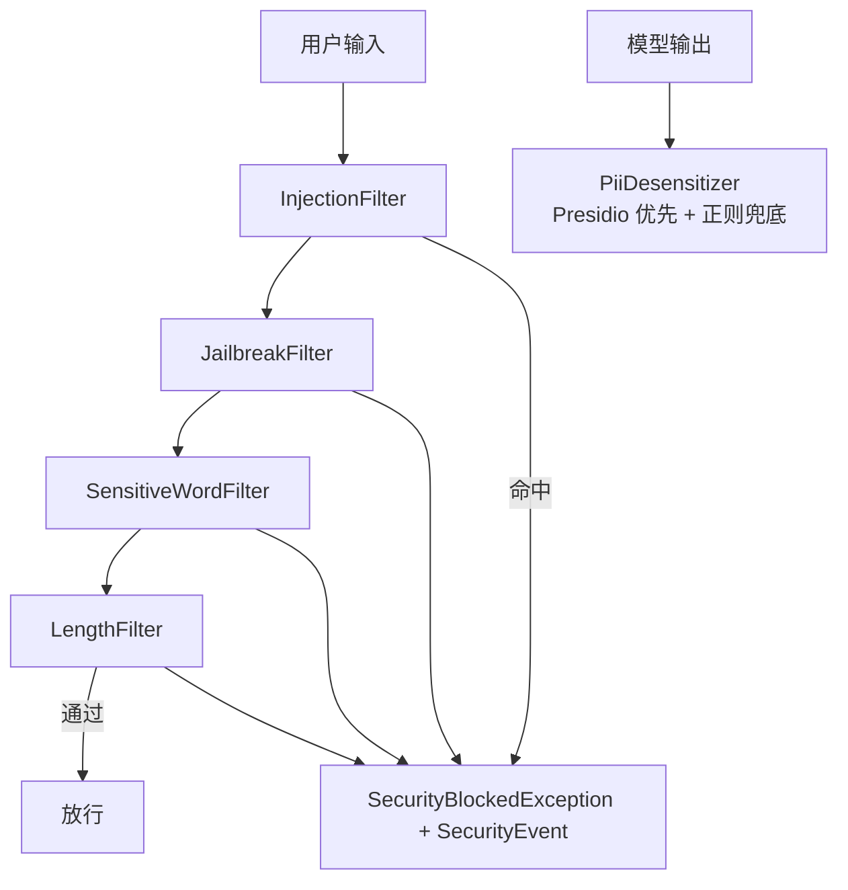

#### 现状边界

`filterInput` / `desensitizeOutput` **未被 `StreamOrchestrationService` 调用**。当前主要经 `SecurityFenceController` 管理词库与查询事件。能力完整，主链路未挂载。

---

### 9.9 人机协同审批

#### 解决什么场景

高风险工具（转账、删数据、对外发信）不能模型说了就算，需要人点通过；超时必须自动拒绝，避免工单悬挂；审批结果要实时推到会话页。

#### 为什么这样设计

领域状态机比 Spring StateMachine 更轻（状态少、持久化就是一张表）。超时用动态定时扫描，间隔可 Nacos 调。WS 推 `APPROVAL_CARD` / `APPROVAL_RESULT`，与聊天 SSE 通道分离，避免两种实时协议搅在一起。

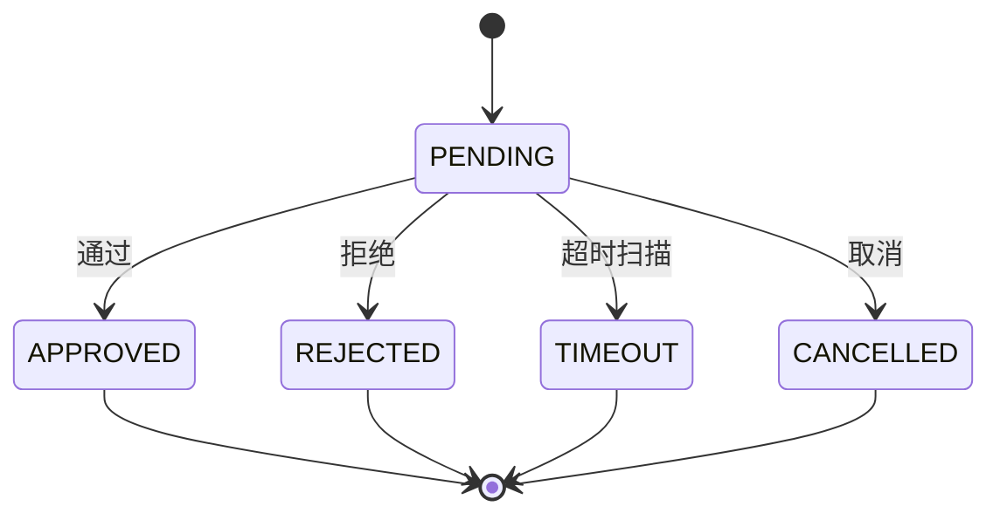

已实现：`createApproval`、超时 Job、`approve` → `DagExecutionService.resumeExecution`、`reject` → `cancelExecution`。  
**未闭合**：无人在工具执行前调用 `createApproval`，也无人调用 `waitForApproval()`。

---

### 9.10 全链路可观测性

#### 解决什么场景

一次对话跨越 HTTP、线程池、Redis、Milvus、LLM。没有 TraceId 无法把日志串起来；没有 Token/耗时指标无法做容量规划；LLM 质量需要独立观测后端。

#### 为什么这样设计

| 决策 | 理由 |
|------|------|
| Filter 注入 MDC | 业务代码零侵入打日志 |
| Micrometer `agent.*` | 对接现成 Prometheus |
| Langfuse HTTP Ingestion 直连 | 官方 Java SDK 0.2.0 过弱；fail-open 空操作 Bean |
| 审计 AOP `@Auditable` | 管理操作留痕，读 MDC traceId |

```mermaid
flowchart LR
    REQ --> TF["TraceFilter"]
    TF --> MDC["MDC traceId/spanId"]
    MDC --> LOG["logback 按天目录"]
    MDC --> AUDIT["AuditLogAspect"]
    APP --> METRICS["AgentMetrics"]
    METRICS --> PROM["/actuator/prometheus"]
    APP --> LF["LangfuseTraceService async"]
```

流式路径已埋点 LLM Timer / Token；Trace 在异步线程需自行保证（TenantContext 已补，MDC 依赖线程池包装或手动传递）。

---

### 9.11 效果评估与持续优化

#### 解决什么场景

上线后要回答「这次改提示词有没有更好」；用户点踩要变成可跟进的工单，而不是沉在日志里。

#### 为什么这样设计

- **离线数据集 + LLM-as-Judge**：用固定题集回归，四维 0–10（准确性/完整性/相关性/幻觉）  
- **领域事件解耦**：点踩发 `MessageFeedbackEvent`，`BadCaseAutoTicketService` 监听后建 `OptimizationTicket`  
- 工单状态 `OPEN → ANALYZING/IN_PROGRESS → RESOLVED → CLOSED`

```mermaid
flowchart TD
    DS["EvaluationDataset"] --> RUN["EvaluationRunService.execute"]
    RUN --> JUDGE["ChatClient Judge JSON"]
    JUDGE --> METRICS["overall + metricsJson"]
    FB["用户 DISLIKE"] --> EVT["MessageFeedbackEvent"]
    EVT --> AUTO["BadCaseAutoTicketService"]
    AUTO --> TKT["OptimizationTicket OPEN"]
    TKT --> OPS["指派 / 解决 / 关闭"]
```

---

### 9.12 配置治理

#### 解决什么场景

调 RAG 的 `topK`、SSE 心跳、审批超时、Sentinel 阈值，不应发版。密钥又绝不能进 Nacos 明文共享给所有开发。

#### 为什么这样设计（三分模型）

| 存放 | 内容 | 变更方式 |
|------|------|----------|
| `application-*.yml` | 数据源、密钥、环境差异 | 发版 / 环境变量 |
| Nacos JSON | 运行时算法参数 | 控制台热更新 |
| `ProjectConstants` | 架构级常数（WS 路径、分页上限） | 编译 |

基类 `NacosConfig<T>`：`@PostConstruct` 拉取 + Listener；失败用代码默认值，保证 Nacos 宕机应用仍能起。

| 子方案 | DataId | 典型参数 |
|--------|--------|----------|
| 01 调度 | `agent-platform-scheduler.json` | MCP 心跳、审批扫描、敏感词刷新 |
| 02 RAG | `agent-platform-rag.json` | ~24 项 TopK/nprobe/RRF/Reranker |
| 03 | `ai-model` / `security` / `session` | 温度、输入长度、记忆 TTL、心跳 |
| 04 | — | `ProjectConstants` 7 内部类 |
| 05 | Sentinel flow/degrade JSON | 限流熔断持久化 |

```mermaid
flowchart TB
    YAML["YAML + Env 密钥"] --> APP["Spring Environment"]
    NACOS["Nacos JSON"] --> NC["NacosConfig Listener"]
    NC --> RAG["RagConfig"]
    NC --> SCH["SchedulerConfig"]
    NC --> AIM["AiModelConfig"]
    NC --> SEC["SecurityConfig"]
    NC --> SES["SessionConfig"]
    PC["ProjectConstants"] --> CODE["编译期引用"]
    SENT["Sentinel NacosDataSource"] --> RULES["Flow / Degrade"]
```

---

## 10. 数据架构

### 10.1 为什么「MySQL + Redis + Milvus + MinIO」四件套

| 存储 | 存什么 | 不存什么 |
|------|--------|----------|
| MySQL | 事务性业务、权限、切片元数据、审计 | 大文件、高维向量 |
| Redis | 会话、Token、短期记忆、缓存、锁 | 权威业务数据 |
| Milvus | embedding + 检索字段 | 用户/权限 |
| MinIO | 文档二进制 | 结构化查询 |

向量与元数据分离：Milvus 负责 ANN，MySQL `t_document_chunk` 负责关键词、软删、命中追溯。删除文档时两边都要处理（弃用路径已清向量）。

### 10.2 核心 ER（简化）

```mermaid
erDiagram
    TENANT ||--o{ USER : has
    USER }o--o{ ROLE : user_role
    ROLE }o--o{ PERMISSION : role_permission
    TENANT ||--o{ CONVERSATION : owns
    CONVERSATION ||--o{ MESSAGE : contains
    USER ||--o{ LONG_TERM_MEMORY : remembers
    TENANT ||--o{ KNOWLEDGE_BASE : owns
    KNOWLEDGE_BASE ||--o{ DOCUMENT : contains
    DOCUMENT ||--o{ DOCUMENT_CHUNK : splits
    TENANT ||--o{ TOOL_REGISTRY : owns
    TOOL_REGISTRY ||--o{ TOOL_VERSION : snapshots
    CONVERSATION ||--o{ TASK_EXECUTION : may_spawn
    TASK_EXECUTION ||--o{ TASK_STEP : contains
    TASK_EXECUTION ||--o| APPROVAL : waits
```

### 10.3 迁移策略

SQL 位于 `docs/database/`，**手动按版本执行**（已移除 Flyway，避免生产自动迁）。版本从 V1.0.0 基线到 V1.7.0 交互权限。新环境必须按序执行，否则权限码/业务 ID/精度字段会缺失。

---

## 11. 横切关注点

### 11.1 Filter / Interceptor / AOP

| 类型 | 组件 | 作用 |
|------|------|------|
| Filter | `TraceFilter` | TraceId，最高优先级 |
| MVC | `SaInterceptor` | 登录与角色 |
| MVC | `TenantInterceptor` | 租户上下文 |
| WS | `WebSocketAuthInterceptor` | 握手带 Bearer 或 `?token=` |
| AOP | `RateLimitAspect` | 租户维度 Sentinel |
| AOP | `AuditLogAspect` | `@Auditable` |
| AOP | `DistributeLockAspect` | 文档管线互斥 |
| AOP | `ScheduledTaskMdcAspect` | 定时任务补 MDC |
| MyBatis | `TenantSqlInterceptor` | **未注册** |

### 11.2 统一响应与异常

- 成功：`Result<T>`（code/message/data）  
- 业务：`BusinessException` 等，经 `GlobalExceptionHandler`  
- 安全阻断：`SecurityBlockedException`  
- 应用层 catch 后必须 re-throw（禁止吞异常），审计/WS/埋点可 fail-open  

### 11.3 ID 与枚举

- 业务 ID：`IdGenerator` 前缀 + 雪花，与自增主键并存（对外暴露业务 ID）  
- 枚举：`code` + `desc` + `fromCode()`，PO 存 code  

---

## 12. 设计模式地图

```mermaid
mindmap
  root((Agent Platform))
    策略
      InteractionStrategy
      ChunkStrategy
      ActionHandler
      Reranker
      VariableResolver
    责任链
      IntentRecognitionChain
      InputFilter
    工厂
      StrategyFactory
      SseEventFactory
      IntentResult 工厂方法
    模板方法
      DocumentPipelineOrchestrator
      NacosConfig
      RetryPolicy
    备忘录
      Prompt 版本
      Tool 版本
    状态
      DocumentStatus
      ApprovalStatus
      PromptStatus
    观察者
      SSE Reactor
      Spring Event 点踩
      WS 推送
    外观
      各 ApplicationService
```

这些模式不是为了「堆模式」，而是为了：**贵操作可短路、新类型可注册、状态不可非法跳、外部系统可替换**。

---

## 13. 设计意图 vs 落地缺口

下表是对照源码的架构诚实清单，便于排期，而不是否定已完成工作。

| 能力 | 模块完整度 | 是否挂上对话主链路 | 说明 |
|------|:----------:|:------------------:|------|
| 多租户上下文 + RBAC | 高 | 是 | SQL 自动拦截未启用 |
| 双模式 streamChat | 高 | 是 | 模式靠请求字段，不靠意图 |
| 意图 3 层链 | 高 | 识别是 / 消费否 | 只 log |
| 短期记忆读写 | 高 | 是 | Redis List 最近 10 条 |
| 长期记忆 | 高 | 只写 | Prompt 未注入 |
| 提示词版本 | 高 | 管理面是 | 流式管线未强制走已发布模板 |
| DAG 引擎 | 高 | 独立 API | 未由对话意图触发 |
| RAG 管线 + 混合检索 | 高 | `KNOWLEDGE_SEARCH` 是 | 精度四级未完全接线 |
| MCP/HTTP 工具 | 高 | 否 | 测试 API 可用 |
| 安全 4 层 + PII | 高 | 否 | 管理 API 可用 |
| 审批状态机 | 高 | 否 | 恢复钩子已在 DAG |
| Trace/Metrics/Langfuse | 高 | 部分 | 流式已有指标 |
| Judge + BadCase | 高 | 事件可用 | 依赖反馈入口 |
| StateMachine 槽位 | 仅配置 | 否 | 无驱动代码 |
| LDAP/SSO | Stub/枚举 | 否 | |
| P5 前端 | 0 | — | |

主链路当前形态（精简 Agent）：

```text
鉴权 → 模式策略 → 存消息 → 短期记忆 → （意图旁路）→ LLM SSE → 异步抽记忆
                     ↘ KNOWLEDGE_SEARCH：混合检索 + 引用事件
```

目标形态（完整 Agent，尚未接线）：

```text
鉴权 → 围栏输入 → 意图路由 → 状态机槽位
     → RAG/工具/DAG（高风险则审批）→ 围栏输出 → 记忆读写 → SSE/WS
```

---

## 14. 演进建议

按「对主路径风险/收益」排序：

1. **流式管线挂载 `filterInput` / `desensitizeOutput`** — 安全能力已存在，接线成本低  
2. **消费 `IntentResult`** — 至少用于模式建议、高风险标记  
3. **Prompt 注入长期记忆** — `injectMemoriesIntoPrompt` 已写  
4. **工具 `requireApproval` → `createApproval` + DAG wait** — 闭环 T11  
5. **检索路径调用 `mergeConfig` 加载 KB JSON** — 精度治理才生效  
6. **注册或删除 `TenantSqlInterceptor`** — 避免「以为有自动隔离」  
7. **P5 前端** — SSE 事件协议（token/thinking/references/done/ping）已稳定，可并行  

运维侧（不阻塞架构演进，但阻塞生产）：Grafana、OTel、日志聚合、Docker/K8s、MinIO/Presidio 实装。

---

## 15. 相关文档索引

| 文档 | 用途 |
|------|------|
| 本文 `docs/Agent平台架构设计文档.md` | 架构分析总入口 |
| `docs/Agent平台架构设计图.md` | 4+1 / 部署 / 安全 / MCP 图集 |
| `docs/Agent平台技术方案流程图.md` | 11 张流程/时序 |
| `docs/企业级Agent平台技术方案.md` | 早期技术方案汇总 |
| `docs/project-memory/11-DDD架构强制约束.md` | 分层铁律 |
| `docs/开发进度.md` | 功能完成度 |
| `docs/database/` | DDL 与种子数据 |
| `docs/P0-基础底座/` ~ `docs/P7-多模式交互/` | 子方案细节 |

---

**维护约定**：架构发生模块增减、主链路接线变化、或技术栈大版本变更时，应同步更新本文第 3、9、13 章，并在 `docs/project-memory/` 追加一次架构决策快照。
