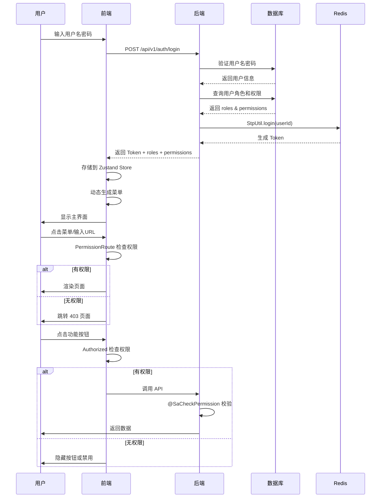

# 前后端权限对应技术方案

> 版本: 1.0.0 | 生效日期: 2026-06-21  
> 目标: 实现前端权限控制与后端 RBAC 权限体系的无缝对接

---

## 一、后端权限体系架构

### 1.1 权限模型（RBAC）

```
用户 (User) → 角色 (Role) → 权限 (Permission)
```

**数据库表结构**:
```sql
-- 用户表
t_user (user_id, username, tenant_id, status, ...)

-- 角色表
t_role (id, role_code, role_name, tenant_id, ...)

-- 权限表
t_permission (id, permission_code, resource, action, description, ...)

-- 用户-角色关联表
t_user_role (user_id, role_id)

-- 角色-权限关联表
t_role_permission (role_id, permission_id)
```

### 1.2 后端鉴权机制

**技术栈**: Sa-Token + Spring Boot

**核心组件**:

1. **StpInterfaceImpl** - Sa-Token 权限接口实现
   ```java
   @Component
   public class StpInterfaceImpl implements StpInterface {
       // 获取用户权限列表
       List<String> getPermissionList(Object loginId, String loginType)
       
       // 获取用户角色列表
       List<String> getRoleList(Object loginId, String loginType)
   }
   ```

2. **@SaCheckPermission** - 方法级权限注解
   ```java
   @PostMapping("/users")
   @SaCheckPermission("user:read")
   public Result<List<UserResponse>> list() { ... }
   ```

3. **@SaCheckRole** - 方法级角色注解
   ```java
   @PostMapping("/tenants")
   @SaCheckRole("TENANT_ADMIN")
   public Result<TenantResponse> create() { ... }
   ```

### 1.3 权限编码规范

**格式**: `{resource}:{action}`

| 资源 (resource) | 操作 (action) | 权限编码示例 | 说明 |
|----------------|--------------|-------------|------|
| user | read | `user:read` | 查看用户列表 |
| user | write | `user:write` | 创建/编辑/删除用户 |
| conversation | read | `conversation:read` | 查看会话 |
| conversation | send | `conversation:send` | 发送消息 |
| conversation | create | `conversation:create` | 创建会话 |
| conversation | update | `conversation:update` | 更新会话 |
| conversation | delete | `conversation:delete` | 删除会话 |
| knowledge | read | `knowledge:read` | 查看知识库 |
| knowledge | create | `knowledge:create` | 创建知识库 |
| knowledge | update | `knowledge:update` | 编辑知识库 |
| knowledge | delete | `knowledge:delete` | 删除知识库 |
| knowledge | search | `knowledge:search` | 知识检索 |
| tool | read | `tool:read` | 查看工具 |
| tool | create | `tool:create` | 注册工具 |
| tool | update | `tool:update` | 编辑工具 |
| tool | execute | `tool:execute` | 执行工具 |
| task | read | `task:read` | 查看任务 |
| task | create | `task:create` | 创建任务 |
| task | execute | `task:execute` | 执行任务 |
| prompt | read | `prompt:read` | 查看提示词 |
| prompt | write | `prompt:write` | 管理提示词 |
| approval | read | `approval:read` | 查看审批 |
| approval | approve | `approval:approve` | 审批工单 |
| security | read | `security:read` | 查看安全配置 |
| security | write | `security:write` | 管理安全配置 |
| optimization | read | `optimization:read` | 查看优化工单 |
| optimization | write | `optimization:write` | 管理优化工单 |
| evaluation | read | `evaluation:read` | 查看评测数据 |
| evaluation | write | `evaluation:write` | 管理评测数据 |
| tenant | admin | `tenant:admin` | 租户管理员 |

**角色编码示例**:
- `SUPER_ADMIN` - 超级管理员（拥有所有权限）
- `TENANT_ADMIN` - 租户管理员
- `OPERATOR` - 操作员
- `VIEWER` - 只读用户

### 1.4 API 端点权限映射总览

> 📋 来源: [[前端架构设计方案]] §5.1 + [[Web聊天界面技术方案]] §8 + [[审批卡片交互技术方案]] §6 + [[用户反馈技术方案]] §4

| 模块 | API 端点 | 方法 | 所需权限 | 说明 |
|------|------|:--:|------|------|
| **认证** | `/api/v1/auth/login` | POST | 公开 | 用户登录 |
| | `/api/v1/auth/me` | GET | 登录 | 获取当前用户信息+权限 |
| | `/api/v1/auth/refresh` | POST | 登录 | 刷新 Token |
| | `/api/v1/auth/logout` | POST | 登录 | 登出 |
| **会话** | `/api/v1/conversations` | GET | `conversation:read` | 会话列表 |
| | `/api/v1/conversations` | POST | `conversation:create` | 创建会话 |
| | `/api/v1/conversations/{id}` | GET | `conversation:read` | 会话详情 |
| | `/api/v1/conversations/{id}/title` | PATCH | `conversation:update` | 修改标题 |
| | `/api/v1/conversations/{id}` | DELETE | `conversation:delete` | 删除会话 |
| **消息** | `/api/v1/conversations/{id}/messages` | POST | `conversation:send` | 发送消息 |
| | `/api/v1/conversations/{id}/messages` | GET | `conversation:read` | 历史消息 |
| | `/api/v1/conversations/{id}/stream` | POST | `conversation:send` | SSE 流式对话 |
| | `/api/v1/conversations/{id}/messages/{msgId}/feedback` | PATCH | `conversation:send` | 提交消息反馈 |
| **审批** | `/api/v1/approvals` | GET | `approval:read` | 审批列表 |
| | `/api/v1/approvals/{id}` | GET | `approval:read` | 审批详情 |
| | `/api/v1/approvals/{id}/approve` | POST | `approval:approve` | 同意审批 |
| | `/api/v1/approvals/{id}/reject` | POST | `approval:approve` | 拒绝审批 |
| | `/api/v1/approvals/stats` | GET | `approval:read` | 审批统计 |
| **反馈统计** | `/api/v1/feedback/stats` | GET | `optimization:read` | 反馈聚合统计 |
| **知识库** | `/api/v1/knowledge-bases` | GET | `knowledge:read` | 知识库列表 |
| | `/api/v1/knowledge-bases` | POST | `knowledge:create` | 创建知识库 |
| | `/api/v1/knowledge/search` | POST | `knowledge:search` | 知识检索 |
| **工具** | `/api/v1/tools` | GET | `tool:read` | 工具列表 |
| | `/api/v1/tools/{id}/execute` | POST | `tool:execute` | 执行工具 |
| **任务** | `/api/v1/tasks` | GET | `task:read` | 任务列表 |
| | `/api/v1/tasks` | POST | `task:create` | 创建任务 |
| | `/api/v1/tasks/{id}/execute` | POST | `task:execute` | 执行任务 |
| **提示词** | `/api/v1/prompts` | GET | `prompt:read` | 提示词列表 |
| | `/api/v1/prompts` | POST | `prompt:write` | 创建提示词 |
| **用户** | `/api/v1/users` | GET | `user:read` | 用户列表 |
| | `/api/v1/users` | POST | `user:write` | 创建用户 |
| **租户** | `/api/v1/tenants` | GET/POST | `tenant:admin` | 租户管理 |
| **安全** | `/api/v1/security/sensitive-words` | GET | `security:read` | 敏感词列表 |
| | `/api/v1/security/sensitive-words` | POST | `security:write` | 添加敏感词 |
| **优化** | `/api/v1/optimization-tickets` | GET | `optimization:read` | 工单列表 |
| | `/api/v1/optimization-tickets` | POST | `optimization:write` | 创建工单 |
| **评测** | `/api/v1/evaluation/datasets` | GET | `evaluation:read` | 数据集列表 |
| | `/api/v1/evaluation/runs` | POST | `evaluation:write` | 执行评测 |

> ⚠️ 反馈提交复用 `conversation:send` 权限（与发送消息相同），反馈统计需 `optimization:read` 权限。

---

## 二、前端权限对接方案

### 2.1 登录流程与权限加载

#### 步骤1: 用户登录

```typescript
// src/services/auth.ts
import { apiClient } from './apiClient';
import { useAuthStore } from '@/stores/useAuthStore';
import { usePermissionStore } from '@/stores/usePermissionStore';

export interface LoginRequest {
  username: string;
  password: string;
  tenantId: number;
  provider?: string; // LOCAL | LDAP | SSO
}

export interface LoginResponse {
  token: string;           // Sa-Token AccessToken
  refreshToken: string;    // RefreshToken
  user?: UserInfo;         // 可选：直接返回用户信息
}

export interface UserInfo {
  userId: string;
  username: string;
  tenantId: number;
  roles: string[];         // 角色列表
  permissions: string[];   // 权限列表
}

export const authService = {
  /**
   * 用户登录
   * 后端接口: POST /api/v1/auth/login
   */
  async login(request: LoginRequest): Promise<LoginResponse> {
    const response = await apiClient.post<LoginResponse>(
      '/api/v1/auth/login', 
      request
    );

    // 存储 Token
    useAuthStore.getState().setToken(response.token);
    useAuthStore.getState().setRefreshToken(response.refreshToken);
    
    // 如果后端直接返回了用户信息和权限
    if (response.user) {
      usePermissionStore.getState().setPermissions(response.user.permissions);
      usePermissionStore.getState().setRoles(response.user.roles);
    } else {
      // 否则单独获取用户信息和权限
      await this.loadUserInfo();
    }
    
    return response;
  },

  /**
   * 获取当前用户信息和权限
   * 后端接口: GET /api/v1/auth/me
   */
  async loadUserInfo(): Promise<UserInfo> {
    const userInfo = await apiClient.get<UserInfo>('/api/v1/auth/me');
    
    // 注意：需要在后端 /me 接口中返回 roles 和 permissions
    // 如果后端未返回，需要新增接口获取
    usePermissionStore.getState().setPermissions(userInfo.permissions || []);
    usePermissionStore.getState().setRoles(userInfo.roles || []);
    
    return userInfo;
  },

  /**
   * 刷新 Token
   * 后端接口: POST /api/v1/auth/refresh
   */
  async refreshToken(): Promise<string> {
    const refreshToken = useAuthStore.getState().refreshToken;
    const userId = useAuthStore.getState().userId;
    
    const response = await apiClient.post<{ token: string; refreshToken: string }>(
      '/api/v1/auth/refresh',
      { userId, refreshToken }
    );
    
    useAuthStore.getState().setToken(response.token);
    useAuthStore.getState().setRefreshToken(response.refreshToken);
    
    // 重新加载权限（确保权限变更后及时同步）
    await this.loadUserInfo();
    
    return response.token;
  },

  /**
   * 登出
   * 后端接口: POST /api/v1/auth/logout
   */
  async logout() {
    try {
      await apiClient.post('/api/v1/auth/logout');
    } finally {
      useAuthStore.getState().logout();
      usePermissionStore.getState().clearPermissions();
    }
  },
};
```

#### 步骤2: 后端改造（如需）

如果后端 `/api/v1/auth/me` 接口未返回权限和角色，需要改造：

```java
// AuthController.java
@GetMapping("/me")
@Operation(summary = "获取当前用户信息")
public Result<UserInfo> currentUser() {
    String userId = (String) StpUtil.getLoginId();
    String username = StpUtil.getSession().getString("username");
    Long tenantId = StpUtil.getSession().getLong("tenantId");
    
    // 从数据库查询用户的角色和权限
    List<String> roles = roleService.getRoleCodes(userId);
    List<String> permissions = permissionService.getPermissionCodes(userId);
    
    UserInfo userInfo = new UserInfo(userId, username, tenantId);
    userInfo.setRoles(roles);
    userInfo.setPermissions(permissions);
    
    return Result.ok(userInfo);
}
```

或者新增专门获取权限的接口：

```java
@GetMapping("/permissions")
@Operation(summary = "获取当前用户权限列表")
public Result<UserPermissionInfo> getUserPermissions() {
    String userId = (String) StpUtil.getLoginId();
    
    List<String> roles = roleService.getRoleCodes(userId);
    List<String> permissions = permissionService.getPermissionCodes(userId);
    
    return Result.ok(new UserPermissionInfo(roles, permissions));
}
```

---

### 2.2 权限状态管理（Zustand）

```typescript
// src/stores/usePermissionStore.ts
import { create } from 'zustand';
import { persist } from 'zustand/middleware';

interface PermissionStore {
  // 权限列表
  permissions: string[];
  
  // 角色列表
  roles: string[];
  
  // 设置权限
  setPermissions: (permissions: string[]) => void;
  
  // 设置角色
  setRoles: (roles: string[]) => void;
  
  // 检查是否有某个权限
  hasPermission: (permission: string) => boolean;
  
  // 检查是否有某个角色
  hasRole: (role: string) => boolean;
  
  // 检查是否有任一权限
  hasAnyPermission: (permissions: string[]) => boolean;
  
  // 检查是否有所有权限
  hasAllPermissions: (permissions: string[]) => boolean;
  
  // 清空权限
  clearPermissions: () => void;
}

export const usePermissionStore = create<PermissionStore>()(
  persist(
    (set, get) => ({
      permissions: [],
      roles: [],
      
      setPermissions: (permissions) => {
        console.log('[Permission] 权限已更新:', permissions);
        set({ permissions });
      },
      
      setRoles: (roles) => {
        console.log('[Permission] 角色已更新:', roles);
        set({ roles });
      },
      
      hasPermission: (permission) => {
        const { permissions, roles } = get();
        
        // 超级管理员拥有所有权限
        if (roles.includes('SUPER_ADMIN')) {
          return true;
        }
        
        // 检查具体权限
        return permissions.includes(permission);
      },
      
      hasRole: (role) => {
        return get().roles.includes(role);
      },
      
      hasAnyPermission: (permissions) => {
        const { roles } = get();
        
        // 超级管理员拥有所有权限
        if (roles.includes('SUPER_ADMIN')) {
          return true;
        }
        
        // 检查是否有任一权限
        return permissions.some(p => get().permissions.includes(p));
      },
      
      hasAllPermissions: (permissions) => {
        const { roles } = get();
        
        // 超级管理员拥有所有权限
        if (roles.includes('SUPER_ADMIN')) {
          return true;
        }
        
        // 检查是否有所有权限
        return permissions.every(p => get().permissions.includes(p));
      },
      
      clearPermissions: () => {
        console.log('[Permission] 权限已清空');
        set({ permissions: [], roles: [] });
      },
    }),
    {
      name: 'agent-platform-permission', // localStorage key
      // 可选：只持久化部分字段
      // partialize: (state) => ({ permissions: state.permissions, roles: state.roles }),
    }
  )
);
```

---

### 2.3 路由级权限控制

```typescript
// src/router/PermissionRoute.tsx
import { Navigate, useLocation } from 'react-router-dom';
import { usePermissionStore } from '@/stores/usePermissionStore';
import { useAuthStore } from '@/stores/useAuthStore';

interface PermissionRouteProps {
  children: React.ReactNode;
  
  // 单个权限
  requiredPermission?: string;
  
  // 多个权限（满足其一即可）
  requiredPermissions?: string[];
  
  // 是否需要满足所有权限
  requireAll?: boolean;
  
  // 角色要求
  requiredRole?: string;
  requiredRoles?: string[];
}

export function PermissionRoute({ 
  children, 
  requiredPermission,
  requiredPermissions = [],
  requireAll = false,
  requiredRole,
  requiredRoles = []
}: PermissionRouteProps) {
  const location = useLocation();
  const isAuthenticated = useAuthStore(state => state.isAuthenticated);
  
  const hasAccess = usePermissionStore(state => {
    // 未登录直接返回 false
    if (!isAuthenticated) return false;
    
    // 检查角色
    if (requiredRole && !state.hasRole(requiredRole)) {
      return false;
    }
    
    if (requiredRoles.length > 0) {
      const hasRequiredRole = requiredRoles.some(role => state.hasRole(role));
      if (!hasRequiredRole) return false;
    }
    
    // 检查单个权限
    if (requiredPermission && !state.hasPermission(requiredPermission)) {
      return false;
    }
    
    // 检查多个权限
    if (requiredPermissions.length > 0) {
      if (requireAll) {
        // 需要满足所有权限
        if (!state.hasAllPermissions(requiredPermissions)) {
          return false;
        }
      } else {
        // 满足任一权限即可
        if (!state.hasAnyPermission(requiredPermissions)) {
          return false;
        }
      }
    }
    
    return true;
  });

  if (!isAuthenticated) {
    // 未登录，跳转到登录页，并记录原始路径
    return <Navigate to="/login" state={{ from: location }} replace />;
  }

  if (!hasAccess) {
    // 已登录但无权限，跳转到 403 页面
    return <Navigate to="/403" replace />;
  }

  return <>{children}</>;
}
```

**路由配置示例**:

```typescript
// src/config/routes.tsx
import { PermissionRoute } from '@/router/PermissionRoute';

export const routes = [
  {
    path: '/chat',
    element: (
      <PermissionRoute requiredPermission="conversation:read">
        <ChatPage />
      </PermissionRoute>
    ),
  },
  {
    path: '/knowledge',
    element: (
      <PermissionRoute requiredPermission="knowledge:read">
        <KBListPage />
      </PermissionRoute>
    ),
  },
  {
    path: '/tools',
    element: (
      <PermissionRoute requiredPermission="tool:read">
        <ToolListPage />
      </PermissionRoute>
    ),
  },
  {
    path: '/tasks',
    element: (
      <PermissionRoute requiredPermission="task:read">
        <TaskPlanPage />
      </PermissionRoute>
    ),
  },
  {
    path: '/prompts',
    element: (
      <PermissionRoute requiredPermission="prompt:read">
        <PromptListPage />
      </PermissionRoute>
    ),
  },
  {
    path: '/approvals',
    element: (
      <PermissionRoute requiredPermission="approval:read">
        <ApprovalListPage />
      </PermissionRoute>
    ),
  },
  {
    path: '/users',
    element: (
      <PermissionRoute requiredPermission="user:read">
        <UserListPage />
      </PermissionRoute>
    ),
  },
  {
    path: '/security',
    element: (
      <PermissionRoute requiredPermission="security:read">
        <SensitiveWords />
      </PermissionRoute>
    ),
  },
  {
    path: '/optimization',
    element: (
      <PermissionRoute requiredPermission="optimization:read">
        <TicketListPage />
      </PermissionRoute>
    ),
  },
  {
    path: '/evaluation',
    element: (
      <PermissionRoute requiredPermission="evaluation:read">
        <DatasetListPage />
      </PermissionRoute>
    ),
  },
  {
    path: '/tenants',
    element: (
      // 仅租户管理员可访问
      <PermissionRoute requiredRole="TENANT_ADMIN">
        <TenantListPage />
      </PermissionRoute>
    ),
  },
];
```

---

### 2.4 动态菜单生成

```typescript
// src/components/Layout/Sidebar.tsx
import { Menu } from 'antd';
import type { MenuProps } from 'antd';
import { 
  MessageOutlined, 
  BookOutlined, 
  ToolOutlined, 
  ProjectOutlined,
  FileTextOutlined,
  CheckCircleOutlined,
  UserOutlined,
  ShieldOutlined,
  TrophyOutlined,
  BarChartOutlined,
  ApartmentOutlined
} from '@ant-design/icons';
import { usePermissionStore } from '@/stores/usePermissionStore';
import { useNavigate, useLocation } from 'react-router-dom';

// 定义菜单配置（包含权限要求）
interface MenuItemConfig {
  key: string;
  label: string;
  icon: React.ReactNode;
  permission?: string;      // 需要的权限
  role?: string;            // 需要的角色
  children?: MenuItemConfig[];
}

const menuConfig: MenuItemConfig[] = [
  {
    key: '/chat',
    label: '智能对话',
    icon: <MessageOutlined />,
    permission: 'conversation:read',
  },
  {
    key: '/knowledge',
    label: '知识库',
    icon: <BookOutlined />,
    permission: 'knowledge:read',
  },
  {
    key: '/tools',
    label: '工具平台',
    icon: <ToolOutlined />,
    permission: 'tool:read',
  },
  {
    key: '/tasks',
    label: '任务管理',
    icon: <ProjectOutlined />,
    permission: 'task:read',
  },
  {
    key: '/prompts',
    label: '提示词管理',
    icon: <FileTextOutlined />,
    permission: 'prompt:read',
  },
  {
    key: '/approvals',
    label: '审批中心',
    icon: <CheckCircleOutlined />,
    permission: 'approval:read',
  },
  {
    key: '/users',
    label: '用户管理',
    icon: <UserOutlined />,
    permission: 'user:read',
  },
  {
    key: '/security',
    label: '安全围栏',
    icon: <ShieldOutlined />,
    permission: 'security:read',
  },
  {
    key: '/optimization',
    label: '优化闭环',
    icon: <TrophyOutlined />,
    permission: 'optimization:read',
  },
  {
    key: '/evaluation',
    label: '效果评估',
    icon: <BarChartOutlined />,
    permission: 'evaluation:read',
  },
  {
    key: '/tenants',
    label: '租户管理',
    icon: <ApartmentOutlined />,
    role: 'TENANT_ADMIN',
  },
];

export function Sidebar() {
  const navigate = useNavigate();
  const location = useLocation();
  const hasPermission = usePermissionStore(state => state.hasPermission);
  const hasRole = usePermissionStore(state => state.hasRole);

  // 根据权限过滤菜单
  const filterMenus = (menus: MenuItemConfig[]): MenuProps['items'] => {
    return menus
      .filter(item => {
        // 如果有权限要求，检查权限
        if (item.permission && !hasPermission(item.permission)) {
          return false;
        }
        
        // 如果有角色要求，检查角色
        if (item.role && !hasRole(item.role)) {
          return false;
        }
        
        return true;
      })
      .map(item => ({
        key: item.key,
        icon: item.icon,
        label: item.label,
        children: item.children ? filterMenus(item.children) : undefined,
      }));
  };

  const menuItems = filterMenus(menuConfig);

  return (
    <Menu
      mode="inline"
      selectedKeys={[location.pathname]}
      items={menuItems}
      onClick={({ key }) => navigate(key)}
    />
  );
}
```

---

### 2.5 组件级权限控制

#### 方案1: 自定义 Hook

```typescript
// src/hooks/usePermission.ts
import { usePermissionStore } from '@/stores/usePermissionStore';

/**
 * 检查是否有某个权限
 */
export function usePermission(permission: string): boolean {
  return usePermissionStore(state => state.hasPermission(permission));
}

/**
 * 检查是否有某个角色
 */
export function useRole(role: string): boolean {
  return usePermissionStore(state => state.hasRole(role));
}

/**
 * 检查是否有任一权限
 */
export function useAnyPermission(permissions: string[]): boolean {
  return usePermissionStore(state => state.hasAnyPermission(permissions));
}

/**
 * 检查是否有所有权限
 */
export function useAllPermissions(permissions: string[]): boolean {
  return usePermissionStore(state => state.hasAllPermissions(permissions));
}
```

**使用示例**:

```tsx
import { usePermission } from '@/hooks/usePermission';

function UserListPage() {
  const canCreate = usePermission('user:write');
  const canDelete = usePermission('user:write');
  
  return (
    <div>
      <h1>用户列表</h1>
      
      {canCreate && (
        <Button type="primary" onClick={handleCreate}>
          创建用户
        </Button>
      )}
      
      {/* ... */}
    </div>
  );
}
```

#### 方案2: 权限组件

```tsx
// src/components/Authorized/Authorized.tsx
import { usePermissionStore } from '@/stores/usePermissionStore';

interface AuthorizedProps {
  // 权限要求
  permission?: string;
  permissions?: string[];
  requireAll?: boolean;
  
  // 角色要求
  role?: string;
  roles?: string[];
  
  // 子组件
  children: React.ReactNode;
  
  // 无权限时的替代内容
  fallback?: React.ReactNode;
}

export function Authorized({
  permission,
  permissions = [],
  requireAll = false,
  role,
  roles = [],
  children,
  fallback = null
}: AuthorizedProps) {
  const hasAccess = usePermissionStore(state => {
    // 检查角色
    if (role && !state.hasRole(role)) return false;
    if (roles.length > 0 && !roles.some(r => state.hasRole(r))) return false;
    
    // 检查权限
    if (permission && !state.hasPermission(permission)) return false;
    if (permissions.length > 0) {
      if (requireAll) {
        if (!state.hasAllPermissions(permissions)) return false;
      } else {
        if (!state.hasAnyPermission(permissions)) return false;
      }
    }
    
    return true;
  });

  return hasAccess ? <>{children}</> : <>{fallback}</>;
}
```

**使用示例**:

```tsx
import { Authorized } from '@/components/Authorized/Authorized';

function KnowledgeBasePage() {
  return (
    <div>
      <h1>知识库管理</h1>
      
      <Authorized permission="knowledge:create">
        <Button type="primary">新建知识库</Button>
      </Authorized>
      
      <Authorized permissions={['knowledge:update', 'knowledge:delete']}>
        <Dropdown menu={...}>
          <Button>更多操作</Button>
        </Dropdown>
      </Authorized>
    </div>
  );
}
```

#### 方案3: 授权按钮（Ant Design 集成）

```tsx
// src/components/Authorized/AuthorizedButton.tsx
import { Button, ButtonProps } from 'antd';
import { usePermissionStore } from '@/stores/usePermissionStore';

interface AuthorizedButtonProps extends ButtonProps {
  permission?: string;
  permissions?: string[];
  requireAll?: boolean;
  role?: string;
}

export function AuthorizedButton({
  permission,
  permissions = [],
  requireAll = false,
  role,
  children,
  ...props
}: AuthorizedButtonProps) {
  const hasAccess = usePermissionStore(state => {
    if (role && !state.hasRole(role)) return false;
    if (permission && !state.hasPermission(permission)) return false;
    if (permissions.length > 0) {
      if (requireAll) {
        return state.hasAllPermissions(permissions);
      } else {
        return state.hasAnyPermission(permissions);
      }
    }
    return true;
  });

  if (!hasAccess) {
    return null;
  }

  return <Button {...props}>{children}</Button>;
}
```

**使用示例**:

```tsx
<AuthorizedButton 
  permission="user:write" 
  type="primary"
  onClick={handleCreate}
>
  创建用户
</AuthorizedButton>

<AuthorizedButton 
  role="TENANT_ADMIN"
  danger
  onClick={handleDelete}
>
  删除租户
</AuthorizedButton>
```

---

## 三、完整权限流程

### 3.1 时序图



### 3.2 权限同步策略

| 场景 | 触发时机 | 操作 |
|------|---------|------|
| **登录** | 登录成功 | 从后端获取权限并存储 |
| **Token 刷新** | AccessToken 过期 | 重新获取权限（确保权限变更及时同步） |
| **手动刷新** | 用户点击刷新按钮 | 调用 `/api/v1/auth/me` 重新加载 |
| **权限变更** | 管理员修改角色/权限 | 强制用户下线，重新登录 |

**后端权限变更处理**:

```java
// RoleController.java
@PostMapping("/{id}/users")
@SaCheckPermission("user:write")
public Result<Void> assignRoleToUser(@PathVariable Long id, 
                                      @RequestBody AssignRoleToUserRequest request) {
    roleService.assignRoleToUser(id, request);
    
    // 权限变更后强制用户下线（清除 Session）
    StpUtil.kickout(request.getUserId());
    
    return Result.ok();
}
```

---

## 四、特殊场景处理

### 4.1 超级管理员

超级管理员拥有所有权限，无需逐个检查：

```typescript
// 在 usePermissionStore 中已实现
hasPermission: (permission) => {
  const { permissions, roles } = get();
  
  // 超级管理员拥有所有权限
  if (roles.includes('SUPER_ADMIN')) {
    return true;
  }
  
  return permissions.includes(permission);
}
```

### 4.2 租户隔离

除了权限控制，还需要租户隔离：

```typescript
// src/stores/useAuthStore.ts
import { create } from 'zustand';

interface AuthStore {
  token: string;
  refreshToken: string;
  userId: string;
  tenantId: number;
  
  setToken: (token: string) => void;
  setRefreshToken: (refreshToken: string) => void;
  setUserId: (userId: string) => void;
  setTenantId: (tenantId: number) => void;
  logout: () => void;
  isAuthenticated: boolean;
}

export const useAuthStore = create<AuthStore>((set) => ({
  token: '',
  refreshToken: '',
  userId: '',
  tenantId: 0,
  
  setToken: (token) => set({ token }),
  setRefreshToken: (refreshToken) => set({ refreshToken }),
  setUserId: (userId) => set({ userId }),
  setTenantId: (tenantId) => set({ tenantId }),
  
  logout: () => set({ 
    token: '', 
    refreshToken: '', 
    userId: '', 
    tenantId: 0 
  }),
  
  get isAuthenticated() {
    return !!this.token;
  },
}));
```

**API 请求自动携带租户 ID**:

```typescript
// src/services/apiClient.ts
this.instance.interceptors.request.use((config) => {
  const token = useAuthStore.getState().token;
  const tenantId = useAuthStore.getState().tenantId;
  
  if (token) {
    config.headers.Authorization = `Bearer ${token}`;
  }
  
  // 可选：在 Header 中携带租户 ID
  if (tenantId) {
    config.headers['X-Tenant-Id'] = tenantId.toString();
  }
  
  return config;
});
```

### 4.3 权限缓存与更新

**问题**: 权限存储在 localStorage，如何确保权限变更后及时更新？

**解决方案**:

1. **Token 刷新时同步权限**（推荐）
   ```typescript
   async refreshToken() {
     const response = await apiClient.post('/api/v1/auth/refresh', {...});
     
     // 重新加载权限
     await this.loadUserInfo();
     
     return response.token;
   }
   ```

2. **定期轮询**（可选）
   ```typescript
   // 每 5 分钟检查一次权限是否变更
   useEffect(() => {
     const interval = setInterval(() => {
       authService.loadUserInfo();
     }, 5 * 60 * 1000);
     
     return () => clearInterval(interval);
   }, []);
   ```

3. **WebSocket 推送**（高级）
   ```typescript
   // 后端通过 WebSocket 推送权限变更通知
   ws.onmessage = (event) => {
     const message = JSON.parse(event.data);
     
     if (message.type === 'permission_changed') {
       // 重新加载权限
       authService.loadUserInfo();
       
       // 提示用户
       notification.info({
         message: '权限已更新',
         description: '您的权限已发生变更，页面将刷新',
       });
       
       // 可选：刷新页面
       window.location.reload();
     }
   };
   ```

### 4.4 IM 渠道安全鉴权

> 📋 来源: [[IM接入适配技术方案]] §9

IM 渠道（企业微信/钉钉）的回调接口不经过 RBAC 权限体系，而是使用平台级签名验证：

```java
// ImCallbackController.java — IM 回调使用签名验证，不走 Sa-Token
@PostMapping("/callback/{channel}")
public String handleCallback(
        @PathVariable String channel,
        @RequestParam("msg_signature") String signature,
        @RequestParam("timestamp") String timestamp,
        @RequestParam("nonce") String nonce,
        @RequestBody String body) {

    ChannelType channelType = ChannelType.valueOf(channel.toUpperCase());
    var adapter = adapterRegistry.getAdapter(channelType);

    // 1. 签名验证（SHA1/HmacSHA256，各平台不同）
    if (!adapter.verifySignature(signature, timestamp, nonce, body)) {
        log.warn("[IM] 签名验证失败: channel={}", channel);
        return "fail";
    }

    // 2. 消息解密（企微 AES-256-CBC）
    String plainText = adapter.decrypt(body);

    // 3. 异步处理（快速响应 IM 服务器，避免 5s 超时）
    imMessageService.handleMessageAsync(adapter.convert(plainText));

    return "success";
}
```

**IM 安全层级**:

| 安全层 | 企微 | 钉钉 | 说明 |
|--------|:--:|:--:|------|
| **传输加密** | AES-256-CBC | HTTPS | 消息体加解密 |
| **签名验证** | SHA1(sort(token,timestamp,nonce,body)) | HmacSHA256 | 防伪造回调 |
| **Token 缓存** | Redis TTL 7200s | Redis TTL 7200s | access_token 不落盘 |
| **限流保护** | Sentinel QPS 限流 | Sentinel QPS 限流 | 防恶意刷量 |
| **日志脱敏** | 消息内容脱敏 | 消息内容脱敏 | 不记录敏感信息 |

> ⚠️ IM 回调接口是**公开端点**（IM 平台主动推送），不校验 RBAC 权限。安全性完全依赖平台级签名验证 + 消息解密 + 限流。内部用户绑定（channelUserId → internalUserId）在 `ImMessageApplicationService` 中完成。

### 4.5 权限同步策略补充 — WebSocket 实时推送

> 📋 来源: [[Web聊天界面技术方案]] §4.2

除 Token 刷新和定期轮询外，后端可通过 WebSocket 主动推送权限变更通知：

```typescript
// WebSocket 消息处理
ws.onmessage = (event) => {
  const message = JSON.parse(event.data);

  if (message.type === 'permission_changed') {
    // 重新加载权限
    authService.loadUserInfo();

    // 提示用户
    notification.info({
      message: '权限已更新',
      description: '您的权限已发生变更，请刷新页面',
    });

    // 强制刷新页面以确保所有组件使用新权限
    window.location.reload();
  }
};
```

**完整权限同步策略（更新）**:

| 场景 | 触发时机 | 操作 | 延迟 |
|------|---------|------|:--:|
| **登录** | 登录成功 | 从后端获取权限并存储 | 即时 |
| **Token 刷新** | AccessToken 过期 | 重新获取权限 | 即时 |
| **WebSocket 推送** | 管理员修改角色/权限 | 强制刷新页面 | ~1s |
| **手动刷新** | 用户点击刷新按钮 | 调用 `/api/v1/auth/me` | 即时 |
| **定时轮询**（可选） | 每 5 分钟 | 静默更新权限 | ≤5min |

---

---

## 五、测试与调试

### 5.1 权限测试清单

| 测试项 | 测试方法 | 预期结果 |
|--------|---------|---------|
| 未登录访问受保护路由 | 直接输入 URL | 跳转到登录页 |
| 登录后访问无权限路由 | 用低权限账号访问 | 跳转到 403 页面 |
| 菜单动态显示 | 登录不同角色账号 | 只显示有权限的菜单 |
| 按钮权限控制 | 检查按钮是否显示 | 无权限时隐藏或禁用 |
| API 权限校验 | 调用无权限的 API | 后端返回 403 |
| Token 刷新后权限同步 | 修改权限后刷新 Token | 权限及时更新 |
| 超级管理员权限 | 用 SUPER_ADMIN 登录 | 可访问所有页面 |

### 5.2 调试工具

**浏览器控制台查看权限**:

```javascript
// 在 Console 中执行
console.log('Permissions:', JSON.parse(localStorage.getItem('agent-platform-permission')).state.permissions);
console.log('Roles:', JSON.parse(localStorage.getItem('agent-platform-permission')).state.roles);
```

**React DevTools 查看 Store**:

安装 Redux DevTools Extension，Zustand 支持集成。

---

## 六、最佳实践

### ✅ 推荐做法

1. **最小权限原则**: 只授予用户完成工作所需的最小权限
2. **前后端双重校验**: 前端控制用户体验，后端保证数据安全
3. **权限集中管理**: 所有权限逻辑通过 Store 统一管理
4. **权限变更及时同步**: Token 刷新时重新加载权限
5. **清晰的权限命名**: 使用 `{resource}:{action}` 格式
6. **角色分组**: 将常用权限组合成角色
7. **日志记录**: 记录权限检查和变更日志

### ❌ 避免做法

1. ❌ 不要在前端硬编码权限判断逻辑
2. ❌ 不要依赖前端隐藏作为唯一的安全措施
3. ❌ 不要在 URL 中传递敏感权限参数
4. ❌ 不要将权限信息暴露给无权限的用户
5. ❌ 不要忘记清理登出后的权限缓存

---

## 七、总结

本方案实现了：

1. ✅ **完整的 RBAC 模型**: 用户 → 角色 → 权限
2. ✅ **前后端权限对齐**: 前端权限标识与后端完全一致
3. ✅ **三层权限控制**: 路由级、菜单级、组件级
4. ✅ **实时权限同步**: Token 刷新时自动更新权限
5. ✅ **灵活的权限检查**: 支持单个、多个、全部权限检查
6. ✅ **超级管理员特权**: 自动拥有所有权限
7. ✅ **租户隔离**: 结合租户 ID 实现数据隔离

通过这套方案，可以确保：
- 用户只能访问有权限的页面和功能
- 权限变更后及时生效
- 前后端权限校验一致
- 系统安全可靠
