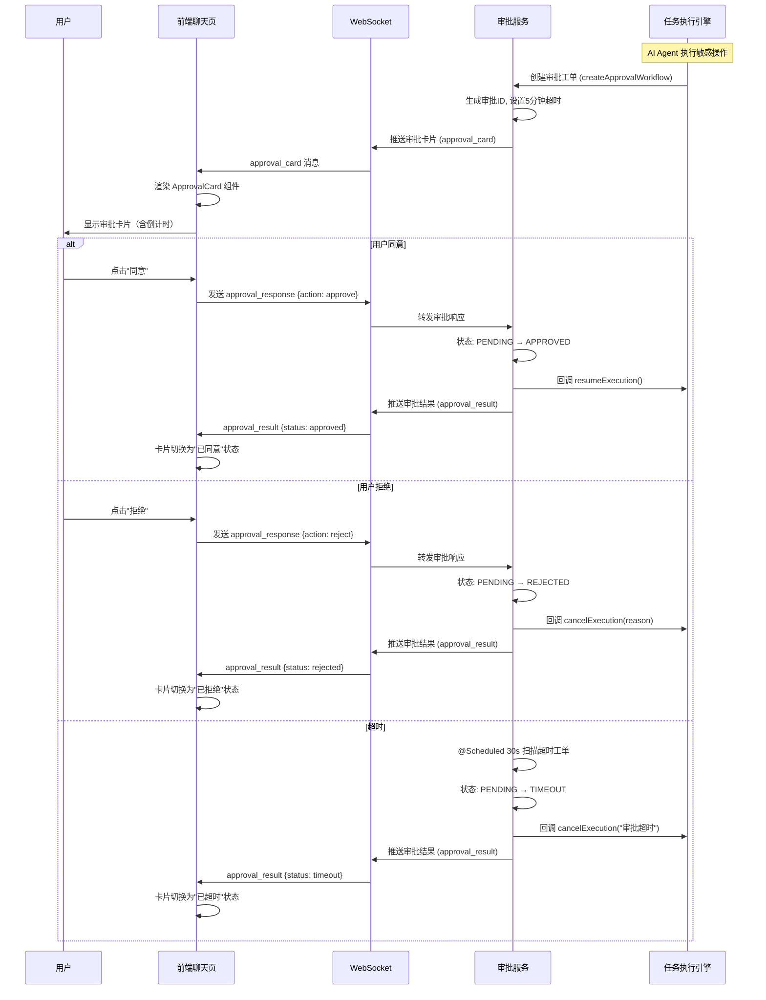

# 审批卡片交互技术方案

> 版本: 1.0.0 | 生效日期: 2026-06-21 | 所属: P5-交互端 / P3-T11 人机协同审批  
> 关联文档: [[前端架构设计方案]] | [[Web聊天界面技术方案]] | [[前后端权限对应技术方案]]

---

## 一、概述

在人机协同场景中，AI Agent 执行敏感操作（如删除用户、修改权限、调用高危工具）前需要人工审批。审批卡片作为自定义消息类型嵌入聊天流中，提供实时的审批交互能力。

**核心能力**:
- 审批卡片内嵌在消息列表中，与普通对话无缝衔接
- 支持同意/拒绝操作，5 分钟超时自动拒绝
- WebSocket 实时推送审批状态变更
- 高风险操作红色边框警示
- 与 T5 任务执行引擎联动，审批结果回调 DAG 执行器

---

## 二、消息格式

### 2.1 审批卡片消息（服务端 → 客户端）

```json
{
  "type": "approval_card",
  "payload": {
    "approvalId": "wf_a1b2c3d4",
    "executionId": "exec_12345",
    "title": "删除用户账号",
    "detail": "即将删除用户 [张三] (ID: user_789) 及其关联的所有会话、知识和权限数据。此操作不可恢复。",
    "riskLevel": "high",
    "requestedBy": "AI-Agent (Task: 批量清理过期用户)",
    "options": ["同意", "拒绝"],
    "timeoutAt": "2026-06-21T12:05:00+08:00",
    "timeoutSeconds": 300,
    "createdAt": "2026-06-21T12:00:00+08:00",
    "metadata": {
      "toolName": "delete_user",
      "toolParams": { "userId": "user_789" },
      "affectedResources": ["user_789", "conv_456", "kb_123"]
    }
  }
}
```

### 2.2 审批响应消息（客户端 → 服务端）

```json
{
  "type": "approval_response",
  "payload": {
    "approvalId": "wf_a1b2c3d4",
    "action": "approve",
    "comment": "确认删除该用户",
    "timestamp": 1750500300000
  }
}
```

### 2.3 审批结果通知（服务端 → 客户端）

```json
{
  "type": "approval_result",
  "payload": {
    "approvalId": "wf_a1b2c3d4",
    "status": "approved",
    "approvedBy": "admin_user",
    "approvedAt": "2026-06-21T12:02:00+08:00",
    "comment": "确认删除该用户",
    "executionResult": {
      "status": "resumed",
      "nextStep": "执行删除操作"
    }
  }
}
```

---

## 三、风险等级定义

| 等级 | 标识 | 边框颜色 | 触发条件示例 |
|:--:|------|:--:|------|
| **low** | 低风险 | `#52c41a` 绿色 | 查看数据、查询操作 |
| **medium** | 中风险 | `#faad14` 黄色 | 修改配置、更新元数据 |
| **high** | 高风险 | `#ff4d4f` 红色 | 删除资源、修改权限 |
| **critical** | 严重 | `#ff4d4f` 红色 + 闪烁 | 批量删除、销毁租户 |

```typescript
// src/types/approval.d.ts
type RiskLevel = 'low' | 'medium' | 'high' | 'critical';

interface RiskConfig {
  level: RiskLevel;
  label: string;
  color: string;
  icon: React.ReactNode;
  animated: boolean;
}

const RISK_CONFIG: Record<RiskLevel, RiskConfig> = {
  low: {
    level: 'low',
    label: '低风险',
    color: '#52c41a',
    icon: <InfoCircleOutlined />,
    animated: false,
  },
  medium: {
    level: 'medium',
    label: '中风险',
    color: '#faad14',
    icon: <WarningOutlined />,
    animated: false,
  },
  high: {
    level: 'high',
    label: '高风险',
    color: '#ff4d4f',
    icon: <CloseCircleOutlined />,
    animated: false,
  },
  critical: {
    level: 'critical',
    label: '严重',
    color: '#ff4d4f',
    icon: <AlertOutlined />,
    animated: true,  // 边框闪烁
  },
};
```

---

## 四、前端组件设计

### 4.1 ApprovalCard 组件

```tsx
// src/components/ApprovalCard/ApprovalCard.tsx
import { useState, useEffect, useCallback } from 'react';
import { Card, Button, Space, Typography, Tag, Tooltip, Progress, message } from 'antd';
import {
  CheckOutlined, CloseOutlined, ClockCircleOutlined,
  ExclamationCircleOutlined
} from '@ant-design/icons';
import { useWebSocket } from '@/hooks/useWebSocket';
import type { ApprovalMessage } from '@/types/message';
import { RISK_CONFIG, type RiskLevel } from '@/types/approval';

const { Text, Paragraph } = Typography;

interface Props {
  message: ApprovalMessage;
}

export function ApprovalCard({ message }: Props) {
  const [remaining, setRemaining] = useState(message.timeout);
  const [status, setStatus] = useState<'pending' | 'approved' | 'rejected' | 'timeout'>('pending');
  const [submitting, setSubmitting] = useState(false);
  const { send, isConnected } = useWebSocket({});

  const riskConfig = RISK_CONFIG[message.riskLevel];

  // 倒计时
  useEffect(() => {
    if (status !== 'pending') return;

    const timer = setInterval(() => {
      setRemaining(prev => {
        if (prev <= 1) {
          setStatus('timeout');
          clearInterval(timer);
          return 0;
        }
        return prev - 1;
      });
    }, 1000);

    return () => clearInterval(timer);
  }, [status]);

  // 提交审批
  const handleAction = useCallback((action: 'approve' | 'reject') => {
    setSubmitting(true);
    
    send({
      type: 'approval_response',
      payload: {
        approvalId: message.approvalId,
        action,
        timestamp: Date.now(),
      },
    });

    // 乐观更新 UI
    setStatus(action === 'approve' ? 'approved' : 'rejected');

    // 3 秒后未收到确认则回滚
    setTimeout(() => {
      setSubmitting(false);
    }, 3000);
  }, [message.approvalId, send]);

  const formatTime = (seconds: number): string => {
    const m = Math.floor(seconds / 60);
    const s = seconds % 60;
    return `${m}:${s.toString().padStart(2, '0')}`;
  };

  // 已处理的审批卡片
  if (status !== 'pending') {
    return (
      <Card
        size="small"
        style={{
          borderColor: status === 'approved' ? '#52c41a' : '#ff4d4f',
          opacity: 0.7,
        }}
      >
        <Space direction="vertical" style={{ width: '100%' }}>
          <Space>
            <Tag color={riskConfig.color}>{riskConfig.label}</Tag>
            <Text strong>{message.title}</Text>
            <Tag color={status === 'approved' ? 'green' : 'red'}>
              {status === 'approved' ? '✅ 已同意' : status === 'rejected' ? '❌ 已拒绝' : '⏰ 已超时'}
            </Tag>
          </Space>
          <Paragraph type="secondary" ellipsis={{ rows: 2 }}>
            {message.detail}
          </Paragraph>
        </Space>
      </Card>
    );
  }

  // 超时倒计时进度
  const progressPercent = (remaining / message.timeout) * 100;

  return (
    <Card
      size="small"
      className={riskConfig.animated ? 'card-critical-animated' : ''}
      style={{
        borderColor: riskConfig.color,
        borderWidth: 2,
        maxWidth: 480,
      }}
      title={
        <Space>
          {riskConfig.icon}
          <Tag color={riskConfig.color}>{riskConfig.label}</Tag>
          <Text strong>{message.title}</Text>
        </Space>
      }
      extra={
        <Tooltip title={`剩余 ${formatTime(remaining)}`}>
          <Space>
            <ClockCircleOutlined style={{ color: remaining < 60 ? '#ff4d4f' : '#faad14' }} />
            <Text type={remaining < 60 ? 'danger' : 'secondary'}>
              {formatTime(remaining)}
            </Text>
          </Space>
        </Tooltip>
      }
    >
      <Space direction="vertical" style={{ width: '100%' }}>
        {/* 倒计时进度条 */}
        <Progress
          percent={progressPercent}
          showInfo={false}
          strokeColor={remaining < 60 ? '#ff4d4f' : riskConfig.color}
          size="small"
        />

        {/* 业务详情 */}
        <Paragraph type="secondary">
          {message.detail}
        </Paragraph>

        {/* 影响范围 */}
        {message.metadata?.affectedResources && (
          <Text type="secondary" style={{ fontSize: 12 }}>
            影响资源: {message.metadata.affectedResources.join(', ')}
          </Text>
        )}

        {/* 操作按钮 */}
        <Space style={{ marginTop: 8 }}>
          <Button
            type="primary"
            icon={<CheckOutlined />}
            loading={submitting}
            onClick={() => handleAction('approve')}
            disabled={!isConnected}
          >
            同意
          </Button>
          <Button
            danger
            icon={<CloseOutlined />}
            loading={submitting}
            onClick={() => handleAction('reject')}
            disabled={!isConnected}
          >
            拒绝
          </Button>
          {!isConnected && (
            <Text type="danger" style={{ fontSize: 12 }}>
              连接已断开，无法提交审批
            </Text>
          )}
        </Space>
      </Space>
    </Card>
  );
}
```

### 4.2 关键 CSS 动画

```less
// 严重风险级别闪烁边框
@keyframes critical-border-blink {
  0%, 100% { border-color: #ff4d4f; box-shadow: 0 0 8px rgba(255, 77, 79, 0.3); }
  50% { border-color: #ff7875; box-shadow: 0 0 16px rgba(255, 77, 79, 0.6); }
}

.card-critical-animated {
  animation: critical-border-blink 1.5s ease-in-out infinite;
}
```

---

## 五、交互流程

### 5.1 完整时序图



### 5.2 断线重连处理

```typescript
// 重连后主动拉取待审批工单
useEffect(() => {
  if (isConnected) {
    // 恢复时拉取所有 PENDING 状态的审批
    approvalService.listPending().then(pendingApprovals => {
      pendingApprovals.forEach(approval => {
        useChatStore.getState().upsertApprovalMessage(approval);
      });
    });
  }
}, [isConnected]);
```

---

## 六、后端 API 接口

### 6.1 审批管理接口（T11 已实现）

| 方法 | 路径 | 权限 | 说明 |
|------|------|------|------|
| GET | `/api/v1/approvals` | `approval:read` | 审批列表（支持 filter: my-pending/my-resolved/by-status） |
| GET | `/api/v1/approvals/{id}` | `approval:read` | 审批详情（含 remainingSeconds） |
| POST | `/api/v1/approvals/{id}/approve` | `approval:approve` | 同意审批 |
| POST | `/api/v1/approvals/{id}/reject` | `approval:approve` | 拒绝审批 |
| GET | `/api/v1/approvals/stats` | `approval:read` | 审批统计 |

### 6.1.1 前端类型定义

```typescript
// src/types/approval.d.ts

/** 审批工单 — 对应后端 ApprovalWorkflowResponse */
interface ApprovalWorkflow {
  approvalId: string;                     // 审批业务 ID
  tenantId: number;                       // 所属租户 ID
  toolId: string;                         // 关联工具 ID
  conversationId: string;                 // 关联会话 ID
  executionId: string;                    // 关联任务执行 ID
  requesterId: string;                    // 请求人 ID
  approverId: string;                     // 审批人 ID
  title: string;                          // 审批标题
  operationDetail: string;                // 操作内容详情（JSON 字符串）
  status: 'PENDING' | 'APPROVED' | 'REJECTED' | 'TIMEOUT' | 'CANCELLED';
  statusLabel: string;                    // 状态中文标签
  approveComment?: string;                // 审批意见
  timeoutAt: string;                      // 超时时间（ISO 8601）
  approvedAt?: string;                    // 审批完成时间（ISO 8601）
  expired: boolean;                       // 是否已超时
  remainingSeconds: number;               // 剩余时间（秒）
  createdAt: string;                      // 创建时间（ISO 8601）
  updatedAt: string;                      // 更新时间（ISO 8601）
}

/** 审批统计 */
interface ApprovalStats {
  pendingCount: number;                   // 待审批数
  approvedCount: number;                  // 已通过数
  rejectedCount: number;                  // 已拒绝数
  timeoutCount: number;                   // 已超时数
  totalCount: number;                     // 总数
}
```

### 6.2 前端 Service 层

```typescript
// src/services/approvals.ts
import { apiClient } from './apiClient';
import { API_PREFIX } from '@/config/constants';
import type { ApprovalWorkflow, ApprovalStats } from '@/types/approval';

export const approvalService = {
  // 审批列表
  list: (filter: string = 'my-pending', page: number = 0, size: number = 20) =>
    apiClient.get<PageResponse<ApprovalWorkflow>>(`${API_PREFIX}/approvals`, {
      params: { filter, page, size },
    }),

  // 审批详情（含剩余时间）
  getById: (id: string) =>
    apiClient.get<ApprovalWorkflow>(`${API_PREFIX}/approvals/${id}`),

  // 同意审批
  approve: (id: string, comment?: string) =>
    apiClient.post(`${API_PREFIX}/approvals/${id}/approve`, { comment }),

  // 拒绝审批
  reject: (id: string, comment?: string) =>
    apiClient.post(`${API_PREFIX}/approvals/${id}/reject`, { comment }),

  // 获取待审批列表（断线重连用）
  listPending: () =>
    apiClient.get<ApprovalWorkflow[]>(`${API_PREFIX}/approvals`, {
      params: { filter: 'my-pending', size: 100 },
    }),

  // 审批统计
  getStats: () =>
    apiClient.get<ApprovalStats>(`${API_PREFIX}/approvals/stats`),
};
```

---

## 七、审批中心页面

除聊天内嵌卡片外，还提供独立的审批中心页面：

```
┌──────────────────────────────────────────────────────────────┐
│  审批中心                                                     │
│  [⏳ 待审批 3] [✅ 已审批 12] [❌ 已拒绝 5]                 │
├──────────────────────────────────────────────────────────────┤
│  ┌─────────────────────────────────────────────────────────┐ │
│  │ 🔴 高风险 | 删除用户账号                                 │ │
│  │ 请求人: AI-Agent (Task: 批量清理过期用户)               │ │
│  │ 详情: 即将删除用户 [张三] 及其关联数据，不可恢复         │ │
│  │ 影响资源: user_789, conv_456, kb_123                     │ │
│  │ ⏱ 剩余 3分45秒                                          │ │
│  │ [✅ 同意] [❌ 拒绝]                                     │ │
│  └─────────────────────────────────────────────────────────┘ │
│  ┌─────────────────────────────────────────────────────────┐ │
│  │ 🟡 中风险 | 修改知识库切片策略                           │ │
│  │ ...                                                     │ │
│  └─────────────────────────────────────────────────────────┘ │
└──────────────────────────────────────────────────────────────┘
```

```tsx
// src/pages/Approvals/ApprovalListPage.tsx
import { useQuery, useMutation } from '@tanstack/react-query';
import { Table, Tag, Button, Space, message, Tabs } from 'antd';
import { approvalService } from '@/services/approvals';
import { useWebSocket } from '@/hooks/useWebSocket';
import { useNavigate } from 'react-router-dom';

export function ApprovalListPage() {
  const [filter, setFilter] = useState('my-pending');
  const navigate = useNavigate();

  const { data, refetch, isLoading } = useQuery({
    queryKey: ['approvals', filter],
    queryFn: () => approvalService.list(filter),
  });

  // WebSocket 实时刷新
  useWebSocket({
    onMessage: (msg) => {
      if (msg.type === 'approval_card' || msg.type === 'approval_result') {
        refetch();
      }
    },
  });

  const approveMutation = useMutation({
    mutationFn: (id: string) => approvalService.approve(id),
    onSuccess: () => {
      message.success('审批已通过');
      refetch();
    },
  });

  const rejectMutation = useMutation({
    mutationFn: (id: string) => approvalService.reject(id),
    onSuccess: () => {
      message.success('已拒绝');
      refetch();
    },
  });

  const columns = [
    { title: '风险等级', dataIndex: 'riskLevel', render: (level: RiskLevel) => (
      <Tag color={RISK_CONFIG[level].color}>{RISK_CONFIG[level].label}</Tag>
    )},
    { title: '标题', dataIndex: 'title' },
    { title: '请求人', dataIndex: 'requestedBy' },
    { title: '剩余时间', dataIndex: 'remainingSeconds', render: (s: number) => (
      <span style={{ color: s < 60 ? '#ff4d4f' : undefined }}>
        {formatTime(s)}
      </span>
    )},
    { title: '操作', render: (_, record) => (
      <Space>
        <Button type="primary" size="small" onClick={() => approveMutation.mutate(record.id)}>
          同意
        </Button>
        <Button danger size="small" onClick={() => rejectMutation.mutate(record.id)}>
          拒绝
        </Button>
        <Button size="small" onClick={() => navigate(`/approvals/${record.id}`)}>
          详情
        </Button>
      </Space>
    )},
  ];

  return (
    <div>
      <Tabs activeKey={filter} onChange={setFilter}
        items={[
          { key: 'my-pending', label: '待审批' },
          { key: 'my-resolved', label: '已处理' },
          { key: 'my-requested', label: '我发起的' },
        ]}
      />
      <Table columns={columns} dataSource={data?.records} loading={isLoading} />
    </div>
  );
}
```

---

## 八、配置项

```json
// public/config.json (运行时配置)
{
  "approval": {
    "defaultTimeout": 300,
    "pollInterval": 30000,
    "enableApprovalCenter": true,
    "soundNotification": true,
    "desktopNotification": true
  }
}
```

| 配置项 | 默认值 | 说明 |
|--------|:--:|------|
| `defaultTimeout` | 300 | 默认超时秒数（5 分钟） |
| `pollInterval` | 30000 | 轮询待审批列表间隔（ms） |
| `enableApprovalCenter` | true | 是否启用独立审批中心页面 |
| `soundNotification` | true | 新审批是否播放提示音 |
| `desktopNotification` | true | 新审批是否弹桌面通知 |

---

> 📋 关联文档: [[Web聊天界面技术方案]] | [[用户反馈技术方案]] | [[前后端权限对应技术方案]]  
> 📐 后端方案: `docs/P3-安全治理/T11-人机协同审批/01-审批工单与超时处理.md`
