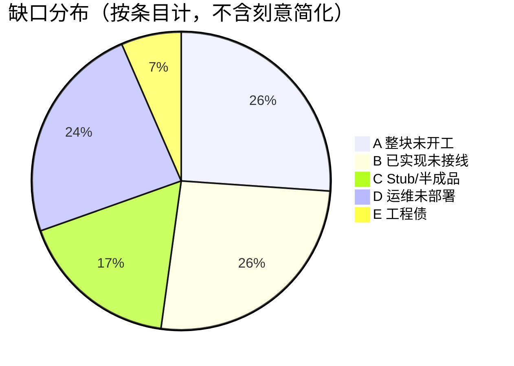
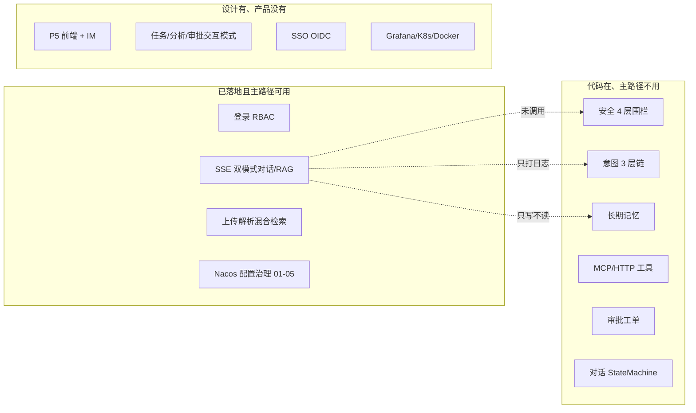

# 已设计未实现清单

> **日期**: 2026-08-27  
> **依据**: 对照 `docs/P0`–`docs/P7` 设计文档与当前 Java 源码  
> **原则**: 「方案里写了」≠「线上能用」。本清单把缺口分成五类，避免把 Stub、未接线、未部署混成一句「没做」。  
> **分项实现方案**: [`docs/未实现事项设计方案/README.md`](未实现事项设计方案/README.md)（一事一文档，含步骤/流程图/验收）

---

## 怎么读这份清单

| 类别 | 含义 | 典型动作 |
|------|------|----------|
| **A. 整块未开工** | 有设计文档，代码几乎没有 | 新模块开发 |
| **B. 已实现未接线** | 类和方法都在，主链路（尤其 streamChat）不调用 | 几处调用点即可闭环 |
| **C. Stub / 半成品** | 有类，内部降级、硬编码或假实现 | 换成真实逻辑或删掉误导代码 |
| **D. 运维未部署** | 应用代码就绪或仅有方案，缺外部服务/编排 | 部署与配置，不是写业务 |
| **E. 质量与工程债** | 测试、SQL 隔离、示例 Handler 等 | 专项补齐 |

**建议优先级（按对主路径收益）**：B 接线 → C 去掉 Stub 误导 → A 的 P5 前端 → D 生产部署。

分项方案目录：`docs/未实现事项设计方案/`（A1-01…E2）。

---

## 总览

---

## A. 整块未开工

### A1. P5 前端交互层（最大产品缺口）

| 子方案 | 设计文档 | 现状 |
|--------|----------|------|
| Web 聊天 | `docs/P5-交互端/01-Web聊天界面.md` | 无前端工程（无 tsx/vite） |
| 审批卡片 UI | `docs/P5-交互端/02-审批卡片.md` | 后端 WS 可推 `APPROVAL_CARD`，无页面 |
| 用户反馈 UI | `docs/P5-交互端/03-用户反馈.md` | 后端已有点赞/点踩 API + BadCase 事件，无按钮 |
| IM 接入 | `docs/P5-交互端/04-IM接入适配.md` | 无 `ImAdapter`、无 `/api/v1/im/callback/{channel}` |

另有完整前端方案：`docs/api-documentation/前端架构设计方案.md`（React 18 + Ant Design 5 + Zustand），进度表全 ⬜。

**解决场景**：没有 UI，后端能力无法被业务用户使用。

---

### A2. P7 设计中的其余交互模式

设计见 `智能体多模式交互系统架构设计方案.md` §4.2.3。当前枚举只有 `CONVERSATION` / `KNOWLEDGE_SEARCH`。

| 模式 | modeCode | 设计意图 | 现状 |
|------|----------|----------|------|
| 任务执行型 | `task_execution` | 对话里直接走 DAG + MCP | 任务只有独立 REST（`TaskController`），无 InteractionStrategy |
| 分析推理型 | `analysis` | 数据洞察 / 报告 | 仅出现在设计表，「待扩展」 |
| 安全审批型 | `approval` | 审批作为交互模式 | 审批是独立 API + WS，不是策略 |

P7 还规划了 **第六阶段**：模式市场、第三方自定义模式、可视化编排、租户配额。代码中无 Quota、无模式市场。

---

### A3. 对话检查点 / 断点续传

`docs/P1-核心能力/T3-意图识别与对话管理/04-对话状态机与记忆管理.md` 设计了 Redis Memento：每会话最多 5 个 checkpoint，中断后恢复。

源码中 **没有** `ConversationCheckpoint` / 检查点读写。Memento 只用在提示词版本、工具版本、任务步骤快照。

---

### A4. SSO / OIDC

设计：`AuthProviderType.SSO` + OAuth2/OIDC，登录后签发 Sa-Token。

现状：枚举有 `SSO`，**无实现类**。`AuthProviderFactory` 扫不到 SSO Provider。

---

### A5. Sentinel Dashboard

设计：`docs/P0-基础底座/T2-统一网关与安全流控/03-Sentinel限流熔断.md` 可选可视化控制台。

现状：规则已走 Nacos DataSource（子方案 05），**没有 Dashboard 部署与对接**。IP 级 / 用户级限流在方案里有，AOP 目前主要拼 **租户维度**。

---

### A6. ColBERT Reranker

`RerankerType.COLBERT` 已定义。实现类只有 `LLMReranker`（可用）和 `CrossEncoderReranker`（Stub）。无 ColBERT。

---

### A7. IM 适配后端

P5-04 要求 `ImAdapter.convert/sendReply`、企微/钉钉回调。Java 全仓库无 `ImAdapter`。

---

## B. 已实现未接线（优先补）

这些项在进度里常被标成 ✅，但 **streamChat / Agent 主路径用不起来**。

| # | 设计 | 代码位置 | 缺口 |
|:--:|------|----------|------|
| B1 | 安全围栏进对话 | `SecurityFenceApplicationService.filterInput/desensitizeOutput` | 仅管理 API；`StreamOrchestrationService` 不调用 |
| B2 | 意图驱动路由 | `IntentRecognitionChain` | stream 里识别后 **只 `log.info`**，不切模式、不补槽、不拦高风险 |
| B3 | 长期记忆注入 Prompt | `LongTermMemoryService.injectMemoriesIntoPrompt` | 流结束会异步抽取写入；**读取注入未调用** |
| B4 | 运行时提示词模板 | `PromptApplicationService.runtimeRender` | 对话用 `buildFullPrompt` 拼接历史，**不走已发布模板** |
| B5 | 工具进对话 / Function Calling | `ToolApplicationService.test` + `SseEventFactory.toolCall` | 只能走工具测试 API；SSE `tool_*` 事件预留未发 |
| B6 | 高风险工具审批 | `ApprovalWorkflowApplicationService.createApproval`、`TaskExecution.waitForApproval` | 实体有 `requireApproval`；**无人 createApproval**；`waitForApproval()` 无业务调用 |
| B7 | 对话槽位状态机 | `ConversationStateMachineConfig` | 仅配置；无 `StateMachineFactory`/`sendEvent` |
| B8 | P7 七步管道 3/4/5/7 | 设计：鉴权→限流→**围栏→意图→意图路由**→策略→**脱敏** | 1、2、6 有；3、4 消费、5、7 无 |
| B9 | SQL 自动租户拦截 | `TenantSqlInterceptor` | 类已写，**无 `@Component`、未注册 Plugin**；实际靠 Mapper 手写 `tenant_id` |
| B10 | 四级精度自动合并 | `PrecisionConfigDomainService.mergeConfig` | 检索调用 `mergeConfig(null, null, searchConfig, null)`，**不加载 KB/文档 JSON** |
| B11 | KB 级联删向量 | `MilvusStoreClient.deleteByKnowledgeId` | `deleteWithCascade` 只软删 MySQL，**不清 Milvus** |
| B12 | 提示词 Redis 读缓存 | `CachedPromptRepository.findLatestPublished` | 发布/删除会 update/evict；**渲染仍 `templateRepository.findByPromptId`，读路径未走缓存** |

B6 补充：`approve` 已能 `DagExecutionService.resumeExecution`，缺的是「工具执行前建单并暂停」。

---

## C. Stub / 半成品

| # | 项 | 现状 | 设计要求 |
|:--:|----|------|----------|
| C1 | LDAP | `LdapAuthenticationProvider` 在 `spring.ldap.enabled=true` 时装配，内部 **降级本地 UserService** | LDAP bind + 属性映射 |
| C2 | Cross-Encoder Reranker | 按 RRF 分排序，日志写明 STUB | 调 bge-reranker-v2-m3 |
| C3 | Presidio | `PresidioPiiAdapter` 条件装配；默认关；且输出脱敏未进 stream（叠 B1） | 部署 Analyzer + 对话出口调用 |
| C4 | 切片参数 | `resolveChunkConfig()` **写死** `chunk_size=512 / overlap=50` | 解析 `doc.chunkConfigJson` / KB 配置 |
| C5 | LOCAL AuthProvider | 无 `LocalAuthenticationProvider`；登录走 `AuthController` → `UserService` | 工厂统一三种 Provider |
| C6 | DAG 内置 Handler | 仅订单查询 / 求和 / 发邮件 **示例** | 生产应注册真实 MCP/HTTP Handler |
| C7 | 量化索引 | 枚举有 IVF_SQ8/PQ/HNSW/DISKANN | 默认仍 IVF_FLAT；量化层未作为可运营能力打通 |
| C8 | `@RateLimit` | 注解+切面在；**业务方法上未见使用** | 方案中的 API/聊天 QPS 保护未挂到接口 |

---

## D. 运维未部署（11 项）

应用侧多数已留接口或方案，缺的是环境。

| # | 项 | 代码/方案状态 | 缺什么 |
|:--:|----|----------------|--------|
| 1 | Grafana Dashboard | `/actuator/prometheus` + `agent.*` 指标已有 | Grafana 与面板 JSON |
| 2 | OpenTelemetry + Jaeger/Tempo | 自研 TraceFilter + MDC | OTel SDK 与追踪后端 |
| 3 | 结构化日志 + Loki/ELK | logback 按天文件 | 采集与聚合 |
| 4 | AlertManager | 告警规则写在 T9 文档 | 通知通道 |
| 5 | JVM 资源观测 | Actuator 有 metrics | Grafana JVM 看板 |
| 6 | Span 层级建模 | 单请求 spanId | 依赖 OTel |
| 7 | Docker 单机 | 无 `docker-compose` | Compose：MySQL/Redis/Milvus/MinIO/App |
| 8 | K8s 部署 | 无清单 | Deployment/Probe/HPA |
| 9 | 企业 LDAP 服务器 | Stub 见 C1 | 真实目录 |
| 10 | MinIO 实例 | Client 已集成 | 服务未作为标准环境交付 |
| 11 | Presidio Python 服务 | Adapter 见 C3 | Docker 镜像未编入环境 |

Langfuse：代码走 HTTP Ingestion，dev 默认关闭，属可选观测后端，同样要部署才有数。

Nacos：配置治理代码已完成，**控制台是否已建 DataId** 属于环境，不属业务缺口。

---

## E. 质量与工程债

| # | 项 | 说明 |
|:--:|----|------|
| E1 | 自动化测试 | 仅 `AgentPlatformApplicationTests`；无领域/编排单测 |
| E2 | 反馈统计路径与设计不一致 | 设计 `GET /api/v1/feedback/stats`；实现是 `POST /api/v1/optimization-tickets/feedback/stats`。能力有，契约与前端方案未对齐 |
| E3 | 进度文档过时 | `docs/开发进度.md`「下一步」仍把工具版本化、MCP 心跳、Reranker、配置治理 05 标成待做，实际代码已有（部分为 Stub/未接线） |

---

## 按子系统对照（设计 → 现状）

### P0 基础底座

| 设计点 | 状态 |
|--------|------|
| Sa-Token + RBAC + 租户上下文 | ✅ 主路径可用 |
| 独立 Spring Cloud Gateway | ⚪ 刻意改为嵌入式 Filter |
| LDAP 真实绑定 | ❌ Stub |
| SSO/OIDC | ❌ 无实现 |
| Sentinel 规则 Nacos | ✅ 子方案 05 |
| Sentinel Dashboard / IP·用户限流 | ❌ |
| MyBatis 自动拼 tenant_id | ❌ 拦截器未注册 |

### P1 对话 / 提示词 / 任务

| 设计点 | 状态 |
|--------|------|
| 意图 3 层链 | ⚠️ 实现了，stream 不消费 |
| 短期 Redis 记忆 | ✅ |
| 长期记忆抽取 | ⚠️ 只写不读 |
| Spring StateMachine 槽位 | ⚠️ 仅配置 |
| 对话 Redis 检查点 | ❌ |
| 提示词 CRUD/发布/回滚/渲染 API | ✅ |
| 对话强制用 PUBLISHED 模板 | ❌ 未接线 |
| Redis 模板缓存读路径 | ⚠️ 装饰器有，render 未用 |
| DAG 规划与并行执行 | ✅ 独立 API |
| 对话意图触发 DAG | ❌ |
| 生产级 ActionHandler（接 MCP） | ❌ 仅 3 个示例 |

### P2 RAG / 工具

| 设计点 | 状态 |
|--------|------|
| 上传→解析→切片→向量化 | ✅ |
| 6 策略切片 | ✅ 策略有；chunk 参数硬编码 |
| 混合检索 + RRF | ✅ |
| LLM Reranker | ✅ |
| Cross-Encoder / ColBERT | Stub / 无 |
| 四级精度自动生效 | ⚠️ 合并函数在，检索未加载 KB 配置 |
| 精度评估 + Grid Search | ✅ 有 Service/API，依赖标注数据 |
| KB 删向量 | ⚠️ 文档弃用会清；KB 级联删除不清 |
| Elasticsearch 全文 | ⚪ 刻意改 MySQL LIKE |
| MCP Client + HTTP 适配 + 版本 + 心跳 + 调用日志 | ✅ 管理面可用 |
| 对话中调工具 | ❌ |
| requireApproval 闭环 | ❌ |

### P3 安全 / 审批

| 设计点 | 状态 |
|--------|------|
| 4 层输入过滤 + 词库 | ⚠️ 管理面可用，对话未挂 |
| 正则 PII | ⚠️ 同样未挂对话出口 |
| 输出过滤器链 | ⚪ 刻意改为单一脱敏方法 |
| Presidio NER | ⚠️ 适配器有，服务+接线都缺 |
| 审批状态机 + 超时 + WS | ⚠️ 工单 API 可用，工具侧不建单 |
| 审批卡片前端 | ❌ P5 |

### P4 观测 / 评估

| 设计点 | 状态 |
|--------|------|
| TraceId + MDC + Prometheus 指标 + Langfuse 客户端 | ✅ 代码 |
| Grafana / OTel / ELK / Alert / Docker / K8s | ❌ 运维 |
| LLM-as-Judge + BadCase 工单 | ✅ API/事件 |
| 反馈 UI | ❌ P5 |
| `GET /feedback/stats` | ⚠️ 换成了另一个 POST 路径 |

### P6 / P7

| 设计点 | 状态 |
|--------|------|
| 配置治理子方案 01–05 | ✅ 代码 |
| 对话 + 知识检索双模式 | ✅ |
| 意图→模式、围栏进管道、更多模式、模式市场 | ❌ 见 A2/B8 |

---

## 推荐实施顺序

只接线、不新开大模块（对应 B）：

1. stream 入口调 `filterInput`，出口调 `desensitizeOutput`  
2. `runtimeRender` 接入对话；缓存走 `CachedPromptRepository.findLatestPublished`  
3. `injectMemoriesIntoPrompt` 在组 Prompt 时调用  
4. 消费 `IntentResult`（至少打标 / 建议 mode）  
5. `requireApproval` → `createApproval` + `waitForApproval`  
6. 检索 `mergeConfig` 传入 KB JSON；级联删除调 `deleteByKnowledgeId`  
7. 注册或删除 `TenantSqlInterceptor`（二选一，避免「以为自动隔离」）

然后才是 P5 前端、真实 LDAP/Reranker、Docker 一键环境。

---

## 明确不做 / 已简化（不要当缺口）

| 原设计 | 实际选择 | 说明 |
|--------|----------|------|
| Spring Cloud Gateway | 嵌入式 Filter | 单体阶段 |
| Nacos 发现 MCP Server | DB 轮询 + `McpClientManager` | 工具量可控 |
| OutputFilterChain | 单一 `desensitizeOutput` | 先保证 PII |
| Elasticsearch | MySQL LIKE + 向量 | 少一个组件 |
| 上传即自动解析 | 手动 `triggerParse` | 保护 Embedding |

---

## 文档维护

- 接线完成后：把对应行从 B 挪到「已闭环」，并改 `docs/开发进度.md` 下一步。  
- 本文件取代 2026-06-18 差距分析中已过时的「8 项代码缺口」（版本化/心跳/LLM Reranker 等已做）。
