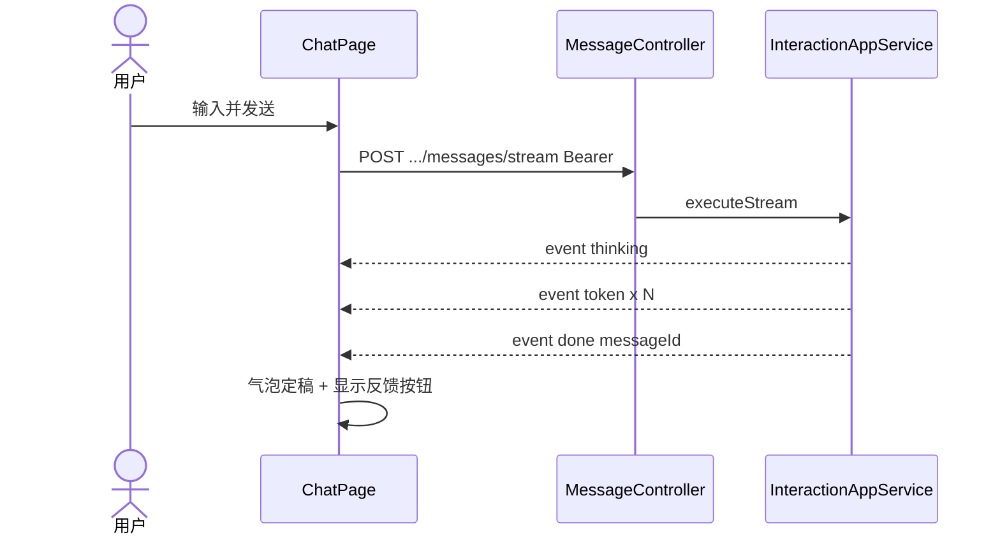

# A1-01 P5 Web 聊天界面实现方案

> **类别**: A 整块未开工 → **已实现（2026-08-27）** | **优先级**: P1  
> **关联**: `docs/P5-交互端/01-Web聊天界面.md`、`docs/api-documentation/前端架构设计方案.md`  
> **依赖后端**: `POST /api/v1/conversations/messages/stream`、会话 CRUD、Sa-Token Bearer  
> **代码**: `agent-platform-web/` + 后端登录/SSE 联调补丁

## 1. 现状与缺口

后端 SSE 双模式（`CONVERSATION` / `KNOWLEDGE_SEARCH`）已可用，事件名：`token` / `thinking` / `references` / `done` / `error` / `ping`。

**已落地（2026-08-27）**：同仓 `agent-platform-web/` Vite+React 聊天应用；登录 Token 走 sessionStorage + fetch SSE；无 `kb:read` 隐藏知识检索。审批/反馈/IM 仍未做。

## 2. 解决什么场景

企业内部员工在浏览器里多轮问答、看流式字、切知识库检索、看引用片段。

## 3. 为什么这样设计

- **独立前端仓库/目录**，不塞进 Maven 模块，避免 Node 与 JDK 构建耦合。  
- **聊天走 SSE 不走 WebSocket**：token 流已是 SSE；WS 留给审批/DAG（见 A1-02）。  
- **Zustand + 会话维度 store**：多会话切换时消息列表不串。  
- **虚拟列表**：长会话上千条，对齐原方案 `react-window`。

## 4. 技术栈

React 18 + Vite + TypeScript + Ant Design 5 + Zustand + EventSource（或 `fetch` + ReadableStream 以便带 Authorization 头）。

> 浏览器原生 `EventSource` 不能自定义 Header。本项目 Token 在 `Authorization: Bearer`，**必须用 fetch 流**封装 SSE 解析。

## 5. 实现方案

### 5.1 工程落点

建议目录：`agent-platform-web/`（与后端同仓，或独立仓，二选一；同仓便于联调）。

```
agent-platform-web/
  src/pages/Chat/
  src/features/sse/parseSse.ts
  src/stores/conversationStore.ts
  src/api/conversation.ts
```

### 5.2 核心交互

1. 登录页调 `POST /api/v1/auth/login`，Token 存内存 + `sessionStorage`（勿长期放 localStorage 明文，可后续改 HttpOnly Cookie）。  
2. 会话列表：`POST /api/v1/conversations/list`（后端现网为 POST JSON，不是 REST GET）。  
3. 发送：`POST /api/v1/conversations/messages/stream`，body：`conversationId, content, mode, knowledgeId`。  
4. 解析 SSE：按 `event:` 行分发到 store（追加 token、thinking 文案、references 卡片、done 结束）。  
5. `ping` 忽略；断线展示「重连」按钮，不自动重放用户消息（防重复落库）。

### 5.3 权限

所有请求带 Bearer；401 跳登录。知识检索需 `kb:read`，无权限时隐藏模式切换。

## 6. 流程图



## 7. 验收标准

- 不传 `mode` 默认智能对话，流式出字。  
- `mode=KNOWLEDGE_SEARCH` 先出 `references` 再出字；无命中显示后端友好提示。  
- 刷新后能拉历史消息。  
- 桌面 1280px 与 375px 布局可用。

## 8. 风险

- fetch SSE 在代理缓冲下可能整段到达：Nginx 需 `proxy_buffering off`。  
- 未完成 B1 前，前端无法展示「安全拦截」专用事件，拦截目前是 HTTP 异常，需在流建立前或 error 事件处理。
