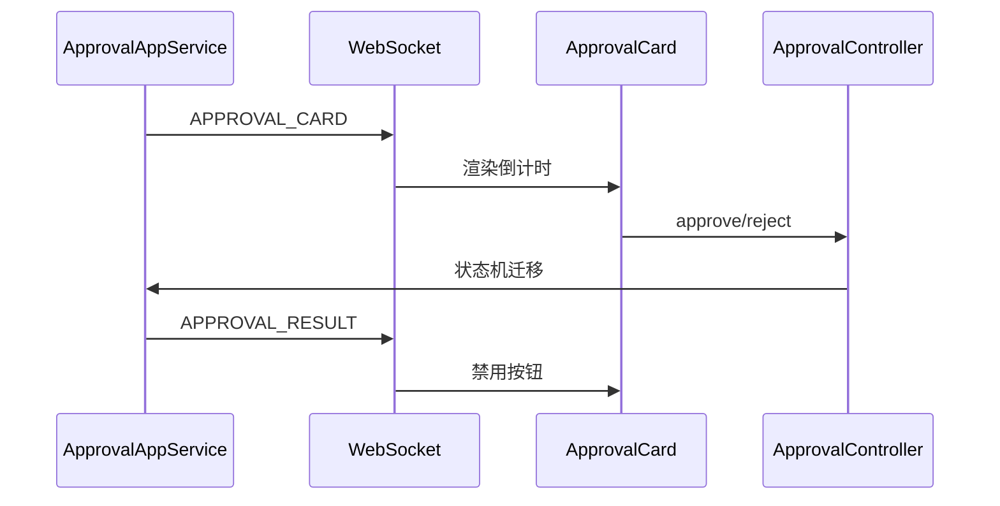

# A1-02 P5 审批卡片实现方案

> **类别**: A | **优先级**: P1  
> **关联**: `docs/P5-交互端/02-审批卡片.md`  
> **依赖**: A1-01；后端 `ConversationWebSocketHandler`、`ApprovalController`

## 1. 现状与缺口

后端可推 `APPROVAL_CARD` / `APPROVAL_RESULT`，REST 可同意/拒绝。聊天页无卡片组件，审批人无法在会话里点按钮。

## 2. 解决什么场景

高风险工具调用弹出卡片：看风险、倒计时、同意或拒绝；结果回写到同一会话。

## 3. 为什么这样设计

- **WS 与 SSE 分离**：SSE 推 token；审批是离散、需双向的短消息，用已有 `/ws/conversation`。  
- **卡片是消息类型而非独立页**：审批发生在对话上下文中。  
- **REST 提交审批结果**：WS 只推送；同意/拒绝走 `ApprovalController`，避免 WS 鉴权与幂等难以做。

## 4. 技术栈

与 A1-01 相同；新增 `useConversationSocket`（握手带 `?token=` 或 Sec-WebSocket 子协议，以后端 `WebSocketAuthInterceptor` 为准）。

## 5. 实现方案

1. 登录后建立 WS，心跳复用后端 `ping/pong`。  
2. 收到 `APPROVAL_CARD`：在消息列表插入 `type=approval` 气泡，渲染 `ApprovalCard`（标题、detail、riskLevel、timeout 倒计时）。  
3. 点击同意/拒绝：`POST /api/v1/approvals/{id}/approve|reject`（以后端实际路径为准）。  
4. 收到 `APPROVAL_RESULT`：禁用按钮、展示结果；超时同样禁用。  
5. 高风险红色边框，对齐原方案。

权限：`approval:*`；无权限只读卡片。

## 6. 流程图

## 7. 验收标准

- 工单 PENDING 时按钮可点；TIMEOUT/终态不可点。  
- 断线重连后通过 REST 拉 pending 列表补卡片（需确认后端 list API；若无则本方案同期补 `GET /approvals/pending`）。

## 8. 风险

B6 未接线时，对话不会自动建单，卡片只能用管理端手工 `createApproval` 联调。前端可先用 mock 事件开发。
