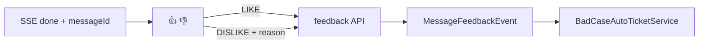

# A1-03 P5 用户反馈实现方案

> **类别**: A | **优先级**: P1  
> **关联**: `docs/P5-交互端/03-用户反馈.md`  
> **依赖**: A1-01；`POST /api/v1/conversations/messages/feedback`

## 1. 现状与缺口

后端 `MessageController.feedback` 已写库并发 `MessageFeedbackEvent`（点踩可自动开优化工单）。助手气泡下无 👍👎。

## 2. 解决什么场景

用户对单条回复点赞/点踩并选原因，驱动 T12 BadCase 闭环。

## 3. 为什么这样设计

- **反馈挂在 messageId 上**，不另造会话级评分。  
- **点踩才弹原因**：降低点赞摩擦。  
- **乐观更新**：先变图标，失败回滚并 toast。

## 4. 技术栈

A1-01 + Ant Design `Rate`/`Popconfirm` 不必，用 Icon + Popover 即可。

## 5. 实现方案

1. `done` 事件带回 `messageId`，写进助手消息。  
2. `FeedbackButtons`：`LIKE` / `DISLIKE` 调 feedback API，body 与 `MessageFeedbackRequest` 对齐（`msgId, conversationId, feedback, reason?`）。  
3. 点踩原因枚举与后端 `FeedbackType` / 原因字段对齐（不准确/不完整/不安全/其他）。  
4. 再次点击同一态视为取消：若后端无取消接口，前端禁用二次点击或补 `NONE`（若无则本方案同步加后端清除反馈）。  
5. 运营页（可选后续）再对接 E2 统计 API。

## 6. 流程图

## 7. 验收标准

- 点赞后图标选中，刷新仍在（消息列表需返回 feedback 字段；若 DTO 没有，同期补 Response）。  
- 点踩产生优化工单（需 BadCase 监听已启用）。

## 8. 风险

历史消息 DTO 若无 `feedback` 字段，刷新后按钮状态丢失。实现时先核对 `Message` 响应。
