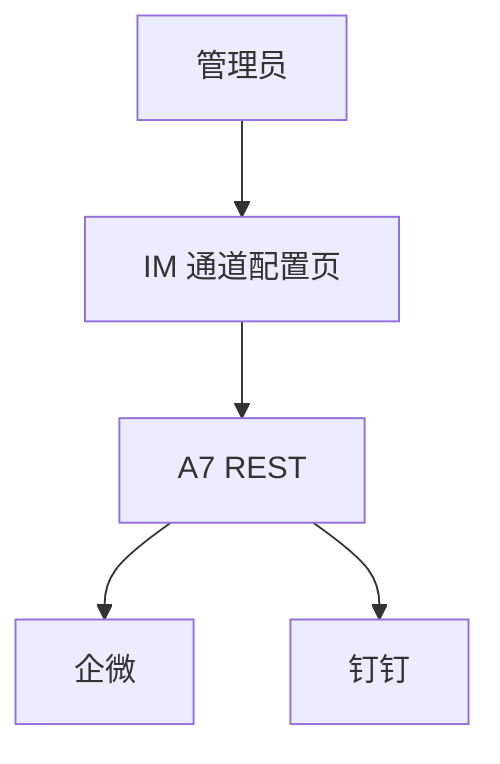

# A1-04 P5 IM 接入前端实现方案

> **类别**: A | **优先级**: P2  
> **关联**: `docs/P5-交互端/04-IM接入适配.md`  
> **依赖**: A7 后端适配器；A1-01 的消息模型可复用

## 1. 现状与缺口

无企微/钉钉通道。本方案只覆盖 **管理端配置 UI 与调试页**；消息进出在 A7。

## 2. 解决什么场景

管理员配置企微 corpId/token、钉钉 appKey；查看回调健康与最近投递失败。

## 3. 为什么这样设计

终端用户在 IM 里聊天，不需要再做一个 IM 里的 React 聊天窗。前端只做 **通道配置与排障**，避免和 A1-01 聊天页重复。

## 4. 技术栈

同 A1-01；配置页放「系统设置 / IM 通道」。

## 5. 实现方案

1. 通道列表：渠道、启用状态、最近回调时间、失败数。  
2. 表单：密钥走后端，前端不回显完整 secret（只显示掩码）。  
3. 「发送测试消息」调 A7 测试接口。  
4. 权限 `im:admin`。

## 6. 流程图

## 7. 验收标准

- 无 `im:admin` 看不到菜单。  
- 保存后回调 URL 展示为 `/api/v1/im/callback/{channel}` 供复制到企微后台。

## 8. 风险

A7 未完成时本页只能出静态原型。
