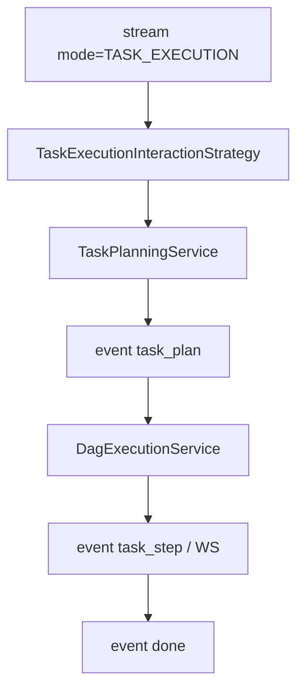

# A2-01 P7 任务执行交互模式实现方案

> **类别**: A | **优先级**: P2  
> **关联**: `智能体多模式交互系统架构设计方案.md` §4.2.3 `task_execution`  
> **依赖**: 现有 `TaskPlanningService` / `DagExecutionService`；建议先完成 B2、B5、B6

## 1. 现状与缺口

任务规划/执行只有 `TaskController` 独立 REST。`InteractionMode` 无 `TASK_EXECUTION`，对话不能说「帮我查订单并汇总」就进 DAG。

## 2. 解决什么场景

用户在同一 stream 入口用自然语言触发多步骤任务，并在 SSE/WS 看步骤进度。

## 3. 为什么这样设计

- **新枚举 + 新 Strategy**，不改 `StreamOrchestrationService`（开闭原则，对齐已有工厂）。  
- 规划与执行复用 T5，策略只做「对话上下文 → plan → execute → 推进度」。  
- 默认可先同步 `plan` 再异步 `execute`，避免 LLM 规划阻塞 token 流过久：先 `thinking`「正在规划任务」。

## 4. 技术栈

现有 DAG + `InteractionStrategy` + SSE 事件（可复用 `tool_*` 或新增 `task_step`）。

## 5. 实现方案

1. `InteractionMode` 增加 `TASK_EXECUTION("TASK_EXECUTION", "任务执行")`，补 `fromCode`。  
2. `TaskExecutionInteractionStrategy`：`executeStream` 内  
   - 调 `TaskPlanningService` 得到 DAG  
   - SSE `thinking` + 可选 `task_plan` 事件（节点列表）  
   - `DagExecutionService.execute`  
   - 步骤完成通过已有 WS 或 SSE `task_step`  
3. `InteractionContext` 增加 `conversationId`（已有则用）。  
4. 高风险步骤走 B6，策略内遇 `WAITING_APPROVAL` 推卡片并结束本轮 stream（后续 resume 不占用原 Emitter）。  
5. Controller 无需改路由，工厂自动发现。

## 6. 流程图

## 7. 验收标准

- 非法 mode 仍 400；新 mode 出现在 `GET /interactions/modes`。  
- 规划失败 SSE `error`，不留下脏 TaskExecution 或状态 FAILED。

## 8. 风险

LLM 规划不稳定：必须经 `DagParser` 校验无环后再执行。C6 未完成时只能跑三个示例 Handler。
