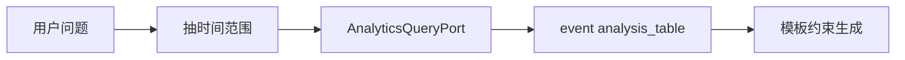

# A2-02 P7 分析推理交互模式实现方案

> **类别**: A | **优先级**: P3  
> **关联**: 多模式方案中 `analysis`「待扩展」  
> **依赖**: A1-01 可选；B4 提示词模板（分析专用模板）

## 1. 现状与缺口

设计表有「数据洞察/报告生成」，无枚举、无策略、无数据源端口。

## 2. 解决什么场景

运营问「本周知识库命中率趋势」「某会话 BadCase 分布」，Agent 查平台自身指标/评估表后生成简报，而不是胡编数字。

## 3. 为什么这样设计

- **只分析本平台数据**（命中记录、反馈、评估 run），不接外部数仓，降低安全面。  
- Domain 端口 `AnalyticsQueryPort`，Infra 用 MyBatis 只读查询，禁止策略里拼 SQL。  
- 输出仍走 SSE：先表格 JSON 事件 `analysis_table`，再 LLM 归纳（B4 模板约束「不得编造表中没有的数字」）。

## 4. 技术栈

`InteractionMode.ANALYSIS` + 只读查询 + ChatClient 流式。

## 5. 实现方案

1. 枚举 `ANALYSIS`。  
2. `AnalyticsQueryPort`：`hitRate(tenantId, from, to)`、`feedbackDist`、`evalOverall`。  
3. `AnalysisInteractionStrategy`：从用户话术抽时间范围（可先正则/规则，缺参则 SSE 提问，后续接 B7）。  
4. 查询 → `SseEventFactory` 新增 `analysis_table` → RAG 式 Prompt 只含表数据 → stream。  
5. 权限 `observability:read` / `evaluation:read`。

## 6. 流程图

## 7. 验收标准

- 无数据时明确说「区间内无记录」，不允许模型编造百分比。  
- 越权查询 403。

## 8. 风险

时间解析失败率高：第一期只支持「最近 7/30 天」固定选项，自然语言日期放到二期。
