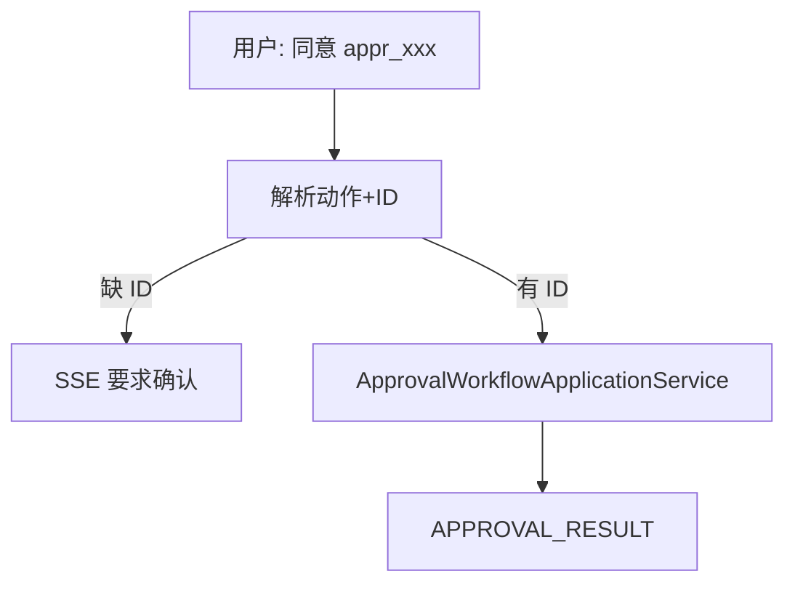

# A2-03 P7 安全审批交互模式实现方案

> **类别**: A | **优先级**: P2  
> **关联**: 多模式方案 `approval`  
> **依赖**: A1-02；B6 更关键。本模式是「在对话里处理审批」的入口，不是再建一套状态机。

## 1. 现状与缺口

审批已有 REST + WS。没有 `InteractionMode.APPROVAL`，用户不能在 stream 里说「同意刚才那笔」。

## 2. 解决什么场景

审批人在聊天输入「同意」「拒绝 xxx」，或进入审批模式查看待办列表。

## 3. 为什么这样设计

- **不复制 ApprovalWorkflow 状态机**，策略只做自然语言 → `approve/reject/list`。  
- 写操作必须落到现有 `ApprovalWorkflowApplicationService`，保证超时 Job 仍有效。  
- 列表用同步 `execute` 也可；与 stream 并存。

## 4. 技术栈

规则意图（同意/拒绝/查看待办）优先，避免 LLM 误点同意。高风险操作需明确审批 ID。

## 5. 实现方案

1. 枚举 `APPROVAL`。  
2. `ApprovalInteractionStrategy`：  
   - `list`：pending 工单 → SSE 多张卡片或 JSON  
   - `approve {approvalId}` / `reject`：调现有应用服务  
3. 无 ID 时进入「待办第一条？」必须二次确认（SSE 提问），禁止默认同意。  
4. 权限 `approval:write`。

## 6. 流程图

## 7. 验收标准

- 「同意」无 ID 不得改库。  
- 非审批人操作 403。

## 8. 风险

与 B2 意图路由重叠：若 B2 已把「审批话术」路由到本模式，不要在 CONVERSATION 里再解析一遍。
