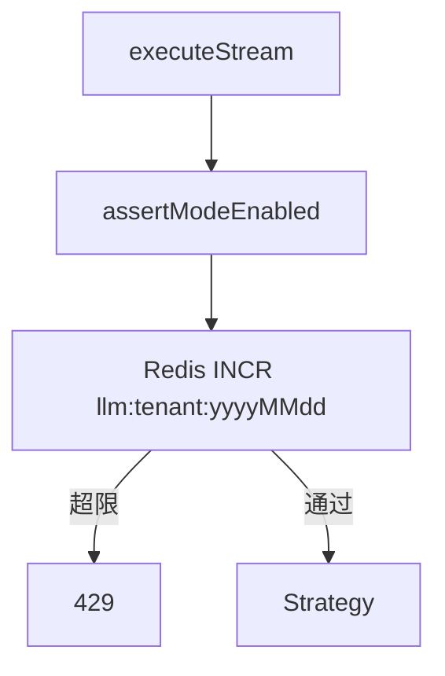

# A2-04 P7 模式市场与租户配额实现方案

> **类别**: A | **优先级**: P3  
> **关联**: 多模式方案第六阶段  
> **依赖**: 现有模式稳定；租户实体 `Tenant`

## 1. 现状与缺口

无第三方模式注册、无可视化编排、无配额字段/拦截。

## 2. 解决什么场景

平台管理员按租户开关模式（如仅开通知识检索）；限制每日 LLM 次数与上传容量，防止打满账单。

## 3. 为什么这样设计

- **一期不做第三方 jar 热加载**（ClassLoader 风险高），「市场」= 官方模式目录 + 租户开关。  
- 配额放租户配置表，拦截放 Application 入口（`InteractionApplicationService.executeStream` 开头），fail-close。  
- 可视化编排（拖拽 DAG）列入二期，一期只 CRUD 开关。

## 4. 技术栈

新表 `t_tenant_mode_quota`；`QuotaGuard` DomainService；Redis INCR 日计数，TTL 到次日。

## 5. 实现方案

1. 表字段：`tenant_id, mode_code, enabled, daily_llm_limit, daily_upload_bytes`。  
2. `TenantQuotaDomainService.assertModeEnabled / assertLlmQuota`。  
3. stream 入口调用；超限 `BusinessException(429, ...)`。  
4. 管理 API：`TenantModeQuotaController`，Response DTO 包装，权限 `tenant:write`。  
5. 前端（A1）模式切换下拉按 enabled 过滤。

## 6. 流程图

## 7. 验收标准

- 关闭 KNOWLEDGE_SEARCH 后该 mode 400/403。  
- 日限额在时区上用租户时区或统一 UTC，文档写死一种。

## 8. 风险

计数与成功调用应对齐：LLM error 是否回滚配额？建议 **预扣 + 失败补偿** 或 **仅成功计数**；一期采用成功后再 INCR 的宽松策略并在文档写明可被刷。二期改预扣。
