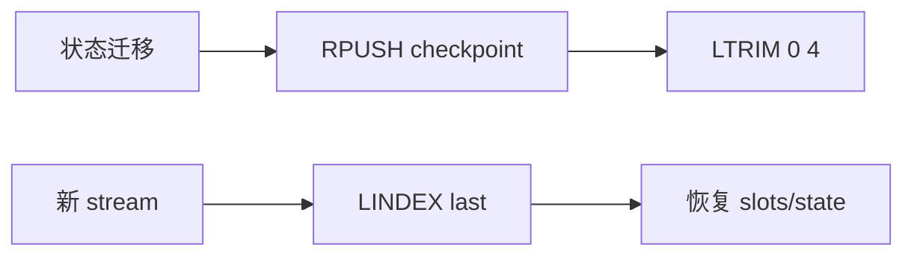

# A3 对话检查点与断点续传实现方案

> **类别**: A | **优先级**: P3  
> **关联**: `docs/P1-核心能力/T3-意图识别与对话管理/04-对话状态机与记忆管理.md` Memento 设计  
> **依赖**: B7 状态机若启用，检查点应含当前 State

## 1. 现状与缺口

设计要求 Redis 每会话最多 5 个 checkpoint，中断可恢复。代码无 `ConversationCheckpoint`。

## 2. 解决什么场景

用户在槽位补全或任务执行中途刷新/断线，恢复后不必从头描述。

## 3. 为什么这样设计

- 检查点是 **会话级快照**，不是消息表替代；消息仍落 MySQL。  
- 只存：state、intent、已填槽位、executionId、stepIndex。不存完整 LLM 上下文（已有 SessionMemory）。  
- Redis List + LTRIM 5，TTL 与会话记忆对齐（`SessionConfig`）。

## 4. 技术栈

Redis + Jackson；Domain 值对象 `ConversationCheckpoint`；`CheckpointService` 在 application。

## 5. 实现方案

1. VO：`checkpointId, conversationId, state, intentCode, slotsJson, executionId, stepIndex, createdAt`。  
2. `ConversationCheckpointStore.save/loadLatest/clear`，key `ckpt:{tenantId}:{conversationId}`。  
3. 在 B7 每次合法迁移后 `save`；stream 入口若 state≠INIT 且 Emitter 新建，先 `loadLatest` 注入上下文。  
4. 会话 CLOSED/ARCHIVED 时 `clear`。  
5. 反序列化失败：打 warn，从 INIT 开始（原设计容错）。

## 6. 流程图

## 7. 验收标准

- 断线后新请求能带出未完成槽位，SSE 提问「请继续补充 xx」。  
- 最多 5 条，旧的被裁掉。

## 8. 风险

B7 未做时本能力价值低，建议与 B7 同一迭代。不要在每次 token 上写 Redis。
