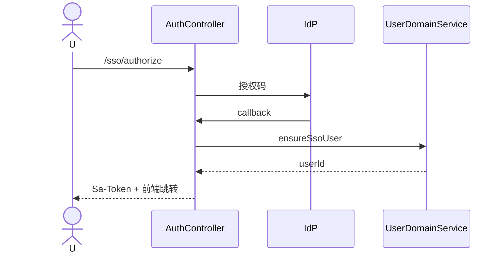

# A4 SSO/OIDC 单点登录实现方案

> **类别**: A | **优先级**: P3  
> **关联**: `AuthProviderType.SSO`、`docs/P6-迭代优化方案/P0-P3-未完成事项-迭代方案/01-P0-企业认证与Sentinel限流面板.md`  
> **依赖**: C5 LocalProvider 先统一工厂；不引入完整 Spring Security Filter 链

## 1. 现状与缺口

枚举有 SSO，无 OAuth2/OIDC 实现。登录仍是用户名密码。

## 2. 解决什么场景

企业员工用 IdP（Azure AD / 企业微信扫码 / Keycloak）登录，平台签发 Sa-Token，RBAC 不变。

## 3. 为什么这样设计

- **Sa-Token 仍是会话权威**，OIDC 只负责身份断言。  
- 用 Spring Boot OAuth2 Client 做授权码换票，**不替换** Sa-Token 鉴权过滤器。  
- `SsoAuthenticationProvider` 实现 `AuthenticationProvider` 不合适（无 password）。另开 `SsoLoginService`：callback 后 JIT 开通本地 User。

## 4. 技术栈

`spring-boot-starter-oauth2-client`；Nacos/YAML：`client-id/secret/issuer`；密钥走环境变量。

## 5. 实现方案

1. `GET /api/v1/auth/sso/authorize?idp=xxx` 重定向到 IdP。  
2. `GET /api/v1/auth/sso/callback` 校验 state/nonce，读 `sub/email`。  
3. `UserDomainService.ensureSsoUser(tenantHint, email)`：已有则启用，无则创建并赋默认角色。  
4. `StpUtil.login(userId)` + Session 写 tenantId（租户映射：email 域名表或首次绑定页）。  
5. 多租户冲突：同一邮箱多租户时必须显式选租户，禁止猜。

## 6. 流程图

## 7. 验收标准

- 无密码接口成功登录；本地密码登录仍可用。  
- CSRF `state` 校验失败 401。  
- 未映射租户不签发 Token。

## 8. 风险

租户绑定是产品问题不是协议问题。一期可限制「一个 IdP 对应一个 tenantId」写死配置。
