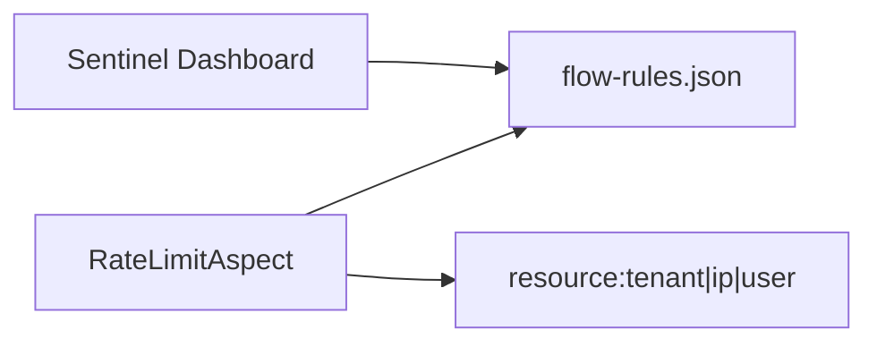

# A5 Sentinel Dashboard 与多维度限流实现方案

> **类别**: A | **优先级**: P3  
> **关联**: `docs/P0-基础底座/T2-统一网关与安全流控/03-Sentinel限流熔断.md`  
> **依赖**: 子方案 05 Nacos 规则已存在；C8 先把注解挂上接口

## 1. 现状与缺口

规则在 Nacos；无 Dashboard。方案中的 IP/用户维度未做，AOP 只拼租户。

## 2. 解决什么场景

运维可视化改 QPS；防单 IP 爬接口、防单用户刷 LLM。

## 3. 为什么这样设计

- **Dashboard 只读 Nacos 同源规则**，避免控制台改内存、重启丢失（与子方案 05 一致）。  
- 多维度用 Sentinel 参数热点或资源名后缀：`chat:ip:{ip}` / `chat:user:{userId}`。  
- Dashboard 作为独立进程，不打进业务 JAR。

## 4. 技术栈

Sentinel Dashboard 1.8.x；`sentinel-datasource-nacos` 已用；网关侧可选 `Transport` 连 Dashboard。

## 5. 实现方案

1. 部署 Dashboard，配置 Nacos 地址与 `SENTINEL_GROUP`。  
2. 应用 `spring.cloud.sentinel.transport.dashboard` 指向它（可选，仅监控）。  
3. 扩展 `RateLimitAspect`：`appendIpDimension` / `appendUserDimension`，资源名最长做哈希防爆炸。  
4. Nacos 增加对应 flow 规则样例。  
5. 文档写明：改规则只走 Nacos 或 Dashboard 写 Nacos，禁止 `@PostConstruct` 硬编码回潮。

## 6. 流程图

## 7. 验收标准

- Dashboard 能看到 `agent-platform` 资源 QPS。  
- 单 IP 超规则返回 429，其它 IP 正常。

## 8. 风险

维度笛卡尔积导致规则爆炸：默认只启用租户+API，IP/用户用热点参数限流（参数索引）而不是无限资源名。
