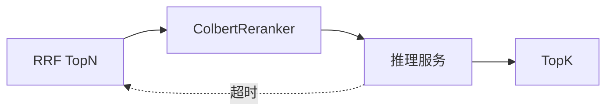

# A6 ColBERT Reranker 实现方案

> **类别**: A | **优先级**: P3  
> **关联**: `RerankerType.COLBERT`、T6 Reranker 方案  
> **依赖**: `Reranker` 端口与 `RerankerRegistry` 已有；C2 可并行

## 1. 现状与缺口

枚举有 COLBERT，无实现类。精排目前只有 LLM（贵）和 CrossEncoder Stub。

## 2. 解决什么场景

延迟敏感的检索：用 late-interaction 对 query/doc token 交互打分，比 Bi-Encoder 准、比 Cross-Encoder 全量便宜（可预计算 doc 向量）。

## 3. 为什么这样设计

- 实现放 Infrastructure，实现 `Reranker`。  
- **不把 Python 模型塞进 JVM**：独立推理服务 HTTP，Java 只做 client。  
- 文档侧 embedding 可离线建索引；一期可 query 时现场算候选（候选集已是 RRF TopN，N≤50）。

## 4. 技术栈

ColBERT/PLAID 推理容器；`ColbertRerankerClient` RestClient；`@ConditionalOnProperty knowledge.reranker.colbert.enabled=true`。

## 5. 实现方案

1. `ColbertReranker`：`supportedType()==COLBERT`，`rerank(query, hits, topK)` POST `/rerank`。  
2. 超时与降级：失败则返回原 RRF 顺序并 `log.warn`（检索 fail-open）。  
3. Registry 自动发现。  
4. KB `rerankerType=COLBERT` 时生效（依赖 B10 merge 真正读到该字段）。

## 6. 流程图

## 7. 验收标准

- 属性关闭时不装配 Bean，检索不受影响。  
- 开启且服务可用时顺序与 RRF 不同（用固定评测集）。

## 8. 风险

运维成本高。未有 GPU 时不要作为默认 `rerankerType`。
