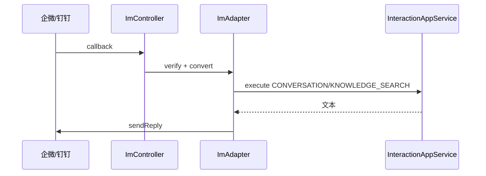

# A7 IM 适配后端实现方案

> **类别**: A | **优先级**: P2  
> **关联**: `docs/P5-交互端/04-IM接入适配.md`  
> **依赖**: 对话主链路；A1-04 配置 UI

## 1. 现状与缺口

无 `ImAdapter`、无 `/api/v1/im/callback/{channel}`。

## 2. 解决什么场景

员工在企微/钉钉发文本，进入同一套意图/RAG/SSE 语义（IM 侧改为「分段回复」而非 SSE）。

## 3. 为什么这样设计

- Domain 端口 `ImAdapter`：`verifyCallback` / `toUnifiedMessage` / `sendReply`。  
- 每个渠道一个 Infra 适配器，Application `ImInboundService` 转成 `InteractionContext` 调工厂。  
- IM **不走 SSE**：策略 `execute` 同步或后台跑完后 `sendReply`；超时先回「处理中」。  
- 验签必须在 Adapter，防伪造回调。

## 4. 技术栈

企微回调加解密；钉钉加签；现有 Sa-Token 不用于回调（用渠道密钥）。内部用户映射表 `t_im_user_bind`。

## 5. 实现方案

1. `ImController`：`GET/POST /api/v1/im/callback/{channel}`（企微 URL 验证用 GET）。  
2. `ImInboundApplicationService.handle(channel, raw)`：验签 → 映射 userId/tenantId → `InteractionApplicationService.execute`（同步知识检索或对话）。  
3. 回复纯文本/Markdown；超长切条。  
4. 未绑定用户：回复绑定口令或提示找管理员。  
5. 权限：回调免登录；管理 API `im:admin`。

## 6. 流程图

## 7. 验收标准

- 伪造回调 401。  
- 绑定用户后一轮问答能回到 IM。  
- 失败不把异常栈回给 IM。

## 8. 风险

流式策略默认 SSE，IM 必须走同步 `execute`。`ConversationInteractionStrategy` 当前禁止同步，需为 IM 增加 `executeSyncForIm` 或允许无 emitter 时 `ChatClient.call()`。
