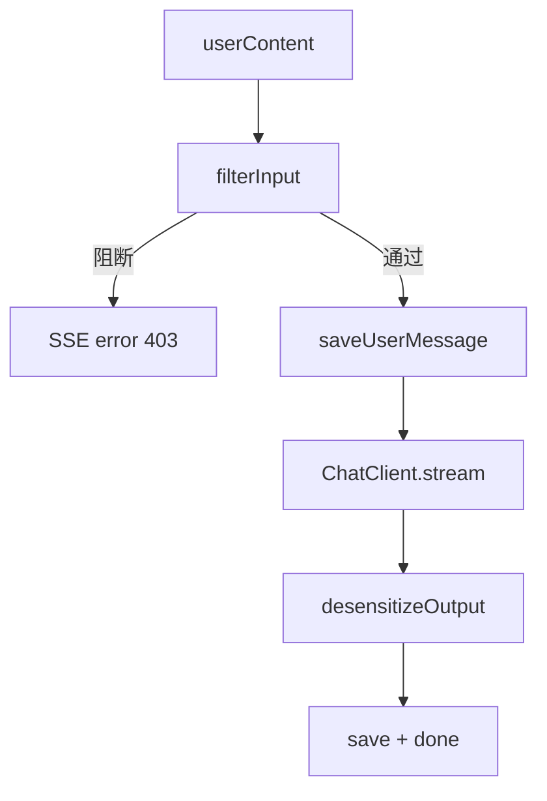

# B1 安全围栏接入对话流实现方案

> **类别**: B 未接线 | **优先级**: P0  
> **现有代码**: `SecurityFenceApplicationService.filterInput/desensitizeOutput`  
> **插入点**: `StreamOrchestrationService`、`KnowledgeSearchStreamService`

## 1. 现状与缺口

四层过滤与 PII 脱敏已实现，对话管线零调用。拦截只存在于管理测试 API。

## 2. 解决什么场景

用户注入/越狱/敏感词/超长在进 LLM 前被拦；模型输出身份证等在进 SSE 前脱敏。

## 3. 为什么这样设计

- **输入 fail-close**：`SecurityBlockedException` 转 SSE `error`（code=403），不调 LLM。  
- **输出按 token 脱敏会破坏流式**：逐 token 无法识别跨 token 的手机号。采用 **完整缓冲脱敏后再发** 或 **双通道**：预览流不脱敏 + done 前替换（体验差）。一期建议：**流式仍推原始 token，落库与 done 使用脱敏文本**，并在 `done` 带 `desensitized=true`；二期再做滑动窗口脱敏。  
  **更稳妥一期（推荐）**：thinking 后不立刻 token，等 LLM complete 脱敏再模拟分片推送（实现简单、安全正确，略增首字延迟）。知识检索同理。  
- 过滤器内部异常保持现有 fail-open。

## 4. 技术栈

现有围栏；`FilterContext.builder()`；`GlobalExceptionHandler` 已处理阻断则 SSE 路径需自己 catch。

## 5. 实现方案

1. 注入 `SecurityFenceApplicationService`。  
2. 保存用户消息 **之前或之后**：`filterInput(content, FilterContext.builder().conversationId(...).tenantId(...).userId(...).build())`。若希望拦截不落库，放在 save 前。推荐 **先过滤再 save**，避免脏数据。  
3. catch `SecurityBlockedException`：`SseEventFactory.error(reason, 403)` + complete。  
4. LLM complete：`String safe = desensitizeOutput(fullResponse, convId, messageId)` 再 `saveAssistantMessage(safe)`。  
5. `KnowledgeSearchStreamService` 同样处理用户 query 与最终答案。  
6. 指标：已有 `security.blocks`，确认调用 `AgentMetrics`。

## 6. 流程图

## 7. 验收标准

- 典型注入句不调用 ChatClient（可用 mock 验证）。  
- 输出含 11 位手机号时落库为掩码。  
- 管理端敏感词仍可运营。

## 8. 风险

先 save 再过滤会留下违规原文。必须先过滤。
