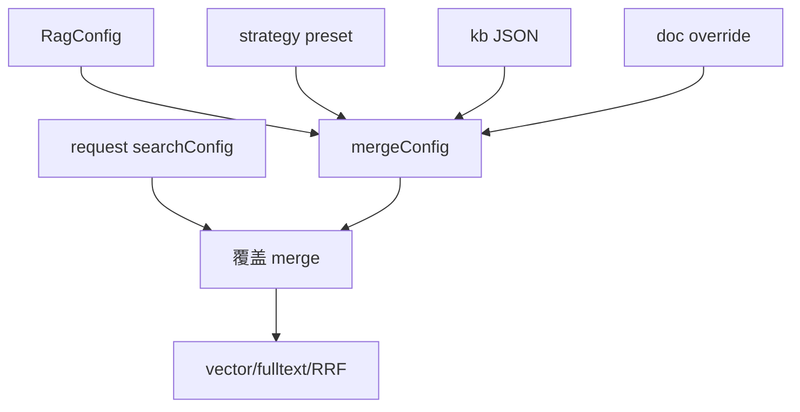

# B10 四级精度配置自动合并实现方案

> **类别**: B | **优先级**: P1  
> **现有代码**: `PrecisionConfigDomainService.mergeConfig`；`HybridSearchApplicationService` 调用 `mergeConfig(null,null,searchConfig,null)`

## 1. 现状与缺口

KB/文档 JSON、策略预设、Nacos `RagConfig` 未进入检索。运营改 KB 精度不生效。

## 2. 解决什么场景

医疗 KB 用 precise，客服用 turbo；请求体仍可临时覆盖。

## 3. 为什么这样设计

真正四级（与领域注释一致）：

`请求 searchConfig` > `文档 override` > `KB JSON` > `策略预设` > `RagConfig 系统默认`

当前方法参数顺序是 system/preset/kb/doc，**调用方负责按层传入**，并另把 request 作为最高层 merge。

## 4. 技术栈

Jackson 读 `searchParamsJson`；`RagConfig`；`SearchStrategy` 预设表（`PrecisionConfigApplicationService.listStrategyPresets`）。

## 5. 实现方案

1. `resolveMergedConfig(kbId, docId, requestConfig)`：  
   - system ← `ragConfig.toMap()`  
   - preset ← kb.searchStrategy 对应预设  
   - kb ← parse JSON  
   - doc ← 文档覆盖  
   - 再 `merge(merged, requestConfig)`  
2. `HybridSearchApplicationService.search` 用合并结果设 topK/threshold/rrf/reranker。  
3. 无 kbId 的全库检索：只用系统默认+请求。  
4. 非法组合走现有 `validateSearchParams`。

## 6. 流程图

## 7. 验收标准

- KB 设 similarityThreshold=0.9 且请求未传时，过滤按 0.9。  
- 请求显式传 0.5 则用 0.5。

## 8. 风险

JSON 与 RagConfig 字段名不一致，要做一层 key 映射表，禁止静默丢字段。
