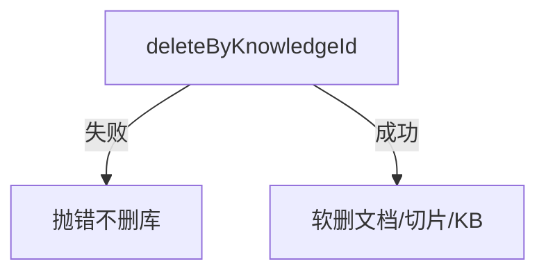

# B11 知识库级联删除 Milvus 实现方案

> **类别**: B | **优先级**: P1  
> **现有代码**: `MilvusStoreClient.deleteByKnowledgeId`；`KnowledgeBaseApplicationService.deleteWithCascade` 只删 MySQL

## 1. 现状与缺口

KB 删除后向量残留在 `kb_{tenantId}`，可能被检索到幽灵切片。

## 2. 解决什么场景

租户删除知识库后检索不再命中其文档。

## 3. 为什么这样设计

- 先删向量再软删 DB，失败则事务回滚 **或** 记录补偿任务（Milvus 不在本地事务）。推荐：**先 Milvus 再 DB**；Milvus 失败整单失败。DB 成功 Milvus 失败则提交 `t_async_task` 补偿删除。  
- collection 名与写入一致：`kb_{tenantId}`。  
- 与文档 `deprecateDocument` 已有清向量路径对齐。

## 4. 技术栈

已有 `MilvusStoreClient`；异步任务中心 V1.6.0。

## 5. 实现方案

```
deleteWithCascade:
  domain 校验 DISABLED + 创建者
  milvusStore.deleteByKnowledgeId("kb_" + tenantId, knowledgeId)
  documentRepository.softDeleteByKnowledgeId
  chunkRepository.softDeleteByKnowledgeId
  kb.markDeleted()
```

catch Milvus 异常 → `BusinessException(500, "向量清理失败", e)` 不继续删库。

## 6. 流程图



## 7. 验收标准

- 删除后混合检索该 kbId 无命中。  
- 其它 KB 同 collection 数据仍在。

## 8. 风险

`deleteByKnowledgeId` 实现必须用 filter `knowledge_id == "..."` 而非 drop collection。
