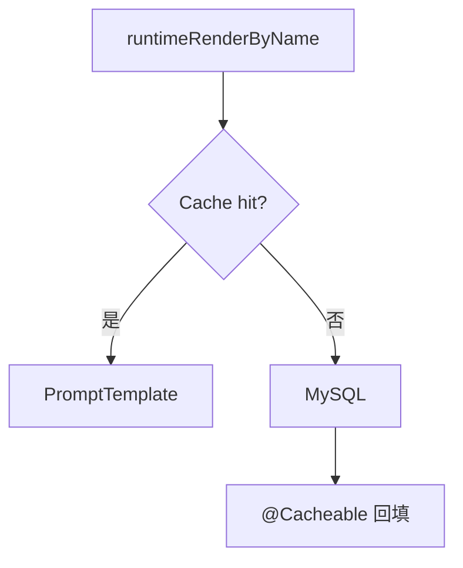

# B12 提示词 Redis 缓存读路径实现方案

> **类别**: B | **优先级**: P2  
> **现有代码**: `CachedPromptRepository` 的 `@Cacheable findLatestPublished` **无调用方**；render 走 `templateRepository.findByPromptId`

## 1. 现状与缺口

发布时 update/evict 已接，热路径不读缓存，Redis 形同虚设。

## 2. 解决什么场景

高频 `runtimeRender` 减少 MySQL。

## 3. 为什么这样设计

- **按 name 的 latest published 才是热点**；按 id 渲染可继续走 DB 或加 id 缓存。对话（B4）按 name，必须走 `findLatestPublished`。  
- 保持 Spring Cache，`spring.cache.type=redis` 已配置。  
- evict 的 key 必须与 `@Cacheable` 一致（已是 `tenantId + ':' + name`）。`@CacheEvict` 对 version cache 的 key 不含 version，可能清不掉带 version 的项：改为 `allEntries=true` 按 cache name 或 `CacheEvict` 两个精确 key。

## 4. 技术栈

Spring Cache + Redis；B4 `runtimeRenderByName`。

## 5. 实现方案

1. `runtimeRenderByName` → `cachedPromptRepository.findLatestPublished(tenantId, name)`。  
2. 按 id 的 `runtimeRender` 可选：先 findByPromptId，若 published 再 `@Cacheable` 包装。  
3. 修 evict：删除模板时 `evictCache` 同时清 `prompt:template:version` 全部相关（`@Caching` 多条）。  
4. 单测：第二次 findLatest 不访问 mapper（mock）。

## 6. 流程图

## 7. 验收标准

- 同租户同名第二次渲染无 SQL（日志 Cache HIT）。  
- 发布后读到新版本。

## 8. 风险

`unless = "#result.isEmpty()"` 对 Optional 的 SpEL 需验证，错误会导致缓存空 Optional。
