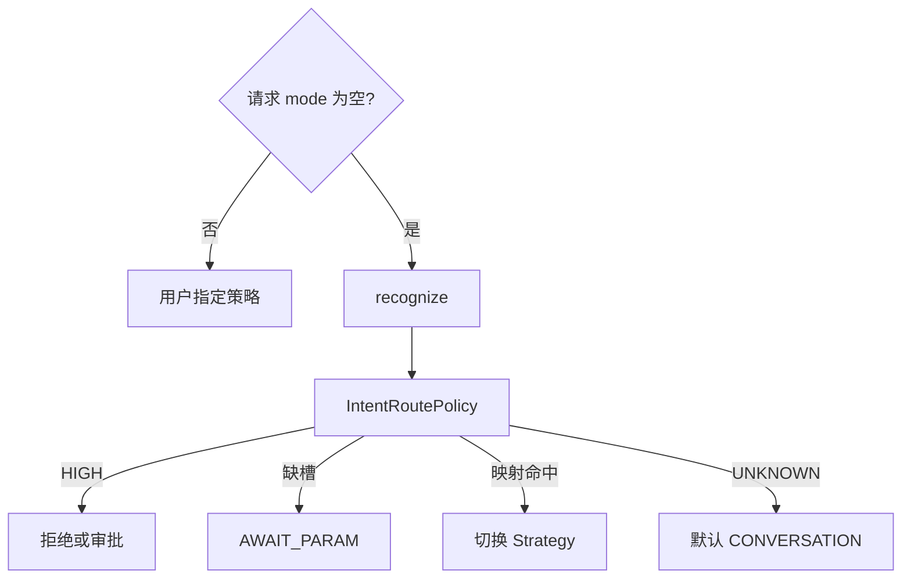

# B2 意图识别结果消费实现方案

> **类别**: B | **优先级**: P1  
> **现有代码**: `IntentRecognitionChain.recognize` 已在 stream 调用但仅 log  
> **字段**: `IntentResult.intentCode/confidence/riskLevel/requiredParams/category`

## 1. 现状与缺口

识别链完整，结果不驱动模式、槽位、审批、工具。

## 2. 解决什么场景

「查制度」自动偏知识检索；高风险意图先审批或拒绝；缺槽位先问参数。

## 3. 为什么这样设计

- **不在 Recognizer 里切模式**，在 Application 增加 `IntentRoutePolicy`，保持识别链纯净。  
- 路由是建议不是强制：请求已显式 `mode` 时 **以用户为准**，意图只打标。未传 mode 时才自动路由。  
- 阈值：沿用规则短路 0.9；自动路由要求 confidence≥0.8 且非 UNKNOWN。

## 4. 技术栈

`IntentRoutePolicy`（application）；可选写 `t_message` 扩展字段或 metadata JSON。

## 5. 实现方案

1. 映射表（可配置）：`category/intentCode → InteractionMode`，如 `KB_QA → KNOWLEDGE_SEARCH`，`TASK → TASK_EXECUTION`（后者依赖 A2-01）。  
2. `InteractionApplicationService.executeStream`：若 `mode` 空，recognize 后 `policy.suggest(intent)` 再 `getStrategy`。注意当前 recognize 在策略内部，需 **上提** 到工厂前，或策略回调。推荐上提：避免每个策略重复识别。  
3. `riskLevel=HIGH`：不调 LLM，SSE 提示转人工/走 B6。  
4. `requiredParams` 非空：进入 B7 AWAIT_PARAM，本轮只提问。  
5. 日志与 Langfuse metadata 写入 intentCode。

## 6. 流程图

## 7. 验收标准

- 显式 mode 不被意图覆盖。  
- 高置信知识类问题未传 mode 时走检索策略（可用规则意图单测）。

## 8. 风险

误路由伤体验：必须可配置关闭 `intent.auto-route.enabled`（Nacos SessionConfig）。
