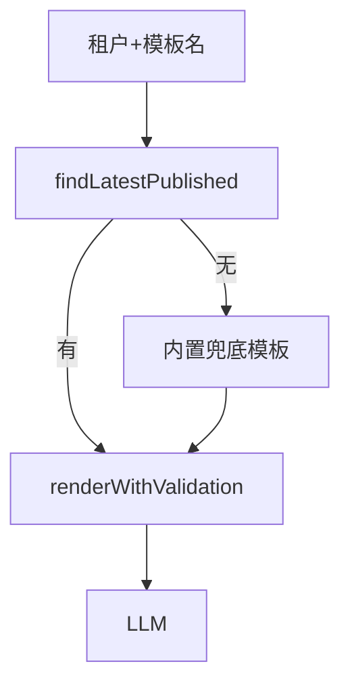

# B4 对话使用已发布提示词模板实现方案

> **类别**: B | **优先级**: P0  
> **现有代码**: `PromptApplicationService.runtimeRender`；stream 使用 `buildFullPrompt` 字符串拼接  
> **配套**: B12 缓存读路径

## 1. 现状与缺口

运营发布的系统提示词不作用于真实对话。

## 2. 解决什么场景

统一人设、安全条款、引用格式；按租户/模式选不同模板。

## 3. 为什么这样设计

- 仅 `PUBLISHED`（`runtimeRender` 已校验）。  
- 模板名约定：`chat.system`、`rag.system`，存在 `t_prompt_template.name`，按租户查找，缺失则内置兜底常量（`ProjectConstants`），保证能聊。  
- 变量：`conversation_history`、`user_input`、`knowledge_context`、`long_term_memory` 走已有 Resolver 链。

## 4. 技术栈

`PromptRenderService` + ContextVariableResolver。

## 5. 实现方案

1. Agent 配置或 Nacos：`session.chatTemplateName`。  
2. `buildFullPrompt` 替换为：组装 `Map context` → `runtimeRenderByName(tenantId, name, context)`。  
3. `PromptApplicationService` 增加 `runtimeRenderByName`（内部走 B12 `findLatestPublished`）。  
4. RAG 管线用 `rag.system`，把检索片段放入 `knowledge_context`。  
5. 模板 DRAFT 变更不影响线上直至 publish。

## 6. 流程图

## 7. 验收标准

- 发布含「必须用中文」的模板后，对话 Prompt 含该句。  
- 未发布模板调 runtime 已有 400，stream 应改走兜底而不是 500。

## 8. 风险

Resolver 需要 history 对象结构与 `ContextVariableResolver` 一致，对接时读该类实现。
