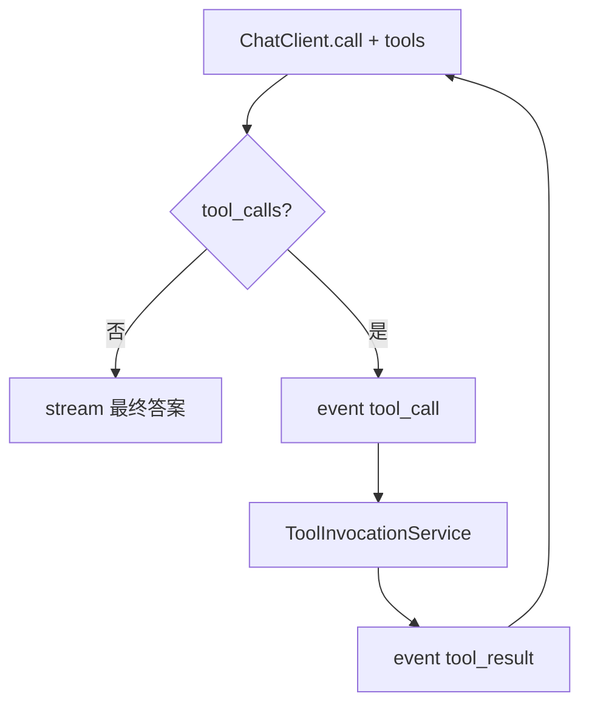

# B5 工具调用接入对话实现方案

> **类别**: B | **优先级**: P1  
> **现有代码**: `ToolApplicationService.test`；`SseEventFactory.toolCall/toolResult` 已预留  
> **依赖**: B6 审批；C6 让 DAG 也能调同一执行器

## 1. 现状与缺口

工具只能「测试调用」，对话 LLM 无法 function call。

## 2. 解决什么场景

模型决定调 MCP/HTTP 工具，前端展示调用中/结果，再继续生成。

## 3. 为什么这样设计

- **抽 `ToolInvocationService.invoke(toolId, params, convId)`**，`test()` 与对话共用，避免两套鉴权/日志。  
- 一期 **工具选择用意图或 Prompt 中的白名单 JSON**，或 Spring AI Tool Callback；优先 Spring AI `function` 声明当前租户 ACTIVE 工具 schema。  
- 循环上限 3 次，防死循环。  
- BUILTIN 走 C6 Handler，不在对话里直接测。

## 4. 技术栈

Spring AI Tool/Function Calling；现有 MCP/HTTP 适配器；SSE tool 事件。

## 5. 实现方案

1. `ToolInvocationService`：租户校验、类型分支、写 `t_tool_invocation_log`，`requireApproval` 时抛出需审批（B6）。  
2. 对话循环：`call` 非 stream 拿 tool_calls → SSE `tool_call` → invoke → SSE `tool_result` → 把结果塞回 messages 再 stream 最终答案。  
   若坚持全 stream：先非流式 tool loop，最后一轮 stream 给用户。  
3. 工具列表：`toolRepository.findActiveByTenant` 转 JSON schema。  
4. 超时用现有 HTTP/MCP 超时。

## 6. 流程图

## 7. 验收标准

- 注册 HTTP echo 工具后，对话能调通并打 invocation 日志。  
- 循环超限 SSE error，不无限请求。

## 8. 风险

DeepSeek 工具调用协议需验证 Spring AI 适配。不行则退化为「意图=调指定工具」规则路径。
