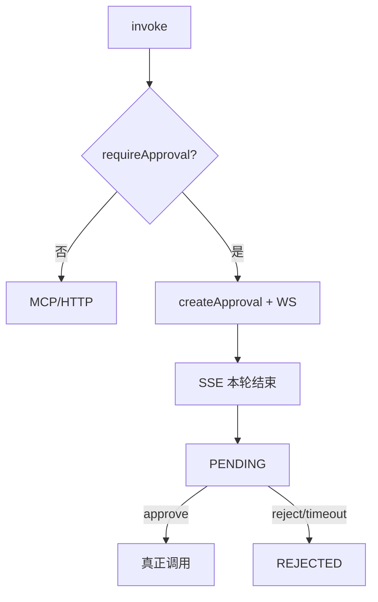

# B6 高风险工具审批闭环实现方案

> **类别**: B | **优先级**: P1  
> **现有代码**: `createApproval`、`waitForApproval`、`resumeExecution`/`cancelExecution`  
> **缺口**: 无人在调用前 `createApproval`

## 1. 现状与缺口

工具实体有 `requireApproval`，测试/执行路径不读该字段。

## 2. 解决什么场景

转账/删数据类工具必须人点同意，超时自动拒绝。

## 3. 为什么这样设计

- 拦截放在 **统一 `ToolInvocationService`**（B5），所有入口一致。  
- 对话场景无 DAG 时：建单后返回 `PENDING`，SSE 结束本轮并推 WS 卡片；通过后用户再发「继续」或系统用检查点（A3）自动 resume。  
- 有 `executionId` 的 DAG：`task.waitForApproval()` 再 `createApproval`。

## 4. 技术栈

现有审批应用服务 + WS；`ApprovalCreateCommand`。

## 5. 实现方案

```
invoke(tool):
  if tool.isRequireApproval():
      if executionId != null: task.waitForApproval(); persist
      approval = createApproval(toolId, executionId, conversationId, params)
      throw ApprovalPendingException(approvalId)  // 应用层转 SSE
  else:
      doInvoke()
```

`approve` 已 resume DAG：补 **无 DAG 时** 把 params 写入 Redis `approval:resume:{id}`，由 `ApprovedToolResumeService` 执行真正 invoke。

拒绝/超时：已有 cancel DAG；无 DAG 则只记日志 REJECTED。

## 6. 流程图



## 7. 验收标准

- `requireApproval=true` 的工具 test/对话都不会在未批准时打到外部。  
- 超时 Job 仍把工单置 TIMEOUT。

## 8. 风险

审批通过后参数被篡改：工单必须持久化 **当时 params 哈希**，resume 只信库里的快照。
