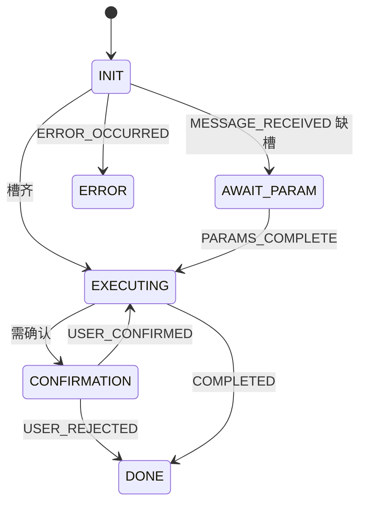

# B7 对话状态机驱动实现方案

> **类别**: B | **优先级**: P2  
> **现有代码**: `ConversationStateMachineConfig` 无业务 `sendEvent`  
> **配套**: B2 缺参、A3 检查点

## 1. 现状与缺口

Spring StateMachine 工厂已启用，编排不用。业务会话状态是另一套 `ACTIVE/CLOSED`。

## 2. 解决什么场景

意图缺槽时停在 AWAIT_PARAM；执行中需确认则 CONFIRMATION。

## 3. 为什么这样设计

- **不要用 StateMachine 表达 ACTIVE/CLOSED**，那是资源生命周期。StateMachine 只表达 **一轮 Agent 执行相位**。  
- 持久化当前相位到 Redis 或 `t_conversation.agent_phase`（新字段），进程重启可恢复。仅内存 SM 不够。  
- 用 `StateMachineFactory.getStateMachine(conversationId)` + persist interceptor，或自研枚举迁移（更轻）。  
  **推荐一期自研**：`AgentPhase` 枚举 + Domain 方法 `canTransit`，与项目 `ApprovalStatus` 风格一致；SM 配置可删除以免误导。若坚持用 SM，必须加 Redis persist。

## 4. 技术栈

优先领域枚举；或 Spring SM + Redis persist。

## 5. 实现方案（推荐领域枚举）

1. `AgentPhase`：INIT / AWAIT_PARAM / EXECUTING / CONFIRMATION / DONE / ERROR，含 `fromCode`。  
2. `Conversation` 增加 `agentPhase` + `phasePayloadJson`（缺的槽）。  
3. `ConversationPhaseDomainService.transit(conv, event)`。  
4. stream：MESSAGE_RECEIVED → 若缺槽 AWAIT_PARAM 并 SSE 提问；槽齐 PARAMS_COMPLETE → EXECUTING。  
5. 删除或标注 `@Deprecated` 未驱动的 `ConversationStateMachineConfig`，避免双源。

## 6. 流程图

## 7. 验收标准

- 缺槽时不调 LLM 生成最终答案。  
- 非法迁移抛 BusinessException。

## 8. 风险

两套 Conversation 状态并存，文档和字段命名必须区分 `status` vs `agentPhase`。
