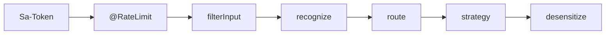

# B8 P7 七步管道编排实现方案

> **类别**: B | **优先级**: P1  
> **关联**: 多模式方案请求管道：鉴权→限流→围栏→意图→路由→策略→脱敏  
> **本方案是编排**，具体步骤实现见 B1/B2/C8

## 1. 现状与缺口

1 鉴权、2 限流（未挂注解）、6 策略已有；3/4/5/7 未进 stream。

## 2. 解决什么场景

所有模式（对话/检索/未来任务）走同一套中间件，避免只改了 `StreamOrchestrationService` 而 RAG 管线漏网。

## 3. 为什么这样设计

- 抽 `InteractionPipeline`（Template Method）：`beforeStrategy` / `afterStrategy`。  
- **两个 stream 服务都经管道**，不要复制 if。  
- 中间件独立类，可单测。

## 4. 技术栈

`InteractionPipeline` in application；有序列表 `List<InteractionMiddleware>`。

## 5. 实现方案

```java
public interface InteractionMiddleware {
    int order();
    void before(PipelineContext ctx); // 可抛阻断
    void after(PipelineContext ctx);  // 脱敏写回 ctx.output
}
```

顺序：Tenant/Auth 已在 MVC → C8 RateLimit（方法注解）→ B1 filterInput → B2 recognize+route → Strategy → B1 desensitize → after。

`PipelineContext`：mode、content、emitter、intent、output。

`InteractionApplicationService.executeStream` 只建 ctx 并 `pipeline.run(() -> strategy.executeStream)`。

## 6. 流程图



## 7. 验收标准

- 新策略自动带围栏与脱敏。  
- 中间件单测：阻断时 strategy mock 零调用。

## 8. 风险

after 在 Reactor complete 回调里，注意线程 TenantContext（现有 stream 已手动 set）。
