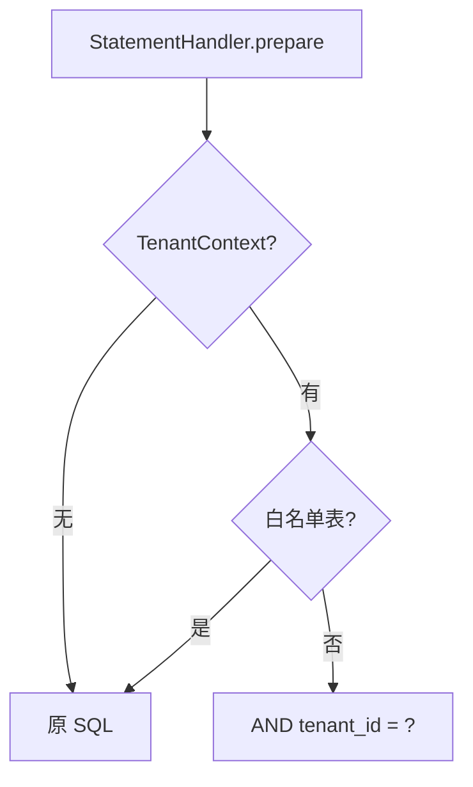

# B9 租户 SQL 拦截器注册实现方案

> **类别**: B | **优先级**: P2  
> **现有代码**: `TenantSqlInterceptor` 无 `@Component` / 未加入 MyBatis 插件

## 1. 现状与缺口

隔离靠各 XML 手写 `tenant_id`。拦截器存在造成「以为自动隔离」的假安全感。漏写的查询会跨租户。

## 2. 解决什么场景

SELECT/UPDATE/DELETE 自动加 `tenant_id`，降低漏条件风险。

## 3. 为什么这样设计

- **先审计再注册**：字符串拼接 SQL 极易弄坏分页/子查询。必须列出所有 Mapper 表，扩充白名单（`t_permission` 已有；检查无 tenant 字段的表）。  
- 与手写条件 **双轨**：短期 AND 重复 `tenant_id` 可接受；中期再删 XML 冗余。  
- `TenantContext` 为空时 **跳过而不是全表**（现逻辑）；对定时任务必须在 Job 里设上下文或走白名单。  
- INSERT 不拦截（现设计如此），插入必须应用层设 tenantId。

## 4. 技术栈

MyBatis `@Intercepts`；Spring `@Intercepts` + `@Component` 或 `ConfigurationCustomizer`。

## 5. 实现方案

1. 全表扫描：无 `tenant_id` 的表加入 `SKIP_TABLES`。  
2. 单测：对样例 SELECT 断言注入后含 `tenant_id = 1`；子查询/UNION 用例必须覆盖，失败则改为 JSqlParser。  
3. `@Component` + `@Intercepts` 生效；dev 配置 `app.tenant.sql-interceptor.enabled` 默认 false，预发 true。  
4. 定时任务 `ScheduledTaskMdcAspect` 同步设 TenantContext 或跳过。  
5. 文档：禁止依赖拦截器而不传 tenant 参数到业务方法。

## 6. 流程图

## 7. 验收标准

- enabled=true 时漏写 tenant 的测试查询返回空而不是外租户数据。  
- 分页 count 不被注入搞崩。

## 8. 风险

字符串注入 SQL 是高风险改动，**必须预发灰度**。若单测失败，本方案改为「删除未注册类」消除误导，而不是强行上线。
