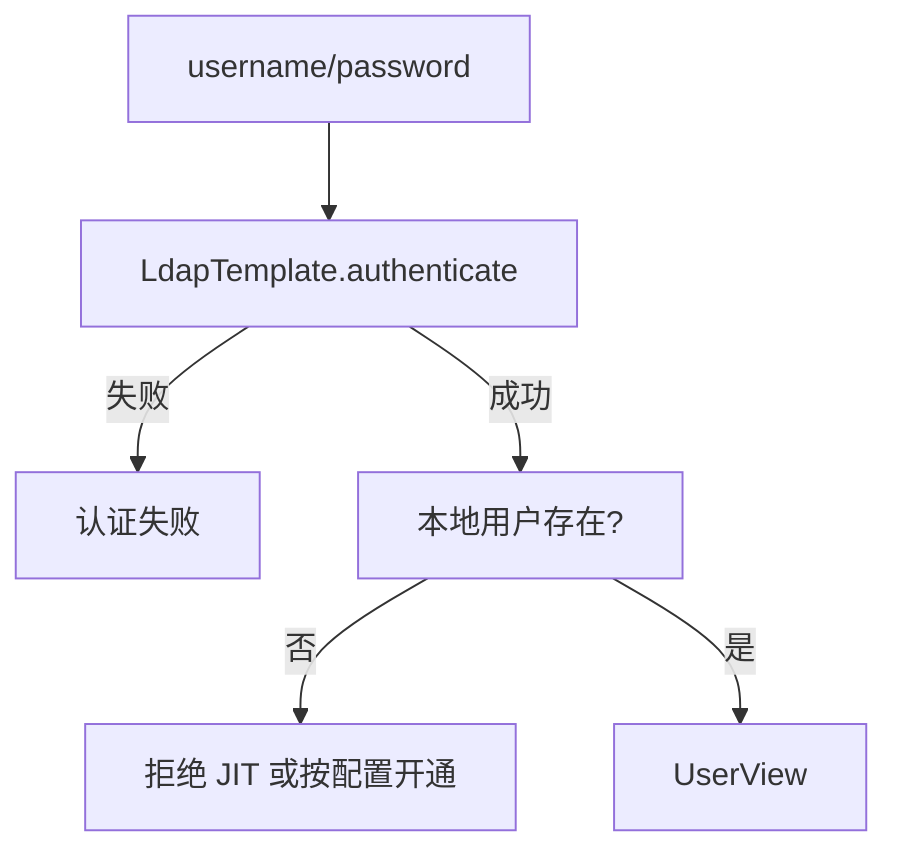

# C1 LDAP 真实绑定实现方案

> **类别**: C Stub | **优先级**: P3  
> **现有代码**: `LdapAuthenticationProvider` 降级 `UserService.authenticate`  
> **依赖**: D9 企业目录；C5 工厂默认 LOCAL

## 1. 现状与缺口

开启 `spring.ldap.enabled=true` 仍验本地密码，存在虚假安全感。

## 2. 解决什么场景

员工用 AD/LDAP 账号登录，不在业务库存明文口令。

## 3. 为什么这样设计

- 用 `LdapTemplate.authenticate` 绑定，失败不得降级本地（**去掉 Stub 降级** 或显式配置 `ldap.fallback-local=false` 默认 false）。  
- 成功后映射到本地 User：无用户则 JIT 创建（与 A4 类似）或拒绝（更安全，一期拒绝并提示管理员开通）。  
- 密码不写本地。

## 4. 技术栈

`spring-boot-starter-data-ldap`；`LdapConfig` 已有 urls/base/userDnPattern。

## 5. 实现方案

1. 注入 `LdapTemplate`。  
2. `filter = uid={username}` 或配置的 pattern。  
3. `authenticate` false → `AuthenticationException`。  
4. 查本地 `findByUsername`；空则 403「未开通平台账号」。  
5. 删除降级代码。  
6. 单测用 embedded LDAP 或 mock Template。

## 6. 流程图

## 7. 验收标准

- 错误本地密码 + 正确 LDAP 能登录（本地密码应被忽略）。  
- LDAP 关时走 LOCAL。

## 8. 风险

userDnPattern 因目录而异，必须可配置。TLS `ldaps://` 证书问题要在 D9 处理。
