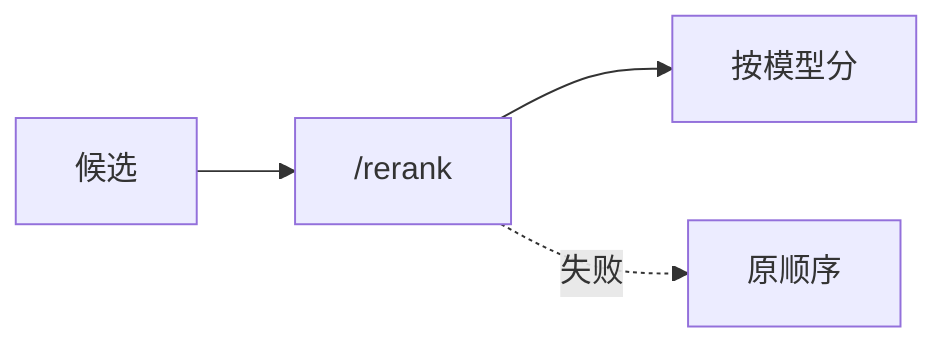

# C2 Cross-Encoder 真实精排实现方案

> **类别**: C | **优先级**: P2  
> **现有代码**: `CrossEncoderReranker` 按 `rrfScore` 排序，注释 STUB

## 1. 现状与缺口

开启 cross-encoder 与未开启效果相同，误导评测。

## 2. 解决什么场景

对 RRF 候选做 (query, doc) 联合编码打分，提高精排质量。

## 3. 为什么这样设计

与 A6 一样 **外置推理 HTTP**（bge-reranker-v2-m3）。Java 不加载 ONNX 除非已有运维标准。

失败 fail-open 回 RRF，并 metrics 记 `reranker.degraded`。

## 4. 技术栈

RestClient；`knowledge.reranker.cross-encoder.{enabled,base-url,timeout-ms}`。

## 5. 实现方案

1. `RerankerModelClient.score(query, List<text>) → List<float>`。  
2. 替换 STUB：按模型分排序 `limit(topK)`。  
3. 批量大小 16，防超时。  
4. 与 B10 联动：`rerankerType=CROSS_ENCODER` 才走该类。

## 6. 流程图

## 7. 验收标准

- 服务关闭时日志 STUB 消失，走降级。  
- 固定 query 下顺序与 RRF 不同。

## 8. 风险

延迟叠加 LLM。默认 rerankerTopK 保持较小。
