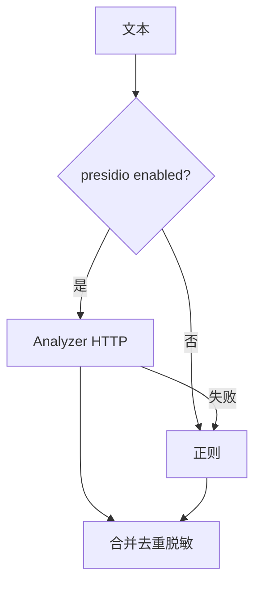

# C3 Presidio 服务对接实现方案

> **类别**: C | **优先级**: P3  
> **现有代码**: `PresidioPiiAdapter` 条件装配；`PiiDesensitizer` 优先 NER 再正则  
> **依赖**: D11 部署；B1 输出脱敏进对话

## 1. 现状与缺口

Adapter 在，默认 `enabled=false`，且对话不调脱敏。即使开启，人名/地址也进不了用户眼睛。

## 2. 解决什么场景

识别正则覆盖不了的人名、地址、组织名。

## 3. 为什么这样设计

保持 **Presidio 优先 + 正则兜底** 现有合并逻辑。不可用静默降级正则（已有）。超时要短（200ms 级），避免拖 SSE。

## 4. 技术栈

现有 RestClient Adapter；配置 `security.pii.presidio.enabled/base-url`。

## 5. 实现方案

1. application-dev 样例 URL `http://presidio-analyzer:3000`。  
2. 健康检查：启动时 ping，失败只 warn。  
3. B1 接通后用含中文人名的样例验收。  
4. 语言参数 `zh`。  
5. 不把原文打到 info 日志。

## 6. 流程图

## 7. 验收标准

- enabled=false 行为与现在一致。  
- enabled=true 且服务可用，人名单词被掩码。

## 8. 风险

中文 NER 效果依赖镜像模型，需在 D11 选中文模型。
