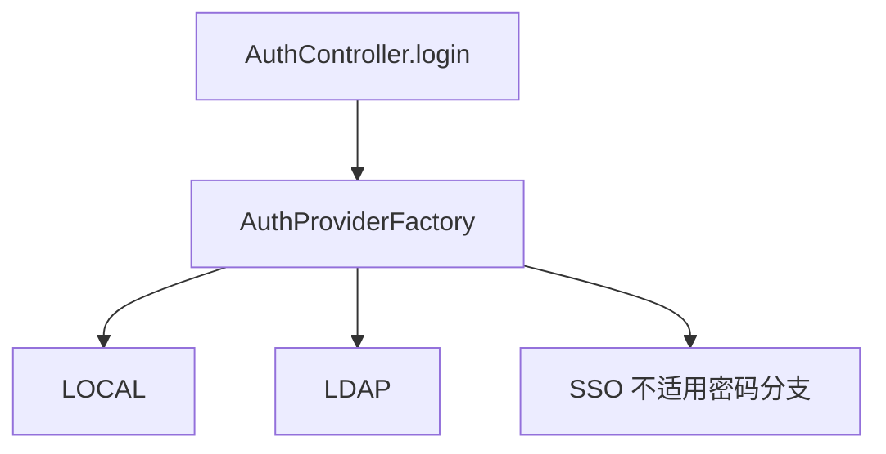

# C5 LocalAuthenticationProvider 实现方案

> **类别**: C | **优先级**: P2  
> **现有代码**: `AuthProviderFactory` 期望 LOCAL Bean；`AuthController` 仍直接 `UserService.authenticate`

## 1. 现状与缺口

工厂 defaultProvider 常为 null；登录不走工厂，LDAP/SSO 参数易被忽略。

## 2. 解决什么场景

三种认证统一入口，`provider=LOCAL|LDAP|SSO` 真正分流。

## 3. 为什么这样设计

- `LocalAuthenticationProvider` 实现 `AuthenticationProvider`，内部调 `UserService.authenticate` + 租户（登录请求需 tenant 标识，保持现有 LoginRequest）。  
- Controller **只调** `authProviderFactory.authenticate(provider, user, pwd)`。  
- LOCAL 无条件装配，LDAP/SSO 条件装配。

## 4. 技术栈

现有接口与工厂。

## 5. 实现方案

1. 新增 `LocalAuthenticationProvider.supportedType()==LOCAL`。  
2. `AuthController.login` 删直连 UserService（登录部分）。  
3. 若 LoginRequest 含 tenantCode，Provider 内解析 tenantId。  
4. 工厂日志确认默认=Local。  
5. 单测：provider 空 → LOCAL。

## 6. 流程图

SSO 走 A4 独立 callback，不走 password authenticate。

## 7. 验收标准

- 现有账号密码登录行为不变。  
- `provider=LDAP` 且未启用 LDAP 时明确错误，不再静默本地成功（或文档定义 fallback）。推荐明确错误。

## 8. 风险

LoginRequest 租户字段要与现网兼容。
