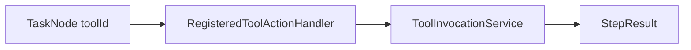

# C6 生产级 ActionHandler 实现方案

> **类别**: C | **优先级**: P2  
> **现有代码**: 仅 `RetrieveOrdersHandler` / `SendEmailHandler` / `CalculateSumHandler` 示例  
> **依赖**: B5 `ToolInvocationService`

## 1. 现状与缺口

DAG 不能调用租户注册的 MCP/HTTP 工具，规划出的节点名对不上生产系统。

## 2. 解决什么场景

LLM 规划 `action=tool:{toolId}` 的节点真实执行。

## 3. 为什么这样设计

- **一个通用 `RegisteredToolActionHandler`**，按节点参数 `toolId` 调统一调用服务，避免每工具一个类。  
- 示例 Handler 保留作教程，标注 `@Profile("dev")` 或文档说明非生产。  
- `ActionHandlerRegistry` 已 InitializingBean 自动注册。

## 4. 技术栈

现有 `ActionHandler` 钩子；B5/B6 调用链。

## 5. 实现方案

1. 节点约定：`actionType=REGISTERED_TOOL`，`params.toolId`。  
2. Handler `execute`：`toolInvocationService.invoke(...)`，把 output 写入 `StepResult`。  
3. 超时走 `TimeoutController`。  
4. `requireApproval` 抛给 DAG 进入 WAITING_APPROVAL（B6）。  
5. 规划 Prompt 增加「只使用已注册 toolId 列表」。

## 6. 流程图

## 7. 验收标准

- DAG JSON 调真实 HTTP 工具成功，步骤 SUCCESS。  
- 未知 toolId FAILED 且不拖垮其它层。

## 8. 风险

规划幻觉 toolId：执行前校验 ACTIVE 列表。
