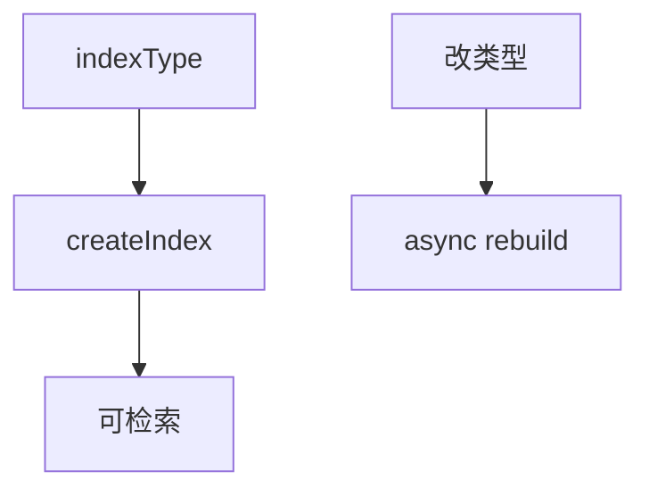

# C7 量化索引运营化实现方案

> **类别**: C | **优先级**: P3  
> **现有代码**: `IndexType` 枚举齐全；创建 collection 多默认 IVF_FLAT + 硬编码 nlist

## 1. 现状与缺口

无法按数据规模选 IVF_SQ8/PQ/HNSW，精度方案第一、二层未运营。

## 2. 解决什么场景

百万级切片降内存；小库保持 IVF_FLAT 高精度。

## 3. 为什么这样设计

- 建索引参数来自 KB `indexType` + `indexParamsJson` + `RagConfig`。  
- **改索引需重建**，API 单独 `rebuildIndex`，不在检索时切换。  
- AUTOINDEX 仅 Milvus 支持时打开。

## 4. 技术栈

`MilvusCollectionManager.createIndex`；异步任务。

## 5. 实现方案

1. `ensureCollection` 读 KB indexType，mapping 到 SDK IndexType。  
2. extraParam：nlist/m/nbits/M/efConstruction 从 JSON 取，缺省用 RagConfig。  
3. 检索 nprobe/ef 来自 B10 合并结果（现已有 RagConfig nprobe）。  
4. 管理 API：重建索引（长时间任务中心）。  
5. 文档给出规模建议表（沿用 T6 精度方案）。

## 6. 流程图

## 7. 验收标准

- 新建 KB 选 IVF_SQ8 后 describe index 类型正确。  
- 错误 extraParam 建库失败有明确错误。

## 8. 风险

重建期间检索质量下降，需维护双 collection 或停写窗口。一期允许短暂不可用并提示。
