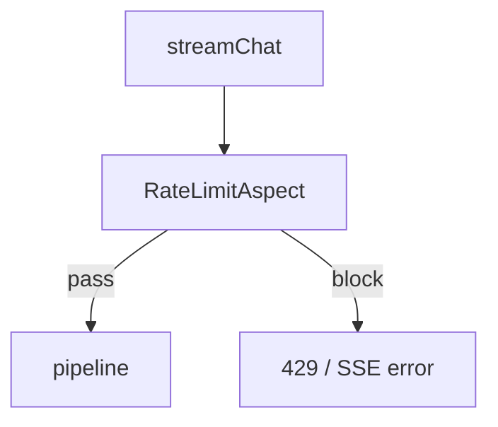

# C8 RateLimit 挂载接口实现方案

> **类别**: C | **优先级**: P2  
> **现有代码**: `@RateLimit` + `RateLimitAspect`；Controller 方法无注解

## 1. 现状与缺口

限流代码死，LLM/上传无应用层 QPS 保护（Nacos Sentinel 资源名需与注解 resource 一致才有效）。

## 2. 解决什么场景

防刷聊天与上传打满 DeepSeek/磁盘。

## 3. 为什么这样设计

- 只挂 **贵接口**：streamChat、search、upload、tool test。CRUD 可不挂或宽松。  
- resource 名稳定：`chat.stream`、`kb.upload`，与 Nacos flow 规则对齐。  
- 切面返回 `Result` 429；**SSE 方法必须单独处理**：around 返回 429 Result 对 SseEmitter 无效。stream 方法内先手动 `SphU.entry` 或切面识别返回类型。

## 4. 技术栈

现有注解；Sentinel；子方案 05 规则 JSON 补资源名。

## 5. 实现方案

1. 扩展 Aspect：若方法返回 `SseEmitter` 且 BlockException，抛 `BusinessException(429)` 由全局处理，或写 emitter error。  
2. 注解：  
   - `MessageController.streamChat` resource=`chat.stream`  
   - `DocumentController.upload` `kb.upload`  
   - `KnowledgeSearchController` `kb.search`  
   - `ToolController.test` `tool.invoke`  
3. Nacos 样例 QPS（dev 宽松、prod 收紧）。  
4. 租户维度已拼接，规则按 `chat.stream:tenant:{id}` 或用参数热点。

## 6. 流程图

## 7. 验收标准

- 超 QPS 聊天返回 429 且不调 LLM。  
- 未注解接口不受影响。

## 8. 风险

切面返回类型不匹配导致客户端挂起，SSE 必须测。
