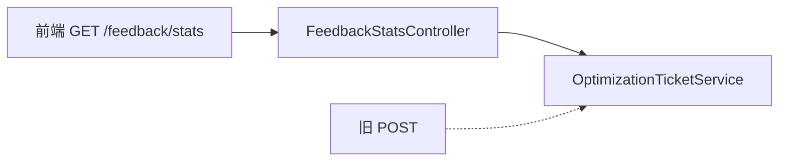

# E2 反馈统计 API 对齐实现方案

> **类别**: E | **优先级**: P2  
> **设计**: `GET /api/v1/feedback/stats`  
> **实现**: `POST /api/v1/optimization-tickets/feedback/stats`

## 1. 现状

能力有，契约与前端方案、权限表不一致。

## 2. 场景

前端 FeedbackStats 页按文档对接不 404。

## 3. 设计要点

- **保留新路径为 canonical**：REST 统计用 GET + query `days` 更合适。  
- 增加 `GET /api/v1/feedback/stats?days=` 委托现有 `OptimizationTicketService.getFeedbackStats`。  
- 旧 POST **短期兼容** 并 `@Deprecated` 文档说明。  
- Controller 返回 `FeedbackStatsResponse`，权限 `optimization:read`。  
- 同步改 `docs/api-documentation` 与前后端权限表。

## 4. 流程图

## 5. 验收

GET 与 POST 同 days 结果一致；Swagger 可见 GET。

## 6. 风险

无数据时返回 0 而不是 404。
