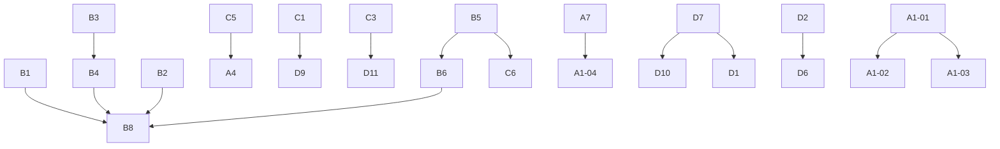

# 未实现事项 — 分项实现方案

> **日期**: 2026-08-27  
> **对照清单**: [`docs/已设计未实现清单.md`](../已设计未实现清单.md)  
> **原则**: 一事一方案；每个文件可独立评审、独立排期、独立验收。  
> **约束**: 遵守 DDD 分层（Controller → ApplicationService → DomainService → Repository）、枚举 `code`+`fromCode()`、Controller 禁止裸 Map/List、应用层 catch 后必须 re-throw。

## 阅读顺序

1. 先接线（B），主路径立刻变完整 Agent。  
2. 再去 Stub（C），避免「看起来有、实际假」。  
3. 然后 P5 前端（A1）让能力可被使用。  
4. 其余 A 与运维 D 按业务需要并行。

## 统一文档结构

每个方案均包含：现状缺口、解决场景、为何这样设计、技术栈、实现步骤（含类/方法）、流程图、验收标准、风险。

## 索引

### A. 整块未开工

| 编号 | 方案 | 优先级 |
|------|------|:------:|
| A1-01 | [P5 Web 聊天界面](A1-01-P5-Web聊天界面.md) | P1 |
| A1-02 | [P5 审批卡片](A1-02-P5-审批卡片.md) | P1 |
| A1-03 | [P5 用户反馈](A1-03-P5-用户反馈.md) | P1 |
| A1-04 | [P5 IM 接入前端](A1-04-P5-IM接入前端.md) | P2 |
| A2-01 | [P7 任务执行交互模式](A2-01-P7-任务执行交互模式.md) | P2 |
| A2-02 | [P7 分析推理交互模式](A2-02-P7-分析推理交互模式.md) | P3 |
| A2-03 | [P7 安全审批交互模式](A2-03-P7-安全审批交互模式.md) | P2 |
| A2-04 | [P7 模式市场与租户配额](A2-04-P7-模式市场与租户配额.md) | P3 |
| A3 | [对话检查点与断点续传](A3-对话检查点与断点续传.md) | P3 |
| A4 | [SSO/OIDC 单点登录](A4-SSO-OIDC单点登录.md) | P3 |
| A5 | [Sentinel Dashboard 与多维度限流](A5-Sentinel-Dashboard与多维度限流.md) | P3 |
| A6 | [ColBERT Reranker](A6-ColBERT-Reranker.md) | P3 |
| A7 | [IM 适配后端](A7-IM适配后端.md) | P2 |

### B. 已实现未接线

| 编号 | 方案 | 优先级 |
|------|------|:------:|
| B1 | [安全围栏接入对话流](B1-安全围栏接入对话流.md) | P0 |
| B2 | [意图识别结果消费](B2-意图识别结果消费.md) | P1 |
| B3 | [长期记忆注入 Prompt](B3-长期记忆注入Prompt.md) | P0 |
| B4 | [对话使用已发布提示词模板](B4-对话使用已发布提示词模板.md) | P0 |
| B5 | [工具调用接入对话](B5-工具调用接入对话.md) | P1 |
| B6 | [高风险工具审批闭环](B6-高风险工具审批闭环.md) | P1 |
| B7 | [对话状态机驱动](B7-对话状态机驱动.md) | P2 |
| B8 | [P7 七步管道编排](B8-P7七步管道编排.md) | P1 |
| B9 | [租户 SQL 拦截器注册](B9-租户SQL拦截器注册.md) | P2 |
| B10 | [四级精度配置自动合并](B10-四级精度配置自动合并.md) | P1 |
| B11 | [知识库级联删除 Milvus](B11-知识库级联删除Milvus.md) | P1 |
| B12 | [提示词 Redis 缓存读路径](B12-提示词Redis缓存读路径.md) | P2 |

### C. Stub / 半成品

| 编号 | 方案 | 优先级 |
|------|------|:------:|
| C1 | [LDAP 真实绑定](C1-LDAP真实绑定.md) | P3 |
| C2 | [Cross-Encoder 真实精排](C2-CrossEncoder真实精排.md) | P2 |
| C3 | [Presidio 服务对接](C3-Presidio服务对接.md) | P3 |
| C4 | [切片参数配置化](C4-切片参数配置化.md) | P2 |
| C5 | [LocalAuthenticationProvider](C5-LocalAuthenticationProvider.md) | P2 |
| C6 | [生产级 ActionHandler](C6-生产级ActionHandler.md) | P2 |
| C7 | [量化索引运营化](C7-量化索引运营化.md) | P3 |
| C8 | [RateLimit 挂载接口](C8-RateLimit挂载接口.md) | P2 |

### D. 运维未部署

| 编号 | 方案 | 优先级 |
|------|------|:------:|
| D1 | [Grafana Dashboard](D1-Grafana-Dashboard.md) | P2 |
| D2 | [OpenTelemetry 分布式追踪](D2-OpenTelemetry分布式追踪.md) | P3 |
| D3 | [结构化日志与 Loki/ELK](D3-结构化日志与聚合.md) | P3 |
| D4 | [AlertManager 告警](D4-AlertManager告警.md) | P3 |
| D5 | [JVM 资源观测](D5-JVM资源观测.md) | P3 |
| D6 | [Span 层级建模](D6-Span层级建模.md) | P3 |
| D7 | [Docker 单机编排](D7-Docker单机编排.md) | P2 |
| D8 | [K8s 集群部署](D8-K8s集群部署.md) | P3 |
| D9 | [企业 LDAP 服务器接入](D9-企业LDAP服务器接入.md) | P3 |
| D10 | [MinIO 环境交付](D10-MinIO环境交付.md) | P2 |
| D11 | [Presidio Docker 交付](D11-Presidio-Docker交付.md) | P3 |

### E. 工程债

| 编号 | 方案 | 优先级 |
|------|------|:------:|
| E1 | [自动化测试补齐](E1-自动化测试补齐.md) | P1 |
| E2 | [反馈统计 API 对齐](E2-反馈统计API对齐.md) | P2 |

## 依赖关系

